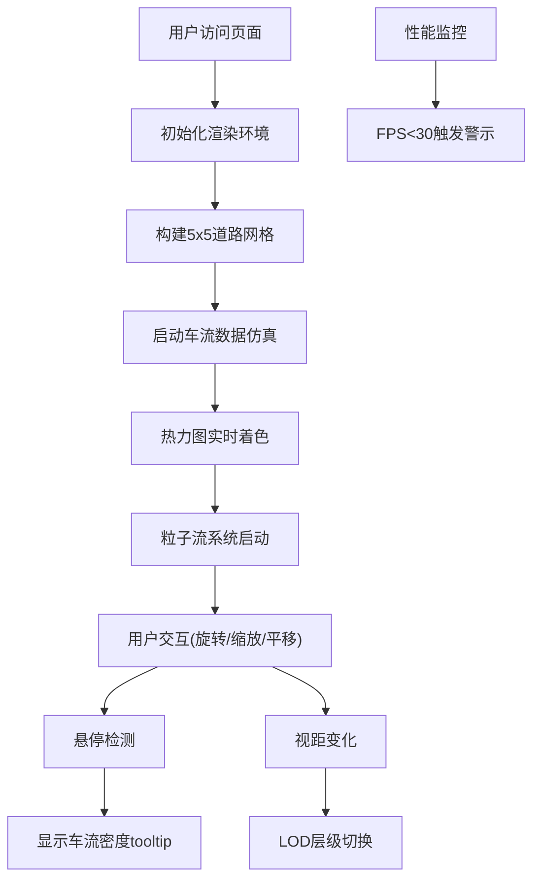

## 1. 产品概述

基于Three.js的3D城市道路车流热力可视化应用，将城市道路实时车流数据转化为三维动态热力图，帮助决策者直观感受不同路段的拥堵变化趋势。

- **核心目标**：构建一个浏览器端3D可视化平台，通过热力色阶和粒子系统直观展示城市道路车流状态
- **目标用户**：城市交通管理部门决策者、智慧城市运营中心

---

## 2. 核心功能

### 2.1 功能模块
1. **3D场景主页面**：5x5正交城市道路网格、热力图可视化、粒子车流方向展示

### 2.2 页面详情
| 页面名称 | 模块名称 | 功能描述 |
|-----------|-------------|----------|
| 3D场景主页 | 道路网格系统 | 5x5正交网格，25个路口，每条路宽4单位、长20单位，路口8x8单位 |
| 3D场景主页 | 热力图渲染 | 车流密度0-200辆/分钟映射到绿→黄→红色阶，实时数据每3秒波动更新 |
| 3D场景主页 | 粒子流系统 | 2000个白色半透明粒子沿车道流动，带拖尾残影，速度与密度负相关 |
| 3D场景主页 | 交互控制系统 | 鼠标旋转/平移/缩放，悬停路段显示车流密度tooltip |
| 3D场景主页 | LOD层级管理 | 视距自动切换显示精度，优化性能 |
| 3D场景主页 | 控制面板 | dat.gui速度倍率滑块(0.5x-3x) |
| 3D场景主页 | 性能监控 | stats.js实时FPS和三角形数监控，低帧率警示 |

---

## 3. 核心流程

用户打开页面 → 初始化Three.js渲染器、场景、相机 → 加载5x5道路网格 → 启动车流数据仿真循环(每3秒更新) → 粒子系统开始流动 → 用户通过鼠标交互(旋转/缩放/平移) → 悬停路段查看实时车流数据 → 视距变化触发LOD切换 → 性能面板实时监控

---

## 4. 用户界面设计

### 4.1 设计风格
- **设计主题**：暗色太空科技风格
- **主色调**：纯黑背景#000000，深灰道路#333333
- **热力色阶**：#22c55e(绿/畅通) → #eab308(黄/缓行) → #ef4444(红/拥堵)
- **UI风格**：半透明毛玻璃效果，扁平设计
- **字体**：无衬线现代字体，数字使用等宽字体增强科技感

### 4.2 页面设计概述
| 页面名称 | 模块名称 | UI元素 |
|-----------|-------------|---------|
| 3D场景主页 | 控制面板(dat.gui) | 右上角，宽220px，背景rgba(0,0,0,0.7)，边框rgba(255,255,255,0.15)，圆角8px，速度滑块0.5x-3x |
| 3D场景主页 | 性能监控(stats.js) | 左下角，FPS和三角形数实时显示 |
| 3D场景主页 | 低帧率警示 | 右下角，红色三角形#ef4444，脉冲放大动画0.5s周期 |
| 3D场景主页 | 悬停tooltip | 跟随鼠标，白色12px字体，背景rgba(0,0,0,0.8)，圆角4px，显示车流密度和时间标签 |
| 3D场景主页 | 路口光晕 | 浅灰色半透明圆形，半径10单位，透明度0.15 |
| 3D场景主页 | 粒子路径虚线 | 相机距离<30单位时显示，细白虚线，透明度0.1 |

### 4.3 响应式设计
- 桌面端优先，最小支持1280x720分辨率
- 所有UI元素采用绝对定位，固定角点锚定
- 宽高比变化时UI自动调整位置

### 4.4 3D场景设计
- **环境**：纯黑背景#000000，无HDRI
- **光照**：环境光+方向光组合，确保热力色彩准确呈现
- **相机**：透视相机，初始距离60单位，俯视角45度
- **LOD策略**：
  - 距离<40单位：完整路段面片+全量粒子
  - 距离40-80单位：合并路段+50%粒子
  - 距离>80单位：仅路口热点色块+无粒子
- **交互**：OrbitControls轨道控制器，左键旋转、右键平移、滚轮缩放(20-120单位范围)
- **后期处理**：FXAA抗锯齿，轻微辉光效果增强科技感
- **性能预算**：FPS≥45，三角形≤15000，粒子≤2500，渲染批次≤80
