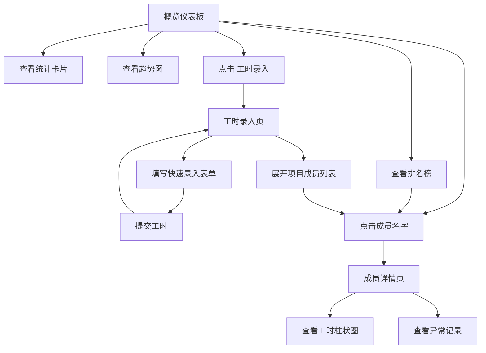

## 1. 产品概述

项目工时与绩效仪表板是一款面向项目经理的工时管理工具，支持按项目录入成员每日工时，自动汇总生成个人工时统计（周/月视图）和项目人力投入趋势图，并对工时异常（单日超12小时、连续7天无记录）给出醒目提示，帮助团队高效追踪人力投入、识别异常并优化资源分配。

## 2. 核心功能

### 2.1 用户角色

| 角色 | 使用方式 | 核心权限 |
|------|----------|----------|
| 项目经理 | 直接访问 | 录入工时、查看仪表板、查看成员详情、查看异常提示 |

### 2.2 功能模块

1. **概览仪表板页**：统计卡片（总项目数/总成员数/近7天总工时）、个人工时排名榜（前5名）、项目工时趋势折线图（近30天）
2. **工时录入页**：按项目分组的可折叠成员列表 + 快速录入表单，提交即时刷新
3. **成员详情页**：近30天工时柱状图（按工时分段着色）+ 异常记录列表（红色标注）

### 2.3 页面详情

| 页面名称 | 模块名称 | 功能描述 |
|----------|----------|----------|
| 概览仪表板 | 统计卡片 | 3张卡片展示总项目数/总成员数/近7天总工时，含周环比变动箭头和百分比，0.3s过渡动画 |
| 概览仪表板 | 个人工时排名榜 | 前5名成员，头像用首字母圆形占位符（36px，随机柔和色），右侧横条进度图（满量60h，浅绿到深绿渐变） |
| 概览仪表板 | 项目工时趋势图 | 400x250px折线图，X轴近30天日期，Y轴总工时，蓝色折线带圆点标记，悬停显示数值 |
| 工时录入 | 可折叠项目成员列表 | 左栏，按项目分组折叠展开，展开后显示成员及当天已填工时 |
| 工时录入 | 快速录入表单 | 右栏，下拉选项目/成员（动态筛选），日期选择器，数字输入（0.5步进，0-24），提交带加载动画和成功反馈 |
| 成员详情 | 工时柱状图 | 近30天每日工时柱状图，柱宽20px圆角4px，按工时分段着色（<4h蓝、4-8h绿、>8h橙、>12h红） |
| 成员详情 | 异常记录列表 | 红色左边框4px，浅红背景，列出单日>12h或周末加班记录，含日期/工时/原因 |

## 3. 核心流程

用户首次进入看到概览仪表板，上方统计卡片一览全局，中部排名榜和趋势图掌握人力分布；需要录入工时时点击顶部"工时录入"进入录入页，左栏选择项目展开成员，右栏填写表单提交；点击成员名字跳转详情页查看个人柱状图和异常记录。

## 4. 用户界面设计

### 4.1 设计风格

- 主色调：浅蓝到浅紫渐变（#e0f2fe → #ede9fe）作为卡片背景，整体清爽专业
- 辅助色：蓝色#3b82f6（折线图）、绿色#22c55e（正常工时/正面变动）、红色#ef4444（异常/负面变动）
- 按钮风格：圆角12px，主按钮蓝色背景，悬停加深
- 字体：标题使用粗体深色#1f2937，副标题灰色#6b7280，数值32px粗体
- 布局风格：顶部导航栏 + 内容区域，卡片式布局，左侧列表右侧表单的分栏布局
- 图标风格：使用lucide-react图标库

### 4.2 页面设计概览

| 页面名称 | 模块名称 | UI元素 |
|----------|----------|--------|
| 概览仪表板 | 统计卡片 | 220x120px卡片，圆角16px，渐变背景，左上指标名14px灰色，中部32px粗体数值，右下变动箭头+百分比（0.3s过渡） |
| 概览仪表板 | 排名榜 | 首字母圆形头像36px，横条进度图满量60h浅绿到深绿渐变 |
| 概览仪表板 | 趋势图 | 400x250px折线图，蓝色折线+圆点标记，悬停tooltip |
| 工时录入 | 项目成员列表 | 可折叠手风琴，展开项含成员名和当天工时标注 |
| 工时录入 | 录入表单 | 下拉框+日期选择器+数字输入+提交按钮（旋转加载0.8s，绿色对勾1.5s） |
| 成员详情 | 柱状图 | 柱宽20px圆角4px，分段着色（蓝/绿/橙/红） |
| 成员详情 | 异常列表 | 红色左边框4px，浅红背景#fef2f2，含日期/工时/原因 |

### 4.3 响应式设计

桌面优先设计，内容区域最大宽度1200px居中。在小屏幕下，仪表板排名榜和趋势图改为纵向排列，录入页左右栏改为上下排列。

### 4.4 3D场景指导

不适用
