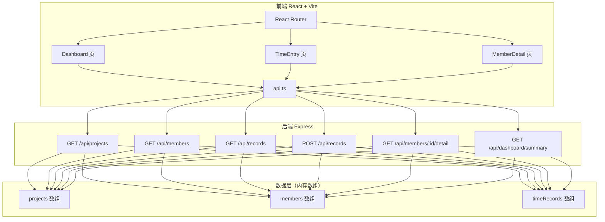
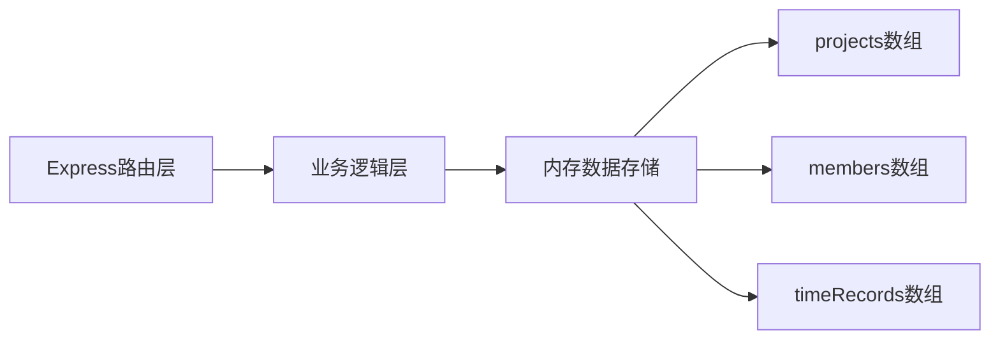
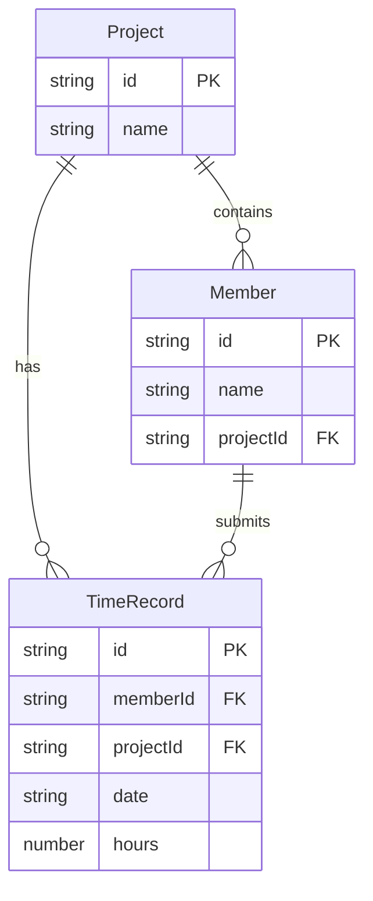

## 1. 架构设计



## 2. 技术说明

- 前端：React@18 + TypeScript + Tailwind CSS + Vite
- 初始化工具：vite-init（react-express-ts 模板）
- 后端：Express@4 + TypeScript + CORS
- 数据库：无，使用后端内存数组模拟持久化
- 路由：react-router-dom
- 图表：自定义Canvas/SVG实现（无额外图表库依赖）
- 状态管理：组件内 useState + useEffect，通过 api.ts 与后端通信
- 图标：lucide-react

## 3. 路由定义

| 路由 | 用途 |
|------|------|
| / | 概览仪表板页，展示统计卡片、排名榜、趋势图 |
| /entry | 工时录入页，项目成员列表 + 快速录入表单 |
| /member/:id | 成员详情页，工时柱状图 + 异常记录 |

## 4. API定义

### 4.1 TypeScript类型定义

```typescript
interface Project {
  id: string;
  name: string;
}

interface Member {
  id: string;
  name: string;
  projectId: string;
  avatar?: string;
}

interface TimeRecord {
  id: string;
  memberId: string;
  projectId: string;
  date: string; // YYYY-MM-DD
  hours: number;
}

interface DashboardSummary {
  totalProjects: number;
  totalMembers: number;
  last7DaysHours: number;
  projectChange: number;
  memberChange: number;
  hoursChange: number;
}

interface MemberRanking {
  memberId: string;
  memberName: string;
  weekHours: number;
}

interface DailyTrend {
  date: string;
  totalHours: number;
}

interface MemberDetail {
  member: Member;
  records: TimeRecord[];
  anomalies: AnomalyRecord[];
}

interface AnomalyRecord {
  date: string;
  hours: number;
  reason: string;
}
```

### 4.2 请求/响应

| 接口 | 方法 | 请求参数 | 响应 |
|------|------|----------|------|
| /api/projects | GET | 无 | Project[] |
| /api/members | GET | ?projectId=xxx | Member[] |
| /api/records | GET | ?memberId=xxx&dateRange=30d | TimeRecord[] |
| /api/records | POST | {memberId, projectId, date, hours} | TimeRecord |
| /api/members/:id/detail | GET | 无 | MemberDetail |
| /api/dashboard/summary | GET | 无 | DashboardSummary |
| /api/dashboard/rankings | GET | 无 | MemberRanking[] |
| /api/dashboard/trend | GET | 无 | DailyTrend[] |

## 5. 服务端架构图



## 6. 数据模型

### 6.1 数据模型定义



### 6.2 初始化数据

预填充3个项目（Alpha项目、Beta项目、Gamma项目），每个项目3-4名成员，近30天随机工时记录（正常4-10小时为主，偶有异常>12小时和周末加班记录），确保仪表板和异常检测有数据可展示。
