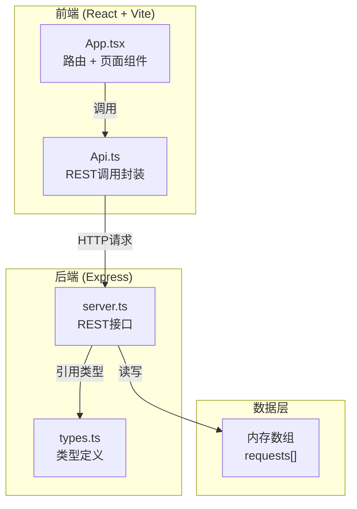
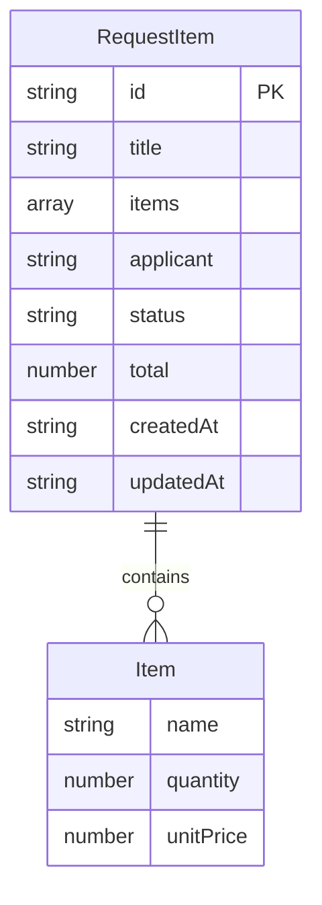

## 1. 架构设计



## 2. 技术说明

- 前端：React@18 + TypeScript + Vite
- 初始化工具：Vite
- 后端：Express@4 + TypeScript
- 数据库：内存数组模拟持久化
- 样式方案：CSS-in-JS（内联样式 + CSS模块），无需额外CSS框架

## 3. 路由定义

| 路由 | 用途 |
|------|------|
| / | 申购列表页，展示所有申购单卡片 |
| /create | 申购表单页，创建新申购单 |
| /admin | 审批仪表板页，管理员审批待处理单 |

## 4. API 定义

### TypeScript 类型定义

```typescript
interface RequestItem {
  id: string;
  title: string;
  items: Array<{
    name: string;
    quantity: number;
    unitPrice: number;
  }>;
  applicant: string;
  status: 'pending' | 'approved' | 'rejected' | 'delivered';
  total: number;
  createdAt: string;
  updatedAt: string;
}
```

### API 端点

| 方法 | 路径 | 请求体 | 响应 | 说明 |
|------|------|--------|------|------|
| GET | /api/requests | - | RequestItem[] | 获取所有申购单，按时间倒序 |
| POST | /api/requests | { title, items, applicant, total } | RequestItem | 创建新申购单 |
| PATCH | /api/requests/:id | { status } | RequestItem | 更新申购单状态 |

## 5. 服务端架构图

```mermaid
flowchart LR
    "Express路由<br/>GET/POST/PATCH" --> "内存数组<br/>requests[]" --> "JSON响应"
```

## 6. 数据模型

### 6.1 数据模型定义



### 6.2 数据定义

数据存储在后端内存数组中，无需DDL。初始数据为空数组，通过POST接口写入。每个RequestItem的id由uuid v4生成。
