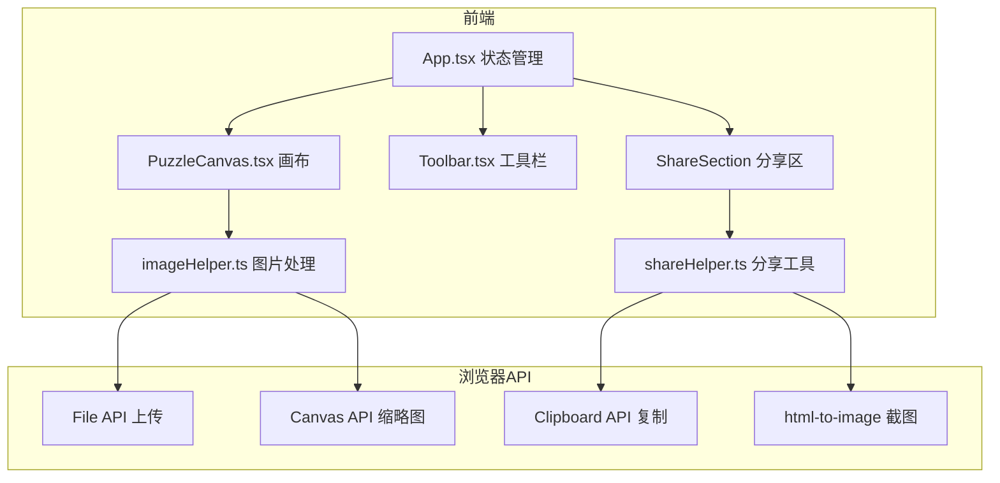
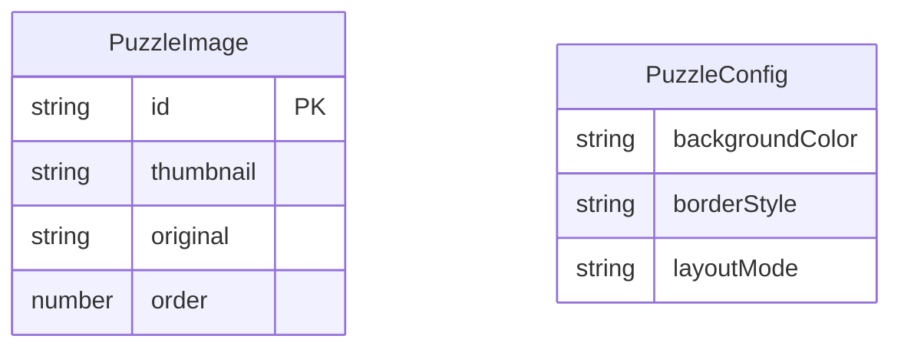

## 1. 架构设计



## 2. 技术说明

- 前端：React 18 + TypeScript + Vite
- 样式：Tailwind CSS 3
- 状态管理：Zustand
- 初始化工具：vite-init（react-ts模板）
- 后端：无
- 数据库：无

## 3. 路由定义

| 路由 | 用途 |
|------|------|
| / | 拼图编辑主页 |

## 4. API定义

无后端API，所有功能在前端完成。

## 5. 服务器架构图

不适用

## 6. 数据模型

### 6.1 数据模型定义



### 6.2 核心类型定义

```typescript
interface PuzzleImage {
  id: string;
  thumbnail: string;
  original: string;
  order: number;
}

type BorderStyle = 'none' | 'white-rounded' | 'gray-dashed';
type LayoutMode = 'compact' | 'loose';

interface PuzzleConfig {
  backgroundColor: string;
  borderStyle: BorderStyle;
  layoutMode: LayoutMode;
}
```
