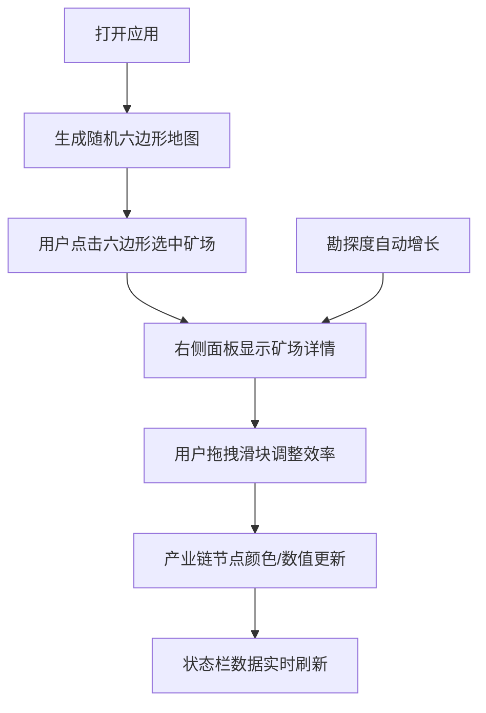

## 1. 产品概述

太空资源采集矿站模拟器是一款帮助玩家规划和模拟太空设施经营的游戏原型，解决玩家在规划太空设施时缺乏直观的产线平衡模拟和弹性调整策略的问题。

- 核心价值：提供直观的六边形网格地图和实时数据反馈，让用户能够可视化地规划矿场布局并模拟资源开采产业链
- 目标用户：太空策略游戏爱好者、资源管理模拟游戏玩家
- 市场价值：填补太空资源管理类游戏中缺乏精细化产线模拟工具的空白

## 2. 核心功能

### 2.1 用户角色
| 角色 | 注册方式 | 核心权限 |
|------|----------|----------|
| 玩家 | 无需注册，直接体验 | 完整的地图交互、矿场部署、效率调整、数据查看权限 |

### 2.2 功能模块
1. **六边形地图系统**：6x8网格、随机资源分布、障碍物、点击选中/取消、发光边框动画
2. **右侧控制面板**：矿场详情展示、勘探进度、效率滑块调整、实时产量显示
3. **产业链示意图**：矿场→运输→精炼→出售四节点流程、流动虚线箭头动画
4. **底部状态栏**：总开采量、财务收入、已部署矿场数实时统计

### 2.3 页面详情
| 页面名称 | 模块名称 | 功能描述 |
|----------|----------|----------|
| 主游戏界面 | 六边形地图 | 6x8网格，随机资源（铁矿/水晶/气体），障碍物分布，点击选中矿场，旋转发光边框 |
| 主游戏界面 | 控制面板 | 显示选中矿场的资源类型、年产量、勘探度，滑块调整开采效率（0.5-2.0） |
| 主游戏界面 | 产业链示意 | 展示从矿场到出售的完整流程，节点颜色随效率变化，流动箭头动画 |
| 主游戏界面 | 状态栏 | 实时显示总开采量、财务收入、已部署矿场数，60FPS流畅更新 |

## 3. 核心流程

用户打开游戏后，首先看到随机生成的六边形地图。用户点击六边形选中作为矿场，右侧面板显示该矿场详细信息。用户可以通过滑块调整开采效率，产业链示意图和底部状态栏会实时反映数据变化。勘探度每2秒自动增加1%，产量数据每秒更新。

## 4. 用户界面设计

### 4.1 设计风格
- **主色调**：深色宇宙主题，主背景#0b0f19
- **资源配色**：铁矿#9ca3af（浅灰）、水晶#8b5cf6（蓝紫）、气体#a3e635（浅绿）
- **功能色**：障碍物#4b5563（深灰）、发光边框#e0f2fe（冷白）、滑块#3b82f6（蓝色）
- **布局**：左侧70%区域为地图，右侧280px控制面板，底部48px状态栏
- **字体**：现代无衬线字体，数据显示使用粗体白色
- **动效**：悬停放大、点击脉冲、发光旋转、平滑过渡

### 4.2 页面设计概述
| 页面名称 | 模块名称 | UI元素 |
|----------|----------|----------|
| 主游戏界面 | 六边形地图 | 6x8网格、随机填充色、障碍物、悬停放大发光、点击脉冲、选中旋转发光边框 |
| 主游戏界面 | 控制面板 | 深灰#1f2937背景、圆角12px、宽280px、资源类型标签、年产量数字、勘探进度条、效率滑块 |
| 主游戏界面 | 产业链示意 | 深灰#111827背景、高120px、四节点圆形图标、流动虚线箭头、颜色过渡动画 |
| 主游戏界面 | 状态栏 | 背景#0f172a、高48px、三项统计数据横向排列、白色粗体数字、0.5s过渡动画 |

### 4.3 响应式
- 桌面优先设计，最小宽度1024px
- 宽屏下控制面板和状态栏保持固定尺寸
- 地图区域自适应剩余空间

### 4.4 性能要求
- 六边形网格渲染与交互帧率不低于55FPS
- 滑块拖拽反馈与数据更新延迟小于100ms
- 数据每帧更新，保持流畅的60FPS体验
