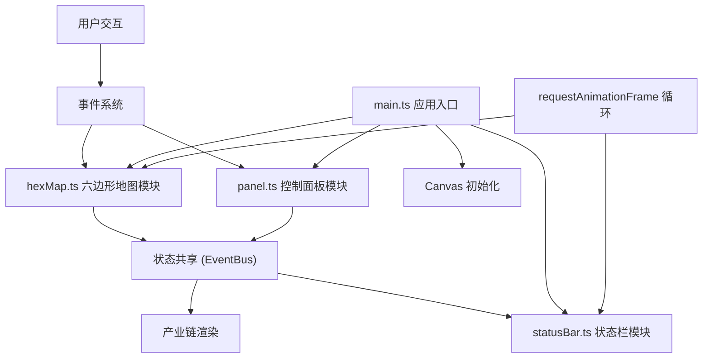

## 1. 架构设计



## 2. 技术描述

- **前端技术栈**：TypeScript + HTML5 Canvas + Vite
- **构建工具**：Vite 5.x
- **语言目标**：ES2020
- **无额外框架依赖**：使用原生Canvas API和DOM操作
- **事件驱动架构**：通过自定义事件实现模块间通信
- **渲染循环**：requestAnimationFrame实现60FPS动画

## 3. 目录结构

| 路径 | 用途 |
|------|------|
| `/package.json` | 项目依赖和脚本配置 |
| `/vite.config.js` | Vite构建配置 |
| `/tsconfig.json` | TypeScript编译配置 |
| `/index.html` | 入口HTML页面 |
| `/src/main.ts` | 应用入口，初始化和模块协调 |
| `/src/hexMap.ts` | 六边形地图生成、渲染、交互逻辑 |
| `/src/panel.ts` | 右侧控制面板UI和交互逻辑 |
| `/src/statusBar.ts` | 底部状态栏数据展示 |
| `/src/types.ts` | TypeScript类型定义 |
| `/src/style.css` | 全局样式和动画 |

## 4. 核心数据模型

### 4.1 六边形单元
```typescript
interface HexCell {
  id: string;
  q: number;
  r: number;
  x: number;
  y: number;
  type: 'iron' | 'crystal' | 'gas' | 'obstacle';
  selected: boolean;
  explored: number;
  efficiency: number;
  annualOutput: number;
  hovered: boolean;
  pulseScale: number;
}
```

### 4.2 游戏状态
```typescript
interface GameState {
  cells: HexCell[];
  selectedCell: HexCell | null;
  totalExtraction: number;
  totalRevenue: number;
  deployedMines: number;
  lastUpdate: number;
}
```

### 4.3 事件类型
```typescript
type GameEventType = 
  | 'cell-selected'
  | 'cell-deselected'
  | 'efficiency-changed'
  | 'exploration-updated'
  | 'stats-updated';
```

## 5. 核心模块职责

### 5.1 hexMap.ts
- 六边形网格数学计算（轴向坐标转像素坐标）
- 随机地图生成（资源类型、障碍物分布）
- Canvas渲染（六边形填充、发光边框、动画）
- 鼠标交互（点击检测、悬停效果、选中状态）
- 发光边框旋转动画（每帧更新角度）

### 5.2 panel.ts
- 控制面板DOM创建和样式
- 矿场信息展示（资源类型、年产量、勘探度）
- 滑块组件实现（拖拽、步长限制、数值显示）
- 产量数字过渡动画（0.3s ease-out）
- 监听选中矿场变化事件

### 5.3 statusBar.ts
- 状态栏DOM创建
- 三项统计数据展示（总开采量、财务收入、已部署矿场数）
- 每帧更新数据计算
- 数字过渡动画（0.5s ease-out）

### 5.4 main.ts
- Canvas元素创建和尺寸设置
- 模块初始化和事件绑定
- requestAnimationFrame主循环
- 全局事件协调
- 勘探度自动增长定时器

## 6. 性能优化策略

- **Canvas分层渲染**：静态地图层和动态效果层分离
- **脏矩形渲染**：仅重绘变化区域
- **对象池复用**：动画对象复用避免GC
- **事件节流**：滑块拖动事件节流到16ms
- **requestAnimationFrame统一调度**：所有动画在同一帧更新
- **计算缓存**：六边形顶点坐标预计算
