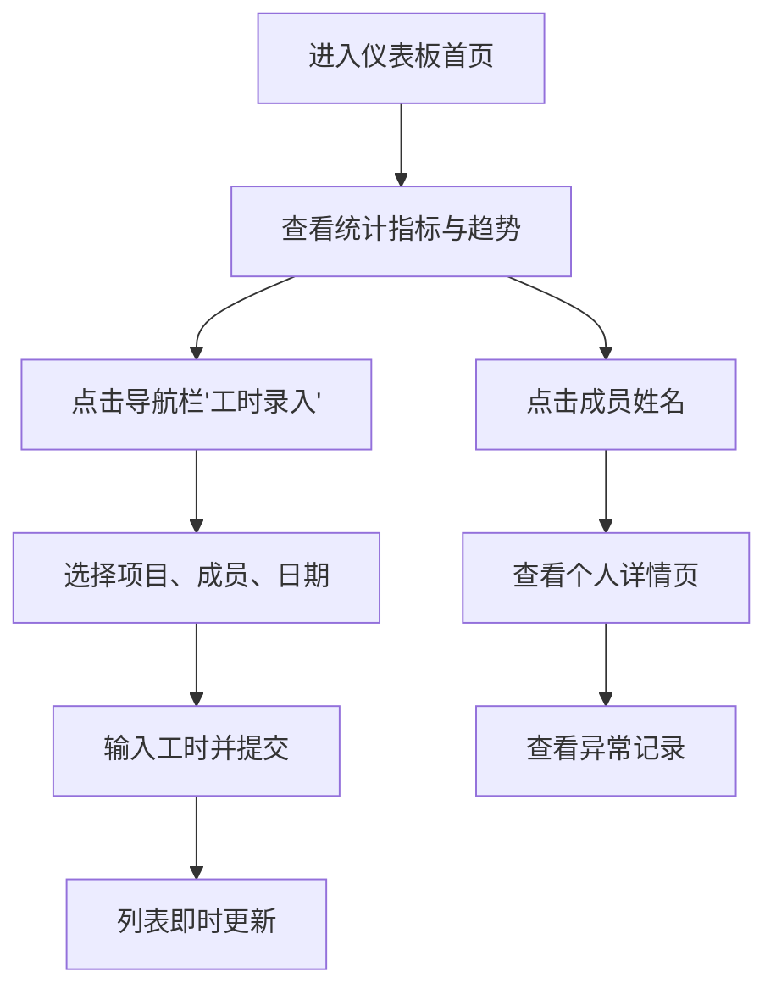

## 1. 产品概述
项目工时与绩效仪表板是一款面向项目经理的团队工时管理工具，通过可视化数据展示和智能异常检测，帮助管理者高效追踪项目人力投入与团队成员工作状态。
- 解决项目人力投入不透明、工时统计繁琐、异常工作模式难以及时发现的痛点
- 目标用户为项目经理、团队负责人，提供工时录入、统计分析、异常预警等核心功能

## 2. 核心功能

### 2.1 用户角色
| 角色 | 注册方式 | 核心权限 |
|------|----------|----------|
| 项目经理 | 系统默认 | 工时录入、数据查看、异常监控、全功能访问 |

### 2.2 功能模块
1. **仪表板首页**：核心指标统计卡片、个人工时排名榜、项目工时趋势折线图
2. **工时录入页**：可折叠项目成员列表、快速工时录入表单
3. **个人详情页**：个人工时柱状图、异常记录列表

### 2.3 页面详情
| 页面名称 | 模块名称 | 功能描述 |
|----------|----------|----------|
| 仪表板首页 | 统计卡片 | 展示总项目数、总成员数、最近7天总工时，显示周环比变化（0.3s过渡动画） |
| 仪表板首页 | 个人工时排名榜 | 展示本周工时前5名成员，含头像占位符和进度条（满量程60小时） |
| 仪表板首页 | 项目工时趋势图 | 近30天总工时折线图，蓝色折线带圆点标记，悬停显示数值 |
| 工时录入页 | 项目成员列表 | 按项目分组可折叠展开，显示成员当日已填工时 |
| 工时录入页 | 快速录入表单 | 项目/成员下拉选择、日期选择器、工时数字输入（0.5步进），提交含加载动画和成功提示 |
| 个人详情页 | 工时柱状图 | 近30天工时柱状图，按工时分段着色（蓝/绿/橙/红） |
| 个人详情页 | 异常记录列表 | 列出单日超12小时或周末加班记录，红色边框醒目提示 |

## 3. 核心流程
项目经理进入系统后，首先在仪表板概览全局数据，可通过导航栏进入工时录入页登记团队成员工时，点击成员姓名查看个人详情及异常记录。所有数据实时同步更新。

## 4. 用户界面设计

### 4.1 设计风格
- **主色调**：蓝色系（#3b82f6）为主，绿色（#22c55e）表示正常/增长，红色（#ef4444）表示异常/下降
- **卡片样式**：圆角16px，浅蓝到浅紫渐变背景（#e0f2fe 至 #ede9fe），柔和阴影
- **按钮样式**：圆角8px，悬停状态有微妙缩放和阴影变化
- **字体**：使用系统字体栈，标题粗体深色#1f2937，辅助文字灰色#6b7280
- **布局风格**：顶部导航栏 + 卡片式网格布局，空间错落有致
- **图标风格**：简洁线性图标，配合状态色彩

### 4.2 页面设计概述
| 页面名称 | 模块名称 | UI元素 |
|----------|----------|--------|
| 仪表板首页 | 统计卡片 | 220x120px，渐变背景，圆角16px，指标名14px#6b7280，数值32px粗体#1f2937，箭头百分比0.3s过渡动画 |
| 仪表板首页 | 个人排名榜 | 头像直径36px圆形，随机柔和色背景，进度条渐变#86efac到#22c55e，满量程60小时 |
| 仪表板首页 | 趋势折线图 | 400x250px，X轴近30天，Y轴工时，蓝色#3b82f6折线带圆点标记，悬停提示 |
| 工时录入页 | 项目列表 | 折叠/展开动画，项目标题加粗，成员列表显示工时标注 |
| 工时录入页 | 录入表单 | 下拉框动态筛选，日期选择器，数字输入框0.5步进，提交按钮加载动画0.8s，成功对勾1.5s |
| 个人详情页 | 柱状图 | 柱宽20px，圆角4px，按工时分段着色（<4h#93c5fd, 4-8h#6ee7b7, >8h#fcd34d, >12h#fca5a5） |
| 个人详情页 | 异常列表 | 左侧4px红色#ef4444边框，背景浅红#fef2f2 |

### 4.3 响应性
- 桌面端优先设计（1280px以上）
- 中等屏幕（768-1280px）自适应网格布局
- 移动端（<768px）单列堆叠布局
- 所有交互元素确保触摸友好（最小44x44px点击区域）

## 5. 异常检测规则
- **单日超12小时**：自动标记为红色异常
- **连续7天无记录**：在仪表板醒目提示
- **周末加班**：记录为异常项，在个人详情页列出
