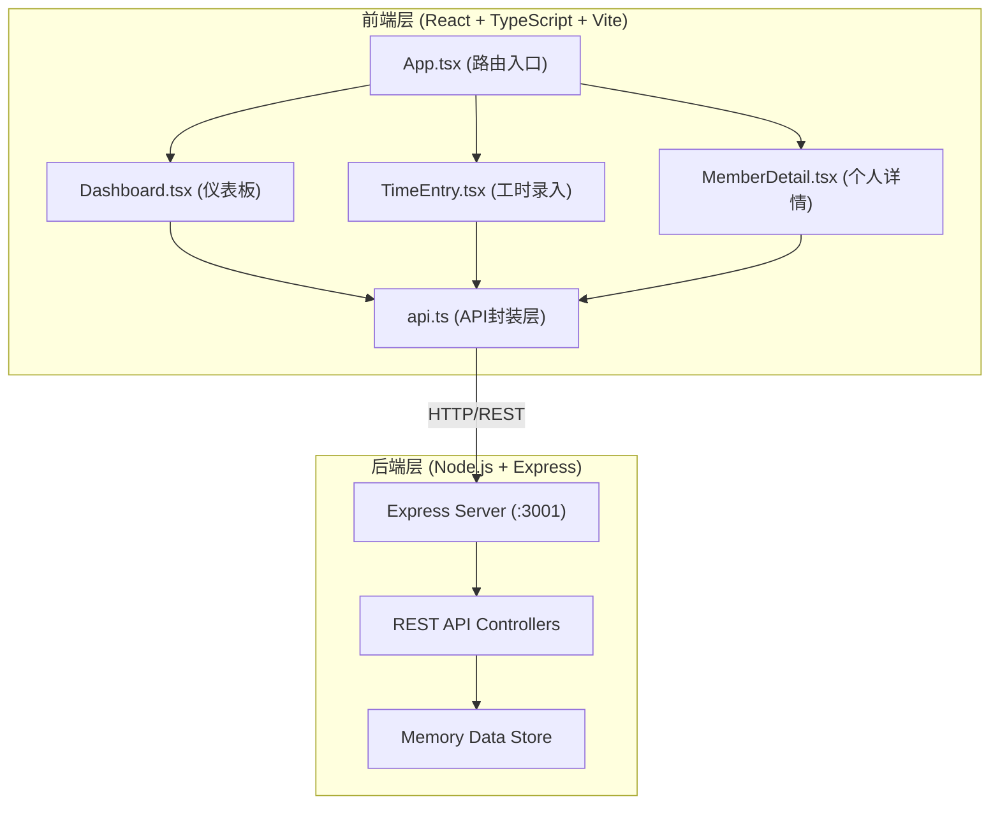
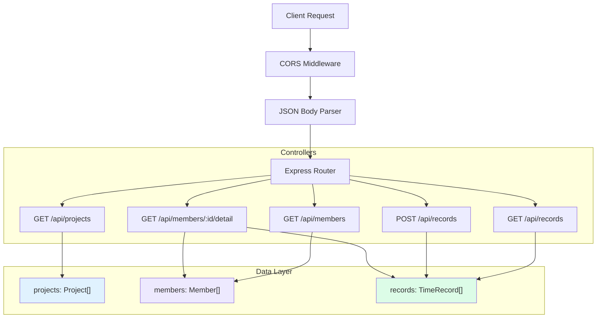
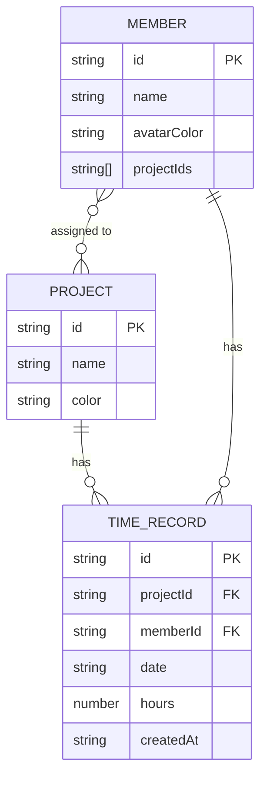

## 1. 架构设计



## 2. 技术描述

- **前端**：React@18 + TypeScript@5 + Vite@5 + React Router@6
- **后端**：Node.js + Express@4 + cors@2 + uuid@9
- **构建工具**：Vite
- **数据存储**：后端内存数组模拟持久化
- **前后端通信**：REST API + JSON

## 3. 路由定义

| 前端路由 | 页面 | 功能 |
|----------|------|------|
| `/` | 仪表板首页 | 展示统计卡片、排名榜、趋势图 |
| `/time-entry` | 工时录入页 | 项目成员列表、快速录入表单 |
| `/member/:id` | 个人详情页 | 工时柱状图、异常记录列表 |

| 后端API | 方法 | 功能 |
|---------|------|------|
| `/api/projects` | GET | 获取项目列表 |
| `/api/members` | GET | 获取成员列表（可选projectId筛选） |
| `/api/records` | GET | 获取工时记录（可选memberId、dateRange筛选） |
| `/api/records` | POST | 提交新工时记录 |
| `/api/members/:id/detail` | GET | 获取成员详情数据 |

## 4. API 定义

### TypeScript 类型定义

```typescript
interface Project {
  id: string;
  name: string;
  color: string;
}

interface Member {
  id: string;
  name: string;
  avatarColor: string;
  projectIds: string[];
}

interface TimeRecord {
  id: string;
  projectId: string;
  memberId: string;
  date: string; // YYYY-MM-DD
  hours: number;
  createdAt: string;
}

interface DailyStats {
  date: string;
  hours: number;
}

interface AnomalyRecord {
  date: string;
  hours: number;
  reason: string;
}

interface MemberDetail {
  member: Member;
  last30Days: DailyStats[];
  anomalies: AnomalyRecord[];
}

interface DashboardStats {
  totalProjects: number;
  totalMembers: number;
  last7DaysHours: number;
  totalProjectsChange: number;
  totalMembersChange: number;
  last7DaysHoursChange: number;
}

interface MemberRanking {
  member: Member;
  weeklyHours: number;
}
```

### 请求/响应示例

**POST /api/records**
```typescript
// Request
interface SubmitTimeRecordRequest {
  projectId: string;
  memberId: string;
  date: string;
  hours: number;
}

// Response (201 Created)
interface SubmitTimeRecordResponse {
  success: boolean;
  record: TimeRecord;
}
```

**GET /api/members/:id/detail**
```typescript
// Response (200 OK)
interface MemberDetailResponse {
  success: boolean;
  data: MemberDetail;
}
```

## 5. 服务器架构



## 6. 数据模型

### 6.1 ER 图



### 6.2 模拟初始化数据

```typescript
// 项目数据
const projects: Project[] = [
  { id: 'p1', name: '电商平台重构', color: '#3b82f6' },
  { id: 'p2', name: '移动端APP开发', color: '#8b5cf6' },
  { id: 'p3', name: '数据分析系统', color: '#10b981' },
];

// 成员数据
const members: Member[] = [
  { id: 'm1', name: '张明', avatarColor: '#fca5a5', projectIds: ['p1', 'p2'] },
  { id: 'm2', name: '李华', avatarColor: '#93c5fd', projectIds: ['p1'] },
  { id: 'm3', name: '王芳', avatarColor: '#6ee7b7', projectIds: ['p2', 'p3'] },
  { id: 'm4', name: '赵强', avatarColor: '#fcd34d', projectIds: ['p1', 'p3'] },
  { id: 'm5', name: '陈静', avatarColor: '#c4b5fd', projectIds: ['p2'] },
  { id: 'm6', name: '刘伟', avatarColor: '#f9a8d4', projectIds: ['p3'] },
  { id: 'm7', name: '孙丽', avatarColor: '#99f6e4', projectIds: ['p1', 'p2', 'p3'] },
  { id: 'm8', name: '周杰', avatarColor: '#fde047', projectIds: ['p3'] },
];
```

## 7. 前端项目结构

```
auto76/
├── package.json
├── vite.config.ts
├── tsconfig.json
├── index.html
├── server/
│   └── index.ts          # Express后端服务
└── src/
    ├── main.tsx          # React入口
    ├── App.tsx           # 路由与主应用
    ├── api.ts            # API请求封装
    └── components/
        ├── Dashboard.tsx      # 仪表板首页
        ├── TimeEntry.tsx      # 工时录入页
        └── MemberDetail.tsx   # 个人详情页
```

## 8. 构建与启动

- **开发依赖安装**：`npm install`
- **启动命令**：`npm run dev`（同时启动前端Vite和后端Express）
- **前端端口**：5173（Vite默认）
- **后端端口**：3001
- **Vite代理**：`/api` → `http://localhost:3001`
