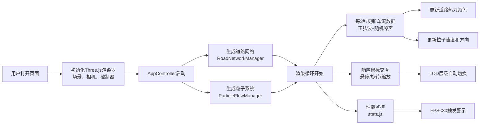
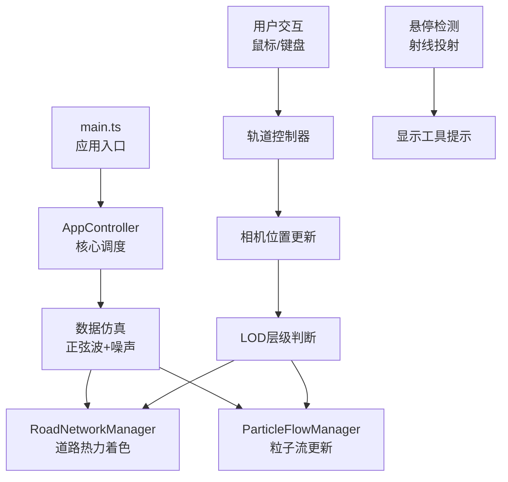

## 1. 产品概述

本项目是一个基于浏览器的3D城市道路车流热力可视化应用，为智慧城市数字孪生项目提供直观的交通拥堵状况展示。通过将实时车流数据转化为三维动态热力图，帮助决策者快速感知不同路段的拥堵变化趋势。

- 核心价值：将抽象的车流数据转化为直观的3D可视化，提升交通决策效率
- 目标用户：城市交通管理部门、智慧城市运营中心决策者

## 2. 核心功能

### 2.1 功能模块

1. **3D道路网络渲染模块**：正交网格城市道路（5x5路口，25个交叉路口），包含双向车道和交叉路口区域
2. **热力图着色模块**：根据车流密度动态着色（绿→黄→红），支持LOD层级切换
3. **粒子流动系统**：沿车道中心线流动的白色半透明粒子，带拖尾效果，速度与拥堵程度负相关
4. **数据仿真模块**：每3秒自动生成基于正弦波加随机噪声的车流波动数据
5. **交互控制模块**：轨道控制器（旋转、平移、缩放）、鼠标悬停提示、LOD自动切换
6. **UI控制面板**：dat.gui速度调节滑块、stats.js性能监控、低帧率警示标志

### 2.2 功能详情

| 模块名称 | 功能描述 |
|----------|----------|
| 道路网络渲染 | 5x5正交网格，每条路宽4单位、长20单位，交叉路口8x8单位，初始深灰色#333333 |
| 热力图着色 | 密度0-200辆/分钟映射颜色：#22c55e(0) → #eab308(100) → #ef4444(200)，线性插值 |
| 粒子流系统 | 约2000个粒子，3px大小，rgba(255,255,255,0.6)，拖尾6帧，速度0.2-0.8单位/帧 |
| 数据仿真 | 每3秒更新，正弦波+随机噪声，确保各路段数值不同趋势合理 |
| 鼠标交互 | 左键旋转、右键平移、滚轮缩放（20-120单位），悬停显示车流密度 |
| LOD层级 | <40单位：完整显示；40-80单位：粒子减半、路段合并；>80单位：仅路口热点、无粒子 |
| UI界面 | 右上角控制面板、左下角stats面板、右下角低帧率警示 |
| 性能监控 | FPS低于30时显示红色三角形警示，带脉冲动画 |

## 3. 核心流程

### 3.1 主流程

### 3.2 数据流向

## 4. 用户界面设计

### 4.1 设计风格

- **整体风格**：暗色太空科技风格，纯黑背景#000000
- **主色调**：热力色阶（绿#22c55e、黄#eab308、红#ef4444）
- **辅助色**：白色#ffffff（网格线、粒子、UI边框），深灰#333333（道路基底）
- **字体**：无衬线字体，12px工具提示文字
- **UI元素**：半透明毛玻璃效果，圆角8px，边框白色透明度0.15

### 4.2 页面布局

| 区域 | 位置 | 内容 |
|------|------|------|
| 3D场景 | 全屏 | 城市道路网络、热力着色、粒子流动 |
| 控制面板 | 右上角（绝对定位） | dat.gui滑块，宽220px，半透明黑背景 |
| 性能面板 | 左下角（绝对定位） | stats.js FPS和三角形面数显示 |
| 警示标志 | 右下角（绝对定位） | 红色三角形，低帧率时显示，脉冲动画 |
| 工具提示 | 跟随鼠标 | 悬停路段时显示车流密度和时间标签 |

### 4.3 3D场景设计指引

- **环境**：纯黑背景，无天空盒，营造太空科技感
- **光照**：环境光（强度0.4）+ 方向光（强度0.6，来自上方45度），确保热力颜色准确呈现
- **相机**：初始位置(0, 60, 60)，看向原点，透视相机，视场角60度
- **路口光晕**：每个路口添加浅灰色半透明圆形光晕（半径10，透明度0.15）
- **路径可视化**：相机距离<30单位时，粒子路径显示为细白虚线
- **网格线**：道路表面保留0.5px白色网格线，透明度0.2

### 4.4 响应式设计

- 桌面优先设计，最小支持1280x720分辨率
- 所有UI元素采用绝对定位，固定锚定到角落
- 窗口大小变化时，自动调整渲染器尺寸和相机宽高比
- 控制面板和性能面板保持固定像素尺寸，不随窗口缩放

## 5. 性能约束

- 分辨率：1080p下稳定45FPS以上
- 三角形面数：≤15000
- 粒子总数：≤2500
- 渲染批次：≤80次
- LOD切换：根据相机距离自动优化渲染负载
