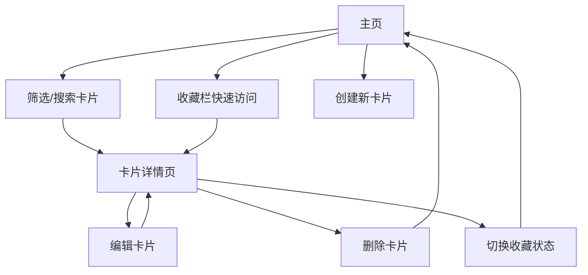

## 1. 产品概述
每日知识卡片管理应用，帮助技术团队系统化沉淀日常工作中学到的新技术点、踩过的坑和工具技巧，解决知识容易遗忘、缺乏检索手段的问题。
- 目标用户：技术团队开发者、工程师
- 核心价值：建立个人/团队知识库，实现知识的快速记录、分类整理、高效检索和回顾复习

## 2. 核心功能

### 2.1 功能模块
1. **主页卡片列表**：卡片网格展示、收藏栏位、筛选搜索区域、入场动画
2. **卡片创建**：新建知识卡片表单，支持标题、分类、Markdown正文、星级
3. **卡片详情**：Markdown渲染、同分类推荐、编辑删除
4. **收藏功能**：心形图标切换收藏、顶部收藏栏缩略展示

### 2.2 页面详情

| 页面名称 | 模块名称 | 功能描述 |
|---------|---------|---------|
| 主页 | 卡片网格 | CSS Grid自适应布局，卡片宽320px，间距20px，支持入场动画 |
| 主页 | 收藏栏 | 高80px水平滚动区域，缩略卡片宽120px高60px，点击跳转 |
| 主页 | 筛选搜索 | 左侧20%区域，分类切换按钮组、圆角搜索框、实时过滤 |
| 卡片详情 | 正文区 | 左侧Markdown渲染，支持编辑模式textarea实时预览 |
| 卡片详情 | 推荐区 | 右侧同分类卡片推荐列表，最多5条 |
| 卡片详情 | 操作栏 | 返回按钮、编辑按钮、删除按钮 |

## 3. 核心流程

用户打开应用 → 浏览卡片列表/使用筛选搜索 → 点击卡片进入详情 → 查看/编辑/删除卡片 → 收藏重要卡片 → 在收藏栏快速访问

## 4. 用户界面设计

### 4.1 设计风格
- **主色调**：蓝色 #3b82f6，灰色系配色
- **分类色**：前端蓝#3b82f6、后端绿#22c55e、工具橙#f97316、踩坑红#ef4444
- **星级色**：金色 #f59e0b
- **按钮样式**：圆角8px切换按钮，选中蓝底白字；搜索框圆角20px
- **卡片样式**：宽320px、圆角12px、白底浅灰边框、悬停上移4px加阴影
- **字体**：系统默认无衬线字体 -apple-system, BlinkMacSystemFont, "Segoe UI"
- **字号**：正文14px，标题16px粗体，分类标签12px粗体

### 4.2 页面设计概述

| 页面名称 | 模块名称 | UI元素 |
|---------|---------|-------|
| 主页 | 左侧筛选区 | 浅灰背景#f9fafb，占20%宽度，分类按钮组+搜索框 |
| 主页 | 右侧卡片区 | 白色背景，占80%宽度，CSS Grid自适应列（最小280px） |
| 主页 | 收藏栏 | 顶部水平滚动，卡片缩略仅显示标题和分类色块 |
| 卡片详情 | 操作栏 | 返回箭头、编辑/删除按钮 |
| 卡片详情 | 正文 | Markdown渲染，编辑模式textarea实时预览 |
| 卡片详情 | 推荐 | 竖直排列同分类卡片，最多5条 |

### 4.3 响应式设计
- 桌面端：两栏布局，左侧20%筛选区，右侧80%卡片区
- 移动端（<768px）：左侧筛选区折叠为顶部横向抽屉，点击汉堡菜单展开

### 4.4 动画效果
- 卡片入场：opacity 0→1、translateY 20px→0、0.3s ease-out，间隔0.05s依次滑入
- 卡片悬停：上移4px、箱体阴影0 6px 18px rgba(0,0,0,0.10)、0.3s ease-out过渡
- 按钮切换：背景色0.2s过渡
