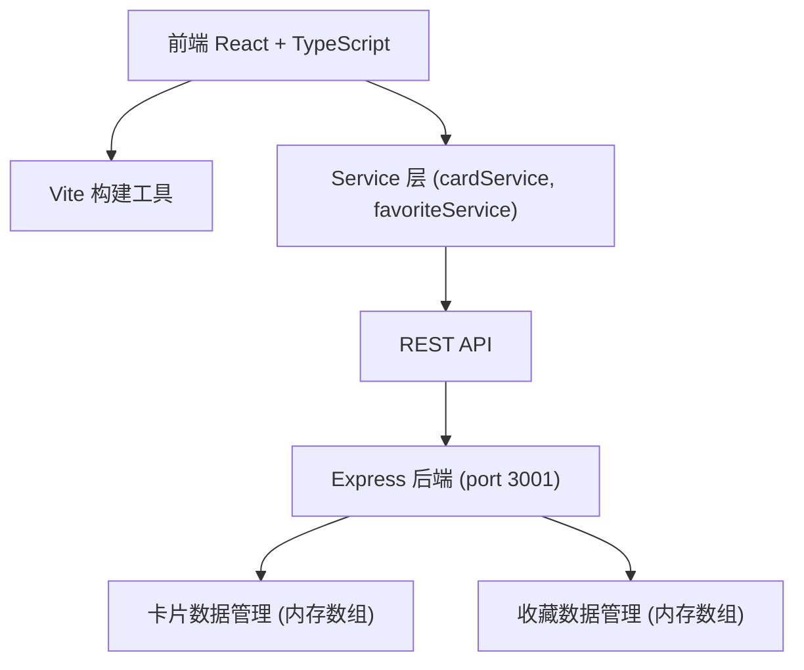
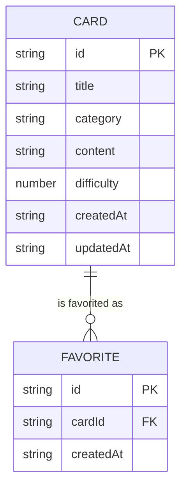

## 1. 架构设计



## 2. 技术描述
- **前端**：React 18 + TypeScript + Vite
- **Markdown渲染**：marked库
- **后端**：Express 4 + Node.js
- **数据存储**：内存数组模拟持久化（两个独立模块：卡片、收藏）
- **通信方式**：REST API + JSON
- **前端路由**：React Router DOM
- **状态管理**：React Hooks (useState, useEffect)
- **CORS支持**：cors中间件

## 3. 项目文件结构

```
auto91/
├── package.json
├── vite.config.js
├── tsconfig.json
├── index.html
├── server.js
└── src/
    ├── App.tsx
    ├── CardList.tsx
    ├── CardDetail.tsx
    ├── SearchFilter.tsx
    └── services/
        ├── cardService.ts
        └── favoriteService.ts
```

## 4. 路由定义

| 路由 | 组件 | 用途 |
|------|------|------|
| / | App.tsx (包含CardList + SearchFilter) | 主页：卡片列表、筛选搜索、收藏栏 |
| /card/:id | CardDetail.tsx | 卡片详情页：Markdown渲染、编辑、同分类推荐 |

## 5. API 定义

### 5.1 卡片接口

```typescript
// 卡片类型定义
interface Card {
  id: string;
  title: string;
  category: 'frontend' | 'backend' | 'tool' | 'pitfall';
  content: string;  // Markdown格式
  difficulty: 1 | 2 | 3 | 4 | 5;
  createdAt: string;
  updatedAt: string;
}
```

| 方法 | 路径 | 请求体 | 响应 | 描述 |
|------|------|--------|------|------|
| GET | /api/cards | - | Card[] | 获取所有卡片 |
| GET | /api/cards/:id | - | Card | 获取单张卡片 |
| POST | /api/cards | Omit<Card, 'id' \| 'createdAt' \| 'updatedAt'> | Card | 创建新卡片 |
| PUT | /api/cards/:id | Partial<Omit<Card, 'id'>> | Card | 更新卡片 |
| DELETE | /api/cards/:id | - | { success: boolean } | 删除卡片 |

### 5.2 收藏接口

```typescript
// 收藏类型定义
interface Favorite {
  id: string;
  cardId: string;
  createdAt: string;
}
```

| 方法 | 路径 | 请求体 | 响应 | 描述 |
|------|------|--------|------|------|
| GET | /api/favorites | - | Favorite[] | 获取所有收藏 |
| POST | /api/favorites | { cardId: string } | Favorite | 添加收藏 |
| DELETE | /api/favorites/:cardId | - | { success: boolean } | 取消收藏 |

## 6. 数据模型



## 7. 性能优化策略
- **搜索性能**：前端内存过滤，响应时间<100ms
- **渲染性能**：1000条以内卡片列表使用CSS动画而非JS动画，避免重排
- **Markdown渲染**：使用marked库，编辑模式采用防抖更新
- **收藏栏**：水平滚动使用CSS overflow-x，避免复杂计算
