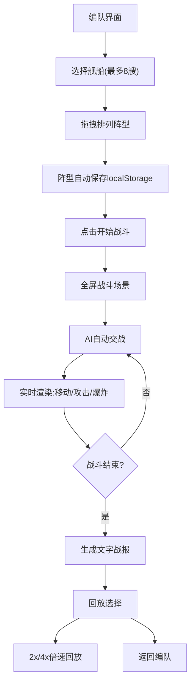

## 1. 产品概述

太空舰队实时对战游戏——一款基于 Canvas 2D 的策略对战网页游戏，解决传统策略手游中战斗过程缺乏视觉冲击和操作延迟高的问题。玩家通过编队配置舰队阵型，进入全屏实时战斗场景观看 AI 自动交战，战斗结束后可回放战报。

- **目标用户**：策略游戏爱好者、太空题材粉丝
- **核心价值**：提供沉浸式太空舰队对战视觉体验，零操作延迟的实时战斗演算

## 2. 核心功能

### 2.1 功能模块

1. **编队界面**：从5种舰船类型中选择最多8艘组成舰队，拖拽排列阵型，数据实时保存
2. **实时对战**：全屏战斗场景，双方舰队 AI 自动交战，独立血量/护盾，粒子特效和爆炸动画
3. **战报回放**：自动生成文字战报，时间轴回放关键帧，2x/4x 倍速播放

### 2.2 页面详情

| 页面名称 | 模块名称 | 功能描述 |
|----------|----------|----------|
| 编队界面 | 舰船选择面板 | 5种舰船类型卡片，点击添加到舰队（最多8艘） |
| 编队界面 | 阵型排列区域 | 网格背景拖拽排列舰船位置和朝向 |
| 编队界面 | 舰队信息面板 | 显示当前舰队组成和总战力 |
| 战斗场景 | 星空背景 | 动态星空粒子背景 |
| 战斗场景 | 己方舰队状态 | 左上角血量条列表（绿→红渐变） |
| 战斗场景 | 敌方舰队状态 | 右上角血量条列表 |
| 战斗场景 | 控制栏 | 底部中央暂停/倍速按钮 |
| 战报界面 | 文字战报 | 每艘舰船击毁时间、伤害、存活时长 |
| 战报界面 | 时间轴回放 | 关键帧标记，2x/4x倍速播放 |

## 3. 核心流程

玩家进入编队界面 → 从预设舰船中选择并排列阵型 → 阵型数据自动保存 → 点击"开始战斗" → 进入全屏战斗场景 → 双方舰队 AI 自动交战 → 实时渲染舰船移动/攻击/爆炸 → 战斗结束 → 生成文字战报 → 可选择回放战斗

## 4. 用户界面设计

### 4.1 设计风格

- **主色调**：深空蓝黑渐变背景（#0a0e27 → #1a1a3e），银白（#e0e8ff）文字，科技蓝（#00d4ff）高亮
- **面板风格**：半透明毛玻璃效果，rgba(10, 14, 39, 0.85) 配科技蓝边框
- **按钮风格**：圆角科技风，hover 发光效果
- **字体**：标题使用 Orbitron（科技感），正文使用 Rajdhani
- **布局风格**：编队界面右侧面板380px，战斗场景全屏 HUD 覆盖

### 4.2 页面设计概览

| 页面名称 | 模块名称 | UI元素 |
|----------|----------|--------|
| 编队界面 | 舰船选择面板 | 半透明面板，舰船图标带呼吸光晕，选中高亮边框 |
| 编队界面 | 阵型排列区域 | 网格背景，可拖拽舰船图标，朝向指示器 |
| 战斗场景 | 己方状态列表 | 左上角半透明面板，血量条绿→红渐变 |
| 战斗场景 | 敌方状态列表 | 右上角半透明面板，血量条绿→红渐变 |
| 战斗场景 | 控制栏 | 底部中央半透明条，暂停/倍速按钮 |
| 战报界面 | 战报面板 | 居中面板，滑入动画(300ms ease-out) |

### 4.3 响应式

- 桌面优先设计，支持 1920x1080 和 1440x900 分辨率
- Canvas 自适应窗口尺寸
- HUD 元素使用百分比定位

### 4.4 动效设计

- 所有弹窗/面板从边缘滑入过渡（300ms ease-out）
- 舰船图标呼吸光晕动画（opacity 0.6→1 循环）
- 选中舰船科技蓝高亮边框脉冲
- 炮口粒子特效（锥形扩散粒子流）
- 爆炸解体动画（碎片飞散+冲击波）
- 血量条颜色平滑渐变（绿→黄→红）
- requestAnimationFrame 驱动所有动画
