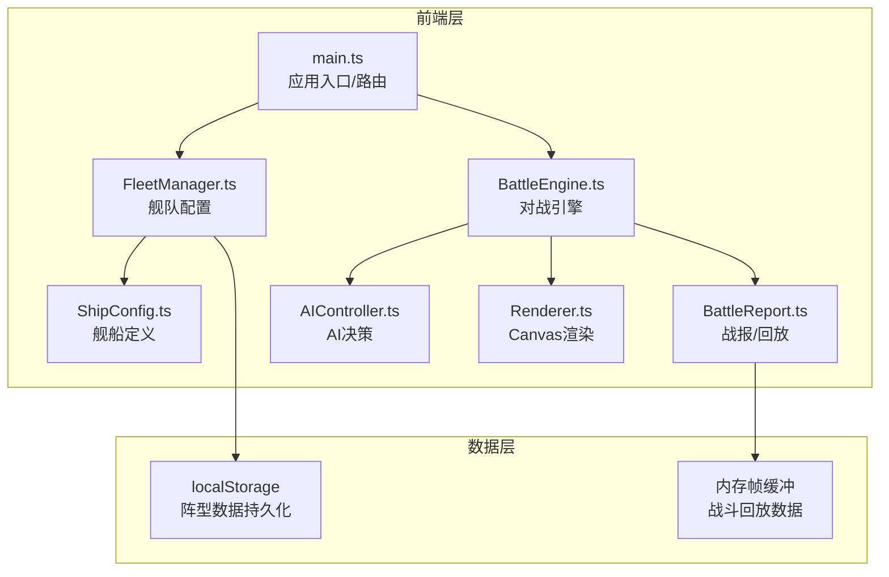
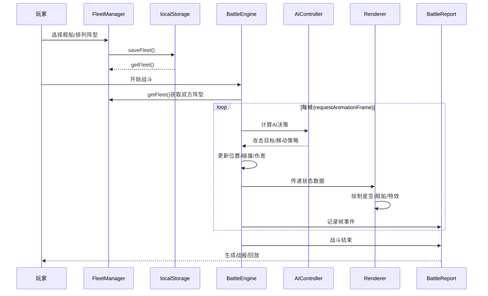

## 1. 架构设计



## 2. 技术说明

- **前端**：TypeScript + Canvas 2D + Vite（纯前端，无框架依赖）
- **构建工具**：Vite
- **运行时**：浏览器原生 Canvas 2D API
- **数据持久化**：localStorage（阵型配置）
- **动画驱动**：requestAnimationFrame
- **无后端**：纯客户端应用

## 3. 路由定义

| 路由状态 | 用途 |
|----------|------|
| fleet | 编队配置界面 |
| battle | 实时对战场景 |
| report | 战报回放界面 |

路由通过 main.ts 中的状态机管理，切换时销毁前一场景的 Canvas 渲染循环并初始化新场景。

## 4. 核心数据流



## 5. 文件结构

```
├── package.json
├── index.html
├── tsconfig.json
├── vite.config.js
└── src/
    ├── main.ts              # 应用入口，路由切换
    ├── fleet/
    │   ├── ShipConfig.ts    # 舰船类型枚举、属性接口、预设数据
    │   └── FleetManager.ts  # 舰队配置、阵型、持久化
    └── battle/
        ├── BattleEngine.ts  # 对战主循环
        ├── Renderer.ts      # Canvas渲染器
        ├── AIController.ts  # AI决策
        └── BattleReport.ts  # 战报生成和回放
```

## 6. 性能设计

- 战斗场景使用单个 Canvas 2D 上下文，避免多 Canvas 切换开销
- 粒子系统使用对象池，预分配粒子对象避免 GC
- 舰船状态每帧增量更新，仅传递变化数据给渲染器
- 目标：8艘舰船同时开火时维持 30+ FPS
- requestAnimationFrame 驱动，帧率自适应
