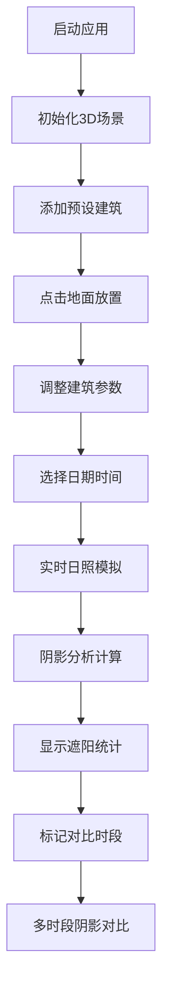

## 1. 产品概述

建筑日照与阴影分析3D应用是为建筑设计师和城市规划师打造的专业协作工具，提供交互式3D环境下的实时日照模拟和阴影投射分析功能。用户可快速放置和调整建筑模型，实时查看任意日期时间的日照方向、阴影范围和遮阳效果，辅助建筑设计决策。

## 2. 核心功能

### 2.1 用户角色

| 角色 | 注册方式 | 核心权限 |
|------|----------|----------|
| 建筑设计师 | 无需注册，本地应用 | 放置/编辑建筑模型、设置日照参数、查看阴影分析结果 |
| 城市规划师 | 无需注册，本地应用 | 多时段对比分析、导出分析结果 |

### 2.2 功能模块

1. **3D场景模块**：建筑模型管理、日照方向光、地面网格、天空背景
2. **日照模拟模块**：太阳位置计算、光照强度随时间变化
3. **阴影分析模块**：阴影投射计算、遮阳百分比统计、时段对比模式
4. **时间控制模块**：日期选择器、时间滑块、时段标记功能
5. **UI控制面板**：建筑操作面板、阴影统计面板、响应式布局

### 2.3 页面详情

| 页面名称 | 模块名称 | 功能描述 |
|----------|----------|----------|
| 主页面 | 3D视图区 | 全屏3D场景，支持旋转/缩放/平移，点击放置建筑，选中高亮 |
| 主页面 | 左侧建筑面板 | 添加预设建筑（办公楼/住宅楼/塔楼）、删除选中、调整高度和旋转 |
| 主页面 | 右侧分析面板 | 实时显示每栋建筑遮阳面积百分比统计 |
| 主页面 | 底部时间轴 | 日期选择、时间滑块（6:00-19:00）、时段标记按钮 |

## 3. 核心流程

用户进入应用 → 3D场景初始化 → 添加建筑模型（点击地面放置） → 调整建筑参数（位置/高度/旋转） → 选择日期和时间 → 实时查看日照方向和阴影 → 标记对比时段 → 查看多时段阴影对比 → 导出/保存分析结果

## 4. 用户界面设计

### 4.1 设计风格

- **主色调**：专业暗色主题，深灰到黑色渐变背景
- **强调色**：科技蓝 `#00D4FF`（建筑选中高亮）、蓝色 `#0088FF`（时段1阴影）、红色 `#FF4444`（时段2阴影）
- **字体**：使用现代无衬线字体，清晰专业
- **面板样式**：半透明毛玻璃效果（backdrop-filter: blur(10px)
- **动画效果**：建筑添加/删除300ms淡入淡出，时间轴滑块流畅更新，阴影轮廓100ms内刷新

### 4.2 页面设计概述

| 页面名称 | 模块名称 | UI元素 |
|----------|----------|--------|
| 主页面 | 3D视图区 | 全屏Three.js渲染，地面浅灰色网格线，建筑选中呼吸动画高亮边框 |
| 主页面 | 左侧建筑面板 | 宽度280px，毛玻璃效果，建筑类型按钮，参数滑块 |
| 主页面 | 右侧分析面板 | 建筑列表，遮阳百分比进度条，对比时段切换 |
| 主页面 | 底部时间轴 | 日期显示，时间滑块，时间标签，标记按钮 |

### 4.3 响应式

- **宽屏(>1920px)**：左右面板完全展开
- **中屏(1024-1920px)：面板正常显示
- **窄屏(<1024px)**：面板自动折叠为图标按钮，点击展开

### 4.4 3D场景指引

- **环境**：深灰到黑色渐变背景，浅灰色地面网格
- **光照**：DirectionalLight模拟太阳光，随太阳高度变化光照强度和色温
- **相机**：PerspectiveCamera，支持OrbitControls旋转缩放
- **交互**：Raycaster点击放置建筑，拖拽调整位置
- **阴影**：PCFSoftShadowMap，实时阴影渲染
- **性能**：最多8栋建筑，帧率≥30FPS，阴影计算≤500ms
