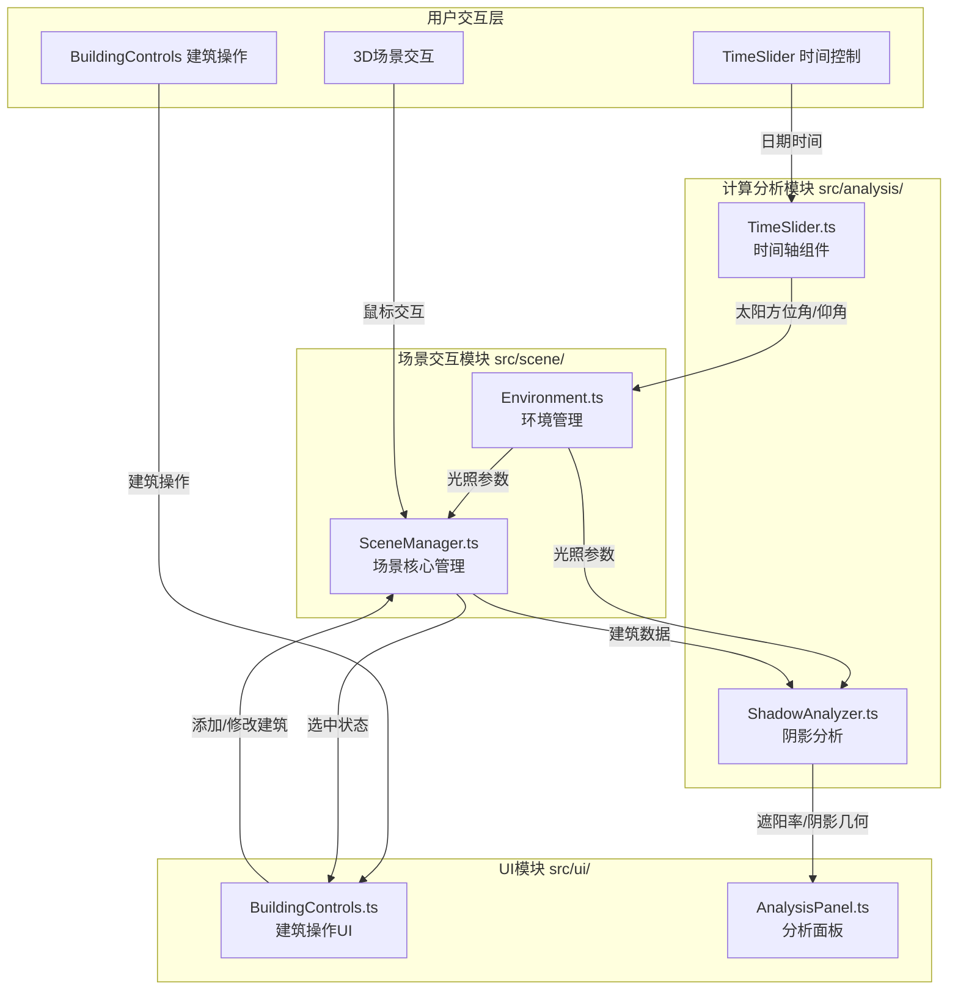

## 1. 架构设计



## 2. 技术描述

- **前端框架**：TypeScript 5.x + Vite 5.x
- **3D引擎**：Three.js r150+，含OrbitControls
- **UI组件**：dat.GUI 0.7.x（时间轴控制）
- **类型定义**：@types/three
- **初始化工具**：npm create vite@latest
- **后端**：无（纯前端应用）
- **数据库**：无（本地内存存储）

## 3. 文件结构定义

```
项目根目录/
├── package.json
├── vite.config.js
├── tsconfig.json
├── index.html
└── src/
    ├── main.ts                 # 应用入口
    ├── types.ts                # 全局类型定义
    ├── scene/                  # 场景交互模块
    │   ├── Environment.ts      # 环境管理（天空、地面、日照光）
    │   └── SceneManager.ts     # 场景核心（渲染器、相机、建筑管理）
    ├── analysis/               # 计算分析模块
    │   ├── ShadowAnalyzer.ts   # 阴影分析核心
    │   └── TimeSlider.ts       # 时间轴控制
    └── ui/                     # UI模块
        ├── BuildingControls.ts # 建筑操作面板
        └── AnalysisPanel.ts    # 阴影统计面板
```

## 4. 调用关系和数据流向

| 文件 | 输入来源 | 输出去向 | 核心数据 |
|------|----------|----------|----------|
| [Environment.ts](file:///e:/solo/SoloAutoDemo/tasks/auto16/src/scene/Environment.ts) | TimeSlider.ts(日期时间) | SceneManager, ShadowAnalyzer | sunPosition, lightIntensity, lightColor |
| [SceneManager.ts](file:///e:/solo/SoloAutoDemo/tasks/auto16/src/scene/SceneManager.ts) | BuildingControls.ts, 用户交互 | ShadowAnalyzer, UI | buildings[], selectedBuilding, camera |
| [ShadowAnalyzer.ts](file:///e:/solo/SoloAutoDemo/tasks/auto16/src/analysis/ShadowAnalyzer.ts) | SceneManager(建筑), Environment(光照) | AnalysisPanel | shadowRates[], shadowGeometries |
| [TimeSlider.ts](file:///e:/solo/SoloAutoDemo/tasks/auto16/src/analysis/TimeSlider.ts) | 用户操作(滑动) | Environment | date, hour, sunAzimuth, sunElevation |
| [BuildingControls.ts](file:///e:/solo/SoloAutoDemo/tasks/auto16/src/ui/BuildingControls.ts) | 用户操作(按钮/滑块) | SceneManager | buildingType, height, rotation |

## 5. 数据模型定义

### 5.1 核心接口

```typescript
// 建筑类型
export type BuildingType = 'office' | 'residential' | 'tower';

// 建筑数据
export interface BuildingData {
  id: string;
  type: BuildingType;
  position: { x: number; z: number };
  height: number;      // 10-200米
  rotation: number;    // 0-360度
  width: number;
  depth: number;
}

// 太阳位置
export interface SunPosition {
  azimuth: number;     // 方位角（度）
  elevation: number;   // 仰角（度）
}

// 光照参数
export interface LightParams {
  position: { x: number; y: number; z: number };
  intensity: number;
  color: number;
}

// 阴影分析结果
export interface ShadowResult {
  buildingId: string;
  shadowRate: number;  // 遮阳百分比 0-100
  shadowGeometry?: THREE.BufferGeometry;
}

// 标记时段
export interface MarkedTime {
  id: number;
  date: string;
  hour: number;
  color: string;
}
```

### 5.2 太阳位置计算算法

基于北纬39.9°（北京纬度），使用简化的太阳轨迹公式：

1. **计算赤纬角**：δ = 23.45° × sin(360° × (284 + N) / 365)
   - N为一年中的第几天
   
2. **计算时角**：H = 15° × (ST - 12)
   - ST为真太阳时
   
3. **计算太阳仰角**：sin(α) = sin(φ) × sin(δ) + cos(φ) × cos(δ) × cos(H)
   - φ = 39.9°（纬度）
   
4. **计算太阳方位角**：cos(A) = (sin(δ) × cos(φ) - cos(δ) × sin(φ) × cos(H)) / cos(α)

## 6. 性能优化策略

1. **阴影计算优化**：
   - 使用简化的射线检测替代高精度阴影贴图
   - 限制采样点密度（每栋建筑顶部采样100个点）
   - 对比模式下使用离屏渲染缓存

2. **渲染优化**：
   - 建筑网格合并（相同材质）
   - 阴影贴图尺寸限制在1024x1024
   - 使用Frustum Culling剔除不可见对象

3. **动画优化**：
   - 使用requestAnimationFrame批量更新
   - 建筑呼吸动画使用GPU实例化
   - 限制最大建筑数量为8栋

## 7. 核心算法伪代码

### 7.1 阴影率计算

```
function calculateShadowRate(building, allBuildings, sunDirection):
  samplePoints = generateGridPoints(building.topFace, 10x10)
  shadowedCount = 0
  
  for point in samplePoints:
    ray = Raycaster(point, sunDirection)
    intersections = ray.intersectObjects(allBuildings exclude building)
    if intersections.length > 0:
      shadowedCount++
  
  return (shadowedCount / samplePoints.length) * 100
```

### 7.2 阴影轮廓生成

```
function generateShadowContour(building, sunDirection):
  // 投影建筑顶点到地面平面(y=0)
  projectedVertices = []
  for vertex in building.vertices:
    rayDir = sunDirection.normalized()
    t = -vertex.y / rayDir.y
    projectedVertex = vertex + rayDir * t
    projectedVertices.push(projectedVertex)
  
  // 计算凸包生成轮廓
  contour = convexHull(projectedVertices)
  return createLineGeometry(contour)
```
