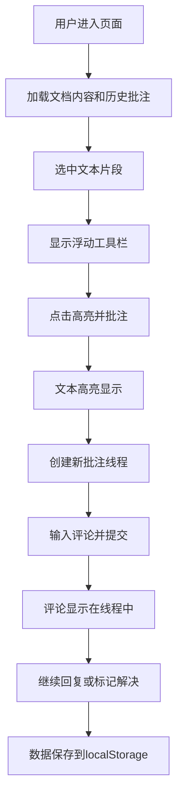

## 1. 产品概述

在线文档批注与协作应用，允许团队成员在文档内容上进行高亮标记、添加评论、回复讨论以及解决批注。
- 主要目的：提升团队文档协作效率，实现基于文本内容的精准讨论与反馈
- 目标用户：产品团队、研发团队、文档编写团队等需要协作审阅文档的群体
- 产品价值：将分散的讨论锚定到具体文本位置，减少沟通成本，追踪反馈进度

## 2. 核心功能

### 2.1 用户角色
本应用为单页前端应用，不涉及用户注册登录系统，使用本地存储保存数据。

### 2.2 功能模块
1. **文档阅读区**：富文本内容展示、文本选区识别、浮动工具栏、高亮渲染
2. **批注面板**：批注线程列表、状态筛选、展开/折叠、回复评论、解决/重开批注
3. **评论表单**：文本输入、提交评论
4. **数据持久化**：localStorage存储、页面刷新数据保留

### 2.3 页面详情
| 页面名称 | 模块名称 | 功能描述 |
|-----------|-------------|---------------------|
| 主页面 | 筛选栏 | 提供"全部"、"未解决"、"已解决"三个筛选按钮，切换时列表有淡入淡出动画 |
| 主页面 | 文档阅读区 | 渲染可滚动富文本内容，支持选中文本后弹出高亮按钮，高亮文本带黄色背景 |
| 主页面 | 批注面板 | 按批注ID分组显示所有评论线程，支持展开/折叠动画，显示高亮文本摘要、用户头像、时间、评论内容 |
| 主页面 | 评论表单 | 在每个批注线程下提供回复输入框和提交按钮 |

## 3. 核心流程

用户在文档区选中任意文本片段 → 选区上方弹出浮动工具栏（"高亮并批注"按钮）→ 点击按钮 → 文本高亮 → 右侧批注面板生成新批注线程（自动展开并聚焦评论表单）→ 用户输入评论并提交 → 评论显示在线程中。

其他用户（或同一用户）可在线程下继续回复评论，形成讨论链。批注完成后可点击"标记为已解决"，线程折叠且高亮变为浅绿色。已解决的批注可重新打开恢复。

## 4. 用户界面设计

### 4.1 设计风格
- **主色调**：蓝色 #007bff，悬停深蓝 #0056b3
- **辅助色**：高亮黄色 #fff3cd / #856404，已解决绿色 #d4edda
- **中性色**：文档背景 #f8f9fa，文字 #212529，面板背景 #ffffff，边框 #dee2e6
- **按钮风格**：圆角矩形，主色填充，悬停加深
- **字体**：系统默认无衬线字体，清晰可读
- **布局风格**：左右分栏布局（桌面），上下布局（移动端）
- **卡片风格**：5px圆角，2px阴影，悬停阴影加深

### 4.2 页面设计概述
| 页面名称 | 模块名称 | UI元素 |
|-----------|-------------|-------------|
| 主页面 | 筛选栏 | 三个切换按钮，当前选中状态高亮，切换时有淡入淡出动画 |
| 主页面 | 文档阅读区 | 左侧70%宽度，#f8f9fa背景，可滚动，选中文字上方弹出蓝色工具栏（缩放动画） |
| 主页面 | 批注面板 | 右侧30%宽度，白色背景，1px边框，顶部显示"批注（N）"标题 |
| 主页面 | 批注卡片 | 圆角5px，阴影2px，悬停加深；圆形头像显示首字母；黄色高亮文本标识；解决按钮为绿色带小勾图标 |
| 主页面 | 评论回复 | 时间正序排列，新回复从底部滑入动画 |
| 主页面 | 响应式 | < 768px 转为上下结构，各占100%宽度且可滚动 |

### 4.3 响应式
- Desktop-first设计，桌面端左右分栏（70%/30%）
- 宽度小于768px时转为上下堆叠布局，文档区和批注面板各占100%高度且独立滚动
- 触控设备优化：增大点击区域，确保按钮可点击性

### 4.4 动效设计
- 浮动工具栏出现：从选区位置弹出 + 轻微缩放（scale 0.9 → 1）
- 批注线程展开/折叠：平滑高度过渡
- 新评论出现：从底部滑入（translateY + opacity）
- 筛选切换：列表整体淡入淡出（opacity 0 → 1）
- 卡片悬停：阴影加深过渡
