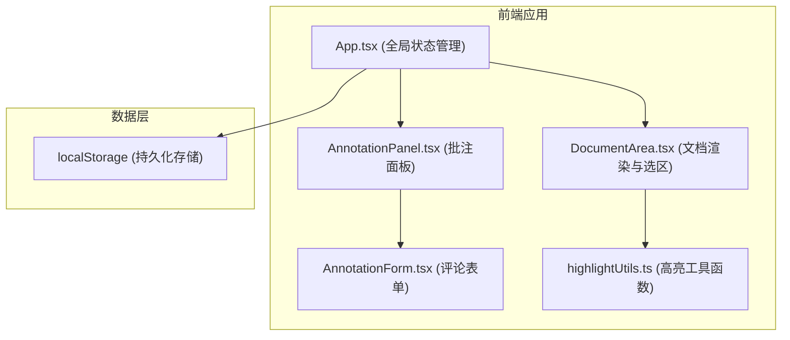

## 1. 架构设计



## 2. 技术描述
- **前端框架**：React 18 + TypeScript 5
- **构建工具**：Vite 5 + @vitejs/plugin-react
- **状态管理**：React useState + useReducer（App层集中管理）
- **工具库**：uuid（生成唯一ID）
- **样式方案**：内联CSS / CSS-in-JS（通过style属性和CSS动画实现）
- **数据存储**：浏览器localStorage

## 3. 文件结构

```
auto25/
├── package.json
├── index.html
├── vite.config.js
├── tsconfig.json
└── src/
    ├── App.tsx              # 主组件，全局状态管理，布局
    ├── DocumentArea.tsx     # 文档区组件，文本选择与高亮渲染
    ├── AnnotationPanel.tsx  # 批注面板，评论线程列表
    ├── AnnotationForm.tsx   # 评论表单组件
    └── highlightUtils.ts    # 高亮工具函数
```

## 4. 核心类型定义

```typescript
// 批注线程
interface Annotation {
  id: string;
  selectedText: string;       // 高亮的原文文本
  startOffset: number;        // 在文档中的起始偏移
  endOffset: number;          // 在文档中的结束偏移
  resolved: boolean;          // 是否已解决
  createdAt: number;          // 创建时间戳
  comments: Comment[];        // 评论列表
}

// 单条评论
interface Comment {
  id: string;
  author: string;             // 用户名（显示首字母头像）
  content: string;            // 评论内容
  createdAt: number;          // 创建时间戳
}

// 高亮坐标数据
interface HighlightCoords {
  top: number;
  left: number;
  width: number;
  height: number;
}

// 筛选状态
type FilterType = 'all' | 'unresolved' | 'resolved';
```

## 5. 工具函数模块 (highlightUtils.ts)

| 函数名 | 签名 | 功能描述 |
|--------|------|----------|
| `getSelectionRange` | `() => Range \| null` | 获取当前用户选中的文本Range对象 |
| `getSelectionCoords` | `(range: Range) => HighlightCoords` | 计算选区在视口中的坐标，用于定位浮动工具栏 |
| `highlightText` | `(container: HTMLElement, annotation: Annotation) => HTMLElement \| null` | 在容器中根据偏移量找到并高亮文本，返回创建的高亮span |
| `removeHighlight` | `(element: HTMLElement) => void` | 移除高亮元素，恢复原始文本 |
| `updateHighlightStyle` | `(element: HTMLElement, resolved: boolean) => void` | 根据resolved状态切换高亮样式（黄色/绿色） |

## 6. 数据流

1. **初始化**：App.tsx 从 localStorage 读取 annotations 数据，若不存在则初始化为空数组
2. **创建批注**：
   - DocumentArea 监听 mouseup 事件，检测文本选区
   - 调用 highlightUtils 获取选区坐标，显示浮动工具栏
   - 用户点击按钮，App 创建新 Annotation 对象（含空comments），写入 localStorage
   - DocumentArea 根据偏移量渲染高亮
3. **添加评论**：
   - AnnotationForm 提交新评论
   - App 将评论 push 到对应 Annotation 的 comments 数组，更新 localStorage
4. **解决/重开**：
   - 切换 Annotation.resolved 状态
   - highlightUtils 更新对应高亮元素的样式
5. **筛选**：
   - App 维护 filterType 状态
   - AnnotationPanel 根据 filterType 过滤并渲染列表
