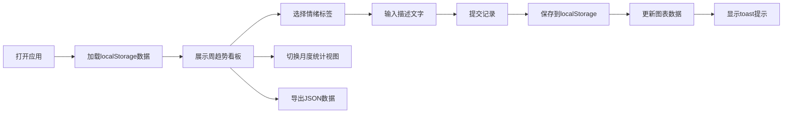

## 1. 产品概述

情绪日记是一款帮助用户记录和复盘日常情绪趋势的Web应用，解决手动记录情绪时缺乏结构化分析和可视化反馈的问题。通过直观的图表和数据可视化，帮助用户了解自己的情绪变化规律，提升情绪觉察能力。

- 目标用户：关注心理健康、希望记录和了解自身情绪变化的普通用户
- 市场价值：提供轻量级、无依赖的情绪追踪工具，数据本地化存储保护隐私

## 2. 核心功能

### 2.2 功能模块

1. **情绪记录模块**：添加多条情绪记录，选择情绪标签和输入描述
2. **周趋势看板模块**：展示最近7天情绪趋势折线图和每日主导情绪卡片
3. **月度统计模块**：热力图展示月度情绪分布
4. **数据导出模块**：将情绪数据导出为JSON文件

### 2.3 页面详情

| 页面名称 | 模块名称 | 功能描述 |
|-----------|-------------|---------------------|
| 主页面 | 情绪记录模块 | 选择情绪标签（开心、平静、悲伤、愤怒、焦虑），输入描述（≤50字），提交保存到localStorage，显示toast提示 |
| 主页面 | 周趋势看板 | 折线图展示最近7天情绪数值变化，emoji卡片展示每日主导情绪 |
| 主页面 | 月度统计 | 热力图表格展示月度情绪均值分布，可切换月份 |
| 主页面 | 数据导出 | 导出全部情绪数据为JSON文件 |

## 3. 核心流程

用户打开应用 → 查看历史情绪趋势（周/月视图）→ 点击情绪标签选择当前情绪 → 输入描述文字 → 提交记录 → 查看更新后的图表数据 → 可选择导出数据

## 4. 用户界面设计

### 4.1 设计风格

- **主色调**：紫色（#9c27b0）和绿色（#66bb6a）搭配
- **背景**：柔和的上下渐变，从#f7f0fc到#e8f5e9
- **按钮样式**：圆角矩形（border-radius: 12px），带轻微box-shadow
- **字体**：系统默认字体栈
- **图标风格**：使用emoji表示情绪类型
- **动画**：卡片入场淡入动画（从底部向上，0.4s），toast滑入滑出，标签选中弹跳动画

### 4.2 页面设计概述

| 页面名称 | 模块名称 | UI元素 |
|-----------|-------------|-------------|
| 主页面 | 情绪记录模块 | 5个情绪标签卡片（带选中高亮），文本输入框，提交按钮，toast提示 |
| 主页面 | 周趋势看板 | 左侧emoji卡片列表（7天），右侧Canvas折线图（数据点+tooltip） |
| 主页面 | 月度统计 | 热力图表格（周次×星期），月份切换按钮 |
| 主页面 | 数据导出 | 导出JSON按钮 |

### 4.3 响应性

- 桌面端（1920px）：三栏布局，各模块并排展示
- 移动端（375px）：单列布局，模块垂直堆叠
- 图表使用Canvas/SVG渲染，自适应容器宽度
- 触摸交互优化，确保移动端可操作性

### 4.4 性能要求

- 页面切换和图表渲染响应时间 ≤ 100ms
- localStorage读写操作 ≤ 10ms
- 动画流畅度 ≥ 60fps
