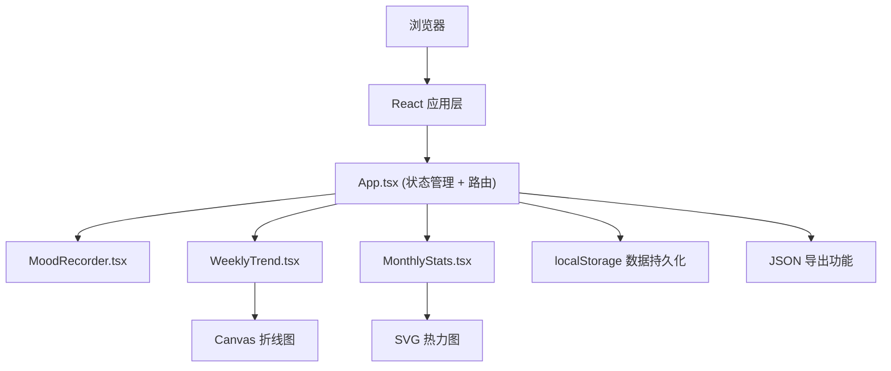
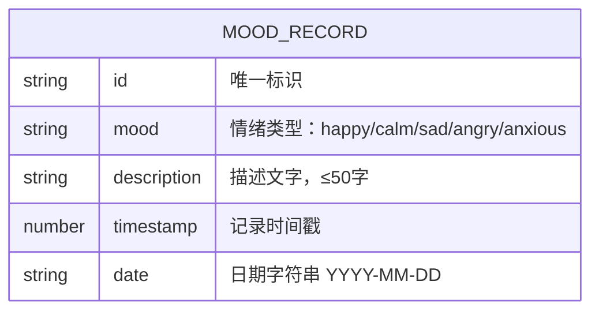

## 1. 架构设计



## 2. 技术描述

- **前端**：React 18 + TypeScript + Vite
- **状态管理**：React useReducer（全局状态）
- **图表渲染**：Canvas API（折线图）+ SVG（热力图）
- **数据存储**：localStorage（浏览器本地存储）
- **唯一标识**：uuid v4
- **构建工具**：Vite 5
- **CSS方案**：CSS Modules + 原生CSS动画
- **初始化工具**：vite-init

## 3. 核心文件结构

| 文件路径 | 用途 |
|-------|---------|
| `src/App.tsx` | 主组件，管理全局状态（useReducer），集成子组件，导出功能 |
| `src/MoodRecorder.tsx` | 情绪记录表单组件 |
| `src/WeeklyTrend.tsx` | 周趋势看板组件，Canvas折线图 |
| `src/MonthlyStats.tsx` | 月度统计热力图组件 |
| `src/types.ts` | TypeScript类型定义 |
| `src/utils/storage.ts` | localStorage操作工具 |
| `src/utils/export.ts` | JSON导出工具 |
| `src/index.css` | 全局样式和动画 |

## 4. 数据模型

### 4.1 数据模型定义



### 4.2 情绪映射表

| 情绪标签 | 数值 | Emoji |
|---------|------|-------|
| happy（开心） | 5 | 😊 |
| calm（平静） | 4 | 😌 |
| sad（悲伤） | 2 | 😢 |
| angry（愤怒） | 1 | 😠 |
| anxious（焦虑） | 3 | 😰 |

## 5. 核心配置

### 5.1 package.json 依赖

```json
{
  "dependencies": {
    "react": "^18.2.0",
    "react-dom": "^18.2.0",
    "uuid": "^9.0.0"
  },
  "devDependencies": {
    "@types/react": "^18.2.0",
    "@types/react-dom": "^18.2.0",
    "@types/uuid": "^9.0.0",
    "@vitejs/plugin-react": "^4.2.0",
    "typescript": "^5.3.0",
    "vite": "^5.0.0"
  }
}
```

### 5.2 tsconfig.json

```json
{
  "compilerOptions": {
    "target": "ES2020",
    "useDefineForClassFields": true,
    "lib": ["ES2020", "DOM", "DOM.Iterable"],
    "module": "ESNext",
    "skipLibCheck": true,
    "moduleResolution": "bundler",
    "allowImportingTsExtensions": true,
    "resolveJsonModule": true,
    "isolatedModules": true,
    "noEmit": true,
    "jsx": "react-jsx",
    "strict": true,
    "noUnusedLocals": true,
    "noUnusedParameters": true,
    "noFallthroughCasesInSwitch": true
  },
  "include": ["src"],
  "references": [{ "path": "./tsconfig.node.json" }]
}
```

### 5.3 vite.config.js

```javascript
import { defineConfig } from 'vite'
import react from '@vitejs/plugin-react'

export default defineConfig({
  plugins: [react()],
  server: {
    port: 3000
  }
})
```

## 6. 性能优化策略

1. **useReducer + useContext**：避免不必要的重渲染
2. **useMemo/useCallback**：缓存计算结果和回调函数
3. **requestAnimationFrame**：Canvas动画优化
4. **防抖处理**：图表resize事件
5. **localStorage缓存**：初始化时一次性读取，避免频繁IO
6. **组件懒渲染**：只渲染可视区域内的热力图格子
