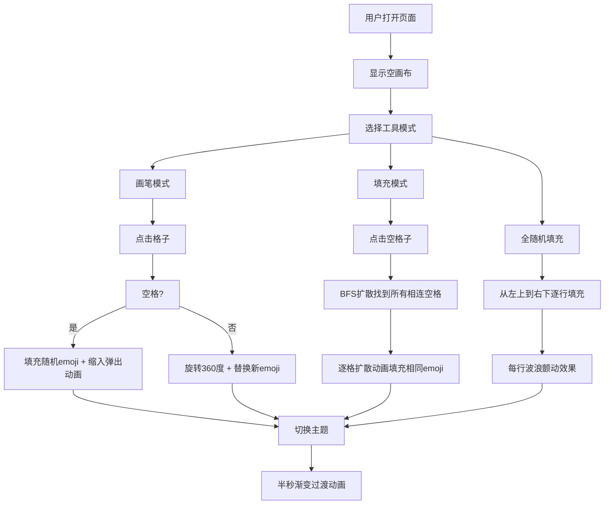

## 1. 产品概述

随机式Emoji像素画生成器是一款创意工具，让用户通过简单的点击操作，用随机排列的emoji组合出有趣的像素风格画作。产品面向所有喜欢创意和像素艺术的用户，提供轻松有趣的创作体验，支持保存和分享作品。

## 2. 核心功能

### 2.1 功能模块

1. **画布区域**: 20x20网格画布，emoji像素画创作主区域
2. **工具栏**: 画笔模式、填充模式、全随机填充
3. **主题切换**: 三套预设配色方案
4. **信息展示**: 底部信息栏显示状态信息

### 2.2 功能详情

| 功能模块 | 功能名称 | 功能描述 |
|---------|---------|---------|
| 画布区域 | 网格画布 | 20x20网格，每格可填充一个随机emoji |
| 画布区域 | 点击填充 | 点击空格填充随机emoji，带缩入弹出动画 |
| 画布区域 | 重新随机 | 再次点击已填充格子，旋转360度后替换新emoji |
| 工具栏 | 画笔模式 | 点击单格逐个填充 |
| 工具栏 | 填充模式 | 类似油漆桶，填充所有相连空格，逐格扩散动画 |
| 工具栏 | 全随机填充 | 所有空单元格从左上到右下逐行快速填充，每行波浪颤动效果 |
| 主题切换 | 赛博朋克 | 霓虹粉蓝配色（背景#0f0f23、边框#00fff5、emoji阴影#ff00ff） |
| 主题切换 | 复古像素 | 黄绿灰配色（背景#2b2b2b、边框#9bbc0f、emoji边框#306230） |
| 主题切换 | 草莓奶油 | 粉白配色（背景#fff5f5、边框#ff6b9d、emoji边框#c92a2a） |

## 3. 核心流程

## 4. 用户界面设计

### 4.1 设计风格

- **整体风格**: 毛玻璃质感卡片式布局，现代简约与创意趣味结合
- **主色调**: 随主题切换动态变化，三套预设方案
- **按钮样式**: 圆角按钮，悬停时向上位移2px，阴影加深
- **动画效果**: 丰富的微交互动画，流畅自然
- **布局方式**: 画布居中，左侧工具栏，底部信息栏

### 4.2 页面设计

| 页面区域 | 模块名称 | UI元素 |
|---------|---------|-------|
| 顶部 | 主题切换区 | 三个主题预览按钮，半秒渐变过渡 |
| 左侧 | 工具栏 | 画笔模式、填充模式、全随机填充按钮 |
| 中央 | 画布区域 | 20x20网格，emoji格子，动画效果 |
| 底部 | 信息栏 | 半透明背景，状态信息展示 |

### 4.3 响应式设计

- **桌面端**: 左侧垂直工具栏，画布居中
- **移动端 (≤420px)**: 工具栏折叠为顶部横向滚动条，画布自动缩放适应屏幕宽度
- **触摸优化**: 确保点击区域足够大，支持触摸操作

### 4.4 动效设计

- **格子填充**: 0.2倍缩入弹出动画
- **重新随机**: 360度旋转 + 新emoji弹出
- **填充模式**: 逐格扩散动画，每秒≥50格填充速率
- **全随机填充**: 逐行填充 + 波浪颤动效果
- **主题切换**: 0.5秒渐变过渡
- **按钮悬停**: translateY(-2px) + 阴影加深
- **毛玻璃效果**: backdrop-filter: blur(8px)
