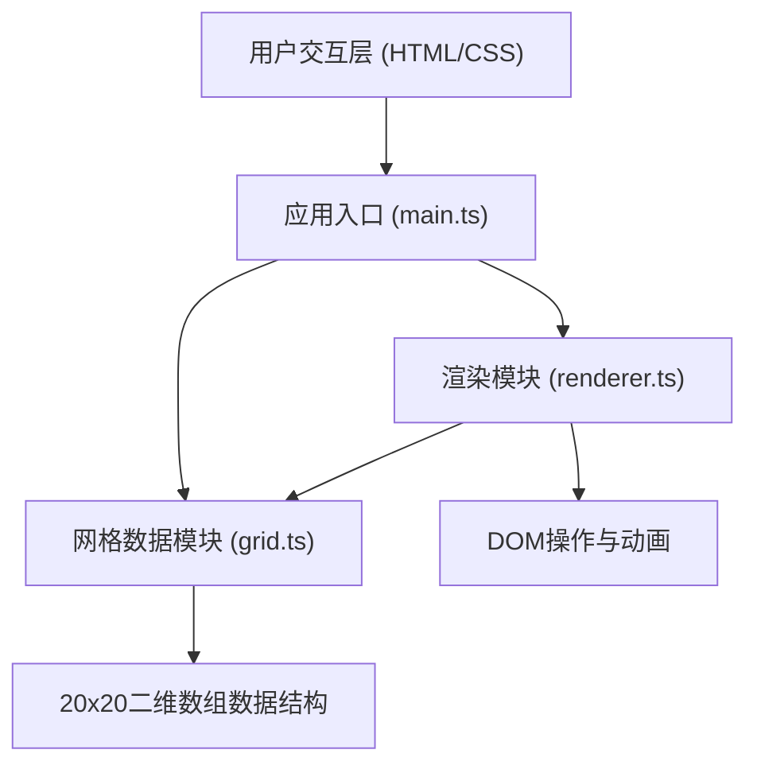

## 1. 架构设计



## 2. 技术选型

- **前端框架**: 原生 TypeScript (无框架)
- **构建工具**: Vite@5
- **编程语言**: TypeScript@5 (严格模式, ES2020)
- **样式方案**: 原生 CSS + CSS 变量 + CSS 动画
- **渲染方式**: DOM 元素网格 (HTML 表格/div 网格)

## 3. 文件结构

```
project-root/
├── index.html              # 入口页面
├── package.json            # 项目配置
├── tsconfig.json           # TypeScript 配置
├── vite.config.js          # Vite 配置
└── src/
    ├── main.ts             # 应用入口，事件绑定，渲染循环
    ├── grid.ts             # 网格数据管理模块
    └── renderer.ts         # 渲染模块
```

## 4. 模块职责

### 4.1 grid.ts - 网格数据管理模块

**核心职责**: 维护20x20二维数组数据，提供填充、随机化和扩散算法

**数据结构**:
```typescript
interface Cell {
  emoji: string | null;
  isAnimating: boolean;
}

type Grid = Cell[][];
```

**核心方法**:
- `createGrid(size: number): Grid` - 创建空网格
- `getCell(row: number, col: number): Cell` - 获取单元格
- `setCell(row: number, col: number, emoji: string): void` - 设置单元格
- `getRandomEmoji(): string` - 从50个预设emoji中随机选择
- `fillCellRandom(row: number, col: number): string` - 随机填充单个格子
- `getConnectedEmptyCells(startRow: number, startCol: number): {row: number, col: number}[]` - BFS算法获取相连空格
- `fillAllRandom(): {row: number, col: number, emoji: string}[][]` - 生成逐行填充数据

### 4.2 renderer.ts - 渲染模块

**核心职责**: 将网格数据渲染到DOM，处理动画和主题

**核心方法**:
- `createGridElement(size: number): HTMLElement` - 创建网格DOM元素
- `renderCell(row: number, col: number, emoji: string, animationType: string): void` - 渲染单个格子
- `applyTheme(theme: Theme): void` - 应用颜色主题
- `animateFill(row: number, col: number, emoji: string): Promise<void>` - 填充动画
- `animateRotateAndReplace(row: number, col: number, newEmoji: string): Promise<void>` - 旋转替换动画
- `animateFloodFill(cells: {row: number, col: number}[], emoji: string, speed: number): Promise<void>` - 洪水填充动画
- `animateRowByRowFill(rows: {row: number, col: number, emoji: string}[][], speed: number): Promise<void>` - 逐行填充动画

### 4.3 main.ts - 应用入口

**核心职责**: 初始化应用，绑定事件，驱动渲染循环

**功能**:
- 初始化网格和渲染器
- 绑定工具栏按钮事件
- 绑定画布点击事件
- 绑定主题切换事件
- 处理响应式布局

## 5. 性能优化策略

### 5.1 填充性能优化
- 使用 BFS 算法预计算所有需填充的格子
- 使用 requestAnimationFrame 分批渲染，每帧处理多格
- 填充速率不低于 50 格/秒
- 确保主线程卡顿不超过 100ms

### 5.2 动画优化
- 使用 CSS transform 和 opacity 属性触发 GPU 加速
- 避免 layout thrashing，批量 DOM 操作
- 使用 will-change 提示浏览器优化

### 5.3 内存优化
- 复用 DOM 元素，不频繁创建销毁
- 及时清理动画定时器
- 限制同时进行的动画数量

## 6. 主题系统

三套预设主题，使用 CSS 变量实现：

```typescript
interface Theme {
  name: string;
  backgroundColor: string;
  borderColor: string;
  emojiBorderColor: string;
  emojiShadowColor?: string;
}
```

| 主题名称 | 背景色 | 边框色 | emoji边框/阴影色 |
|---------|-------|-------|-----------------|
| 赛博朋克 | #0f0f23 | #00fff5 | #ff00ff |
| 复古像素 | #2b2b2b | #9bbc0f | #306230 |
| 草莓奶油 | #fff5f5 | #ff6b9d | #c92a2a |

## 7. 响应式设计

- **断点**: 420px
- **桌面端 (>420px)**: 左侧垂直工具栏 + 居中国画布
- **移动端 (≤420px)**: 顶部横向滚动工具栏 + 自适应画布

## 8. Emoji 列表

50个预设emoji，包含表情、动物和物品：

表情类(20): 😀😃😄😁😆😅🤣😂🙂🙃😉😊😇🥰😍🤩😘😗😚😙

动物类(15): 🐶🐱🐭🐹🐰🦊🐻🐼🐨🐯🦁🐮🐷🐸🐵

物品类(15): 🍎🍊🍋🍌🍉🍇🍓🍒🍑🥝🍅🥑🍆🥕🌽
