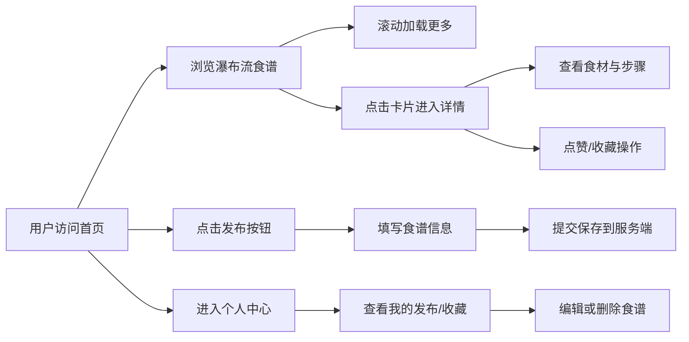

## 1. 产品概述

社区食谱分享平台是一个让美食爱好者分享私房菜谱、交流烹饪心得的在线社区。用户可以上传自己的原创菜谱，浏览和收藏他人的作品，在温馨的氛围中发现美食灵感。

- 核心目标：构建活跃的美食交流社区，降低私房菜分享门槛
- 目标用户：家庭主妇、烹饪爱好者、美食博主
- 产品价值：连接美食创作者与探索者，打造高质量的食谱内容生态

## 2. 核心功能

### 2.1 用户角色

| 角色 | 注册方式 | 核心权限 |
|------|----------|----------|
| 普通用户 | 无需注册（当前版本以访客模式体验所有功能） | 浏览食谱、发布食谱、收藏食谱、点赞食谱、编辑/删除自己发布的食谱 |

### 2.2 功能模块

1. **食谱探索页（首页）**：瀑布流食谱卡片展示、无限滚动加载、骨架屏加载效果
2. **食谱详情页**：完整食谱信息展示、步骤横向滑动切换、收藏/点赞交互
3. **食谱发布**：标题输入、食材清单、步骤描述、封面图片上传
4. **个人中心**：我的发布列表、我的收藏列表、编辑/删除操作

### 2.3 页面详情

| 页面名称 | 模块名称 | 功能描述 |
|----------|----------|----------|
| 食谱探索页 | 顶部导航栏 | Logo、发布按钮、个人中心入口 |
| 食谱探索页 | 瀑布流卡片列表 | 自适应多列瀑布流、卡片悬停动效、无限滚动 |
| 食谱探索页 | 加载骨架屏 | 渐变色骨架屏、加载过渡动画 |
| 食谱详情页 | 封面展示区 | 大图封面、食谱标题、作者信息 |
| 食谱详情页 | 食材清单 | 食材列表展示、用量标注 |
| 食谱详情页 | 步骤滑动区 | 横向步骤卡片、平滑滑动切换、进度指示 |
| 食谱详情页 | 操作栏 | 点赞按钮、收藏按钮、返回按钮 |
| 食谱发布页 | 表单区域 | 标题、食材（多行输入）、步骤（多行输入）、封面图上传 |
| 个人中心页 | Tab切换 | 我的发布 / 我的收藏 |
| 个人中心页 | 列表项 | 食谱缩略卡片、编辑/删除操作按钮 |

## 3. 核心流程

用户进入首页浏览瀑布流食谱卡片，滚动时自动加载更多内容。点击卡片进入详情页，可查看完整步骤、点赞和收藏。用户可通过发布按钮上传新食谱，在个人中心管理自己的发布和收藏。

## 4. 用户界面设计

### 4.1 设计风格

- **主色调**：米白色 `#FFF9F2`（背景）、橙红色 `#E85A2C`（品牌色/强调色）
- **辅助色**：焦糖橙 `#F5A623`、暖棕色 `#8B4513`、奶油白 `#FDF5E6`
- **按钮风格**：圆角胶囊形（16px），橙红渐变填充，悬停时轻微放大+阴影加深
- **字体方案**：标题使用 `'Noto Serif SC'`（衬线体，温馨有温度），正文使用 `'Noto Sans SC'`（无衬线体，清晰易读）
- **布局风格**：卡片式布局、柔和圆角（12-20px）、暖色系阴影
- **图标风格**：线性图标配合暖色调，烹饪相关emoji点缀

### 4.2 页面设计概览

| 页面名称 | 模块名称 | UI元素 |
|----------|----------|--------|
| 食谱探索页 | 顶部导航 | 固定顶部、磨砂玻璃效果、Logo居左、按钮居右 |
| 食谱探索页 | 瀑布流卡片 | 2-4列自适应、封面图圆角裁切、标题截断、点赞数徽章 |
| 食谱探索页 | 骨架屏 | 米白渐变脉冲动画、模拟卡片轮廓 |
| 食谱详情页 | 封面区 | 全屏宽度大图、底部渐变遮罩、文字叠加 |
| 食谱详情页 | 步骤卡片 | 横向排列、滑动指示器、步骤编号圆形徽章 |
| 食谱详情页 | 底部操作栏 | 固定底部、点赞/收藏图标按钮 |
| 个人中心页 | Tab切换 | 下划线动画切换、橙红色激活状态 |

### 4.3 响应式设计

- 桌面端（≥1024px）：瀑布流4列、侧边导航、详情页双栏布局
- 平板端（768-1023px）：瀑布流3列、顶部导航
- 移动端（<768px）：瀑布流2列、底部Tab栏、全宽详情页
- 触控优化：按钮最小尺寸44×44px、滑动手势支持
