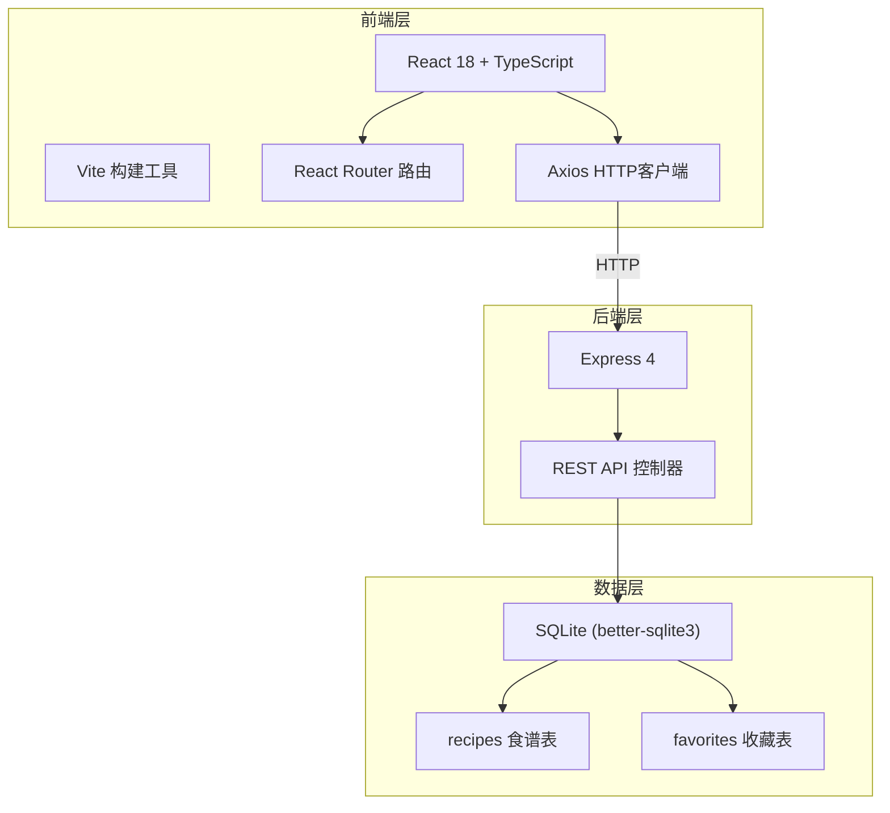
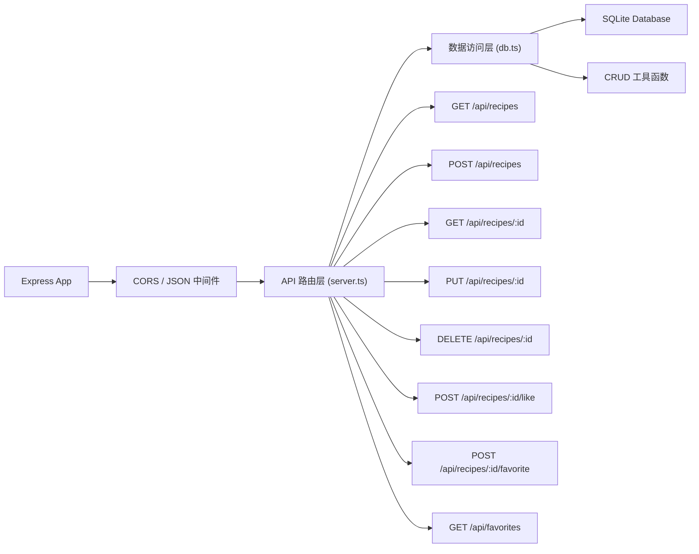
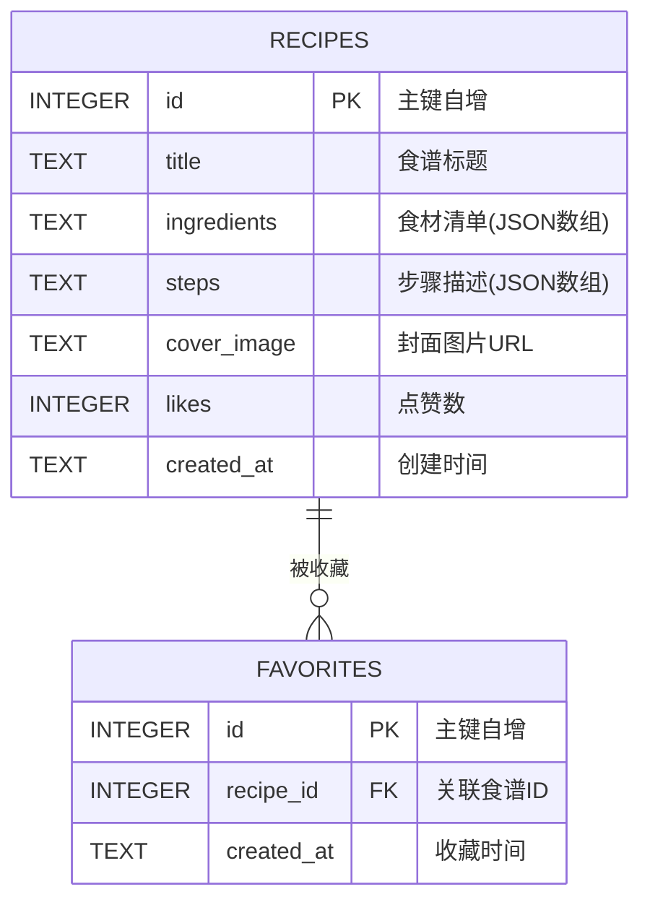

## 1. 架构设计



## 2. 技术描述

- **前端框架**：React 18 + TypeScript（严格模式）
- **构建工具**：Vite 5 + @vitejs/plugin-react
- **路由方案**：react-router-dom v6
- **HTTP客户端**：axios
- **后端框架**：Express 4
- **数据库**：SQLite（通过 better-sqlite3 驱动）
- **样式方案**：原生 CSS（CSS变量、CSS动画、响应式媒体查询）
- **开发模式**：Vite proxy 转发 API 请求到 Express 后端（3001端口）

## 3. 路由定义

| 路由路径 | 页面组件 | 用途 |
|----------|----------|------|
| `/` | RecipeList | 首页/食谱探索页，瀑布流展示 |
| `/recipe/:id` | RecipeDetail | 食谱详情页，展示完整内容与交互 |
| `/publish` | RecipePublish | 食谱发布页，表单提交 |
| `/profile` | Profile | 个人中心，我的发布与收藏 |

## 4. API 定义

### TypeScript 类型定义

```typescript
interface Recipe {
  id: number;
  title: string;
  ingredients: string[];
  steps: string[];
  coverImage: string;
  likes: number;
  createdAt: string;
  isFavorite?: boolean;
}

interface RecipeCreateDTO {
  title: string;
  ingredients: string[];
  steps: string[];
  coverImage: string;
}

interface RecipeUpdateDTO extends Partial<RecipeCreateDTO> {}
```

### REST API 接口

| 方法 | 路径 | 说明 | 请求体 | 响应 |
|------|------|------|--------|------|
| GET | `/api/recipes?page=1&limit=10` | 分页获取食谱列表 | - | `{ data: Recipe[], total: number }` |
| POST | `/api/recipes` | 创建新食谱 | `RecipeCreateDTO` | `Recipe` |
| GET | `/api/recipes/:id` | 获取单条食谱详情 | - | `Recipe` |
| PUT | `/api/recipes/:id` | 更新食谱 | `RecipeUpdateDTO` | `Recipe` |
| DELETE | `/api/recipes/:id` | 删除食谱 | - | `{ success: true }` |
| POST | `/api/recipes/:id/like` | 点赞食谱 | - | `{ likes: number }` |
| POST | `/api/recipes/:id/favorite` | 收藏/取消收藏 | `{ favorite: boolean }` | `{ isFavorite: boolean }` |
| GET | `/api/favorites` | 获取收藏列表 | - | `Recipe[]` |

## 5. 服务器架构图



## 6. 数据模型

### 6.1 数据模型 ER 图



### 6.2 DDL 语句

```sql
CREATE TABLE IF NOT EXISTS recipes (
  id INTEGER PRIMARY KEY AUTOINCREMENT,
  title TEXT NOT NULL,
  ingredients TEXT NOT NULL,
  steps TEXT NOT NULL,
  cover_image TEXT NOT NULL,
  likes INTEGER DEFAULT 0,
  created_at DATETIME DEFAULT CURRENT_TIMESTAMP
);

CREATE TABLE IF NOT EXISTS favorites (
  id INTEGER PRIMARY KEY AUTOINCREMENT,
  recipe_id INTEGER NOT NULL,
  created_at DATETIME DEFAULT CURRENT_TIMESTAMP,
  FOREIGN KEY (recipe_id) REFERENCES recipes(id) ON DELETE CASCADE,
  UNIQUE(recipe_id)
);

CREATE INDEX IF NOT EXISTS idx_recipes_created_at ON recipes(created_at DESC);
CREATE INDEX IF NOT EXISTS idx_favorites_recipe_id ON favorites(recipe_id);
```

### 6.3 初始种子数据

服务启动时自动插入 5-8 条示例食谱数据，包含真实的菜谱内容、食材、步骤和美食封面图，确保首次访问即可看到丰富内容。
