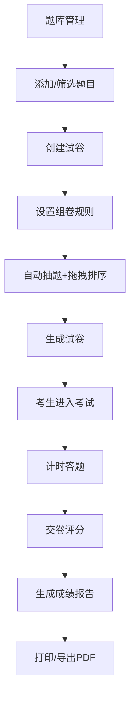

## 1. 产品概述

在线考试管理系统，帮助教育机构高效管理题库、智能组卷、实现在线考试与成绩分析，解决传统纸质考试出题效率低、试卷管理混乱的问题。

- **目标用户**：教育机构管理员、教师、考生
- **核心价值**：提升出题效率，实现试卷标准化管理，提供直观的成绩数据分析

## 2. 核心功能

### 2.1 用户角色

| 角色 | 注册方式 | 核心权限 |
|------|----------|----------|
| 管理员/教师 | 系统内置 | 题库管理、创建试卷、查看考试报告 |
| 考生 | 系统内置 | 参加在线考试、查看个人成绩报告 |

### 2.2 功能模块

1. **题库管理页面**：题目列表展示、多条件筛选、批量添加题目
2. **自动组卷页面**：设定组卷规则、随机抽题、拖拽调整题目顺序
3. **在线考试页面**：实时计时器、题目作答、交卷评分
4. **成绩报告页面**：成绩可视化、题型正确率分析、题目详情、打印/导出PDF

### 2.3 页面详情

| 页面名称 | 模块名称 | 功能描述 |
|-----------|-------------|---------------------|
| 题库管理页 | 题目列表 | 按题型/标签/难度筛选题目，筛选时有平滑渐隐渐现过渡 |
| 题库管理页 | 添加题目表单 | 支持单选/多选/判断题，可填写解析、选择难易度和标签 |
| 自动组卷页 | 组卷规则配置 | 设置各题型数量、难易度分布比例 |
| 自动组卷页 | 试卷题目列表 | 随机抽取结果展示，支持拖拽排序（缩放+阴影效果） |
| 在线考试页 | 计时器 | 左上角显示剩余时间，每分钟变色警示，最后30秒红色闪烁 |
| 在线考试页 | 答题交互 | 选项点击高亮动画，自动记录答题进度 |
| 在线考试页 | 自动评分 | 交卷后即时计算总分和各题型正确率 |
| 成绩报告页 | 成绩概览 | 总分展示，各题型正确率环形进度图（数字递增动画600ms） |
| 成绩报告页 | 答题详情 | 每题答题情况、正确答案与解析 |
| 成绩报告页 | 打印导出 | 支持浏览器打印功能导出PDF |

## 3. 核心流程

管理员/教师在题库中添加和管理题目，创建试卷时设定题型数量和难度分布，系统自动从题库随机抽取题目组成试卷；考生进入考试页面后系统开始计时，考生作答完成后交卷，系统自动评分并生成可视化成绩报告，支持打印或导出PDF。

## 4. 用户界面设计

### 4.1 设计风格

- **主色调**：#1565C0（深蓝）
- **背景色**：#F5F7FA（浅灰蓝）
- **辅助色**：白色卡片、#1976D2（悬停蓝）、#E53935（警示红）
- **卡片样式**：圆角8px，多层级阴影（0 2px 8px, 0 4px 16px）
- **按钮样式**：悬停变色，点击缩放 transform: scale(0.96)
- **字体**：系统无衬线字体，标题18-24px，正文14px
- **布局**：侧边栏导航（固定220px）+ 主内容区，响应式设计（最小宽度1024px）

### 4.2 页面设计概述

| 页面名称 | 模块名称 | UI元素 |
|-----------|-------------|-------------|
| 题库管理页 | 筛选栏 | 下拉选择器（题型/标签/难度），平滑过渡动画 |
| 题库管理页 | 题目卡片 | 卡片式布局，显示题型标签、难度星级、题目内容 |
| 自动组卷页 | 规则配置区 | 数字输入框、比例滑块、确认按钮 |
| 自动组卷页 | 拖拽排序列表 | 拖拽时缩放+阴影，占位符提示 |
| 在线考试页 | 计时器 | 左上角固定位置，动态颜色变化，最后30秒闪烁 |
| 在线考试页 | 题目卡片 | 选项按钮悬停高亮，选中态动画 |
| 成绩报告页 | 环形进度图 | 从0递增到目标值（600ms ease-out） |
| 成绩报告页 | 数字动画 | 数值从0滚动到实际值 |
| 全局 | 侧边栏导航 | 固定宽度220px，选中项左侧边框动画指示 |

### 4.3 响应式设计

- **设计原则**：桌面端优先，适配平板
- **最小宽度**：1024px
- **断点适配**：1024px及以上正常显示，侧边栏始终可见
- **触控优化**：按钮和可点击区域最小高度44px，确保触控友好

### 4.4 动效设计

- **页面切换**：渐隐渐现 300ms ease-out
- **筛选过渡**：列表项 opacity 0→1，translateY 10px→0，延迟递增
- **拖拽效果**：dragging 时 scale(1.02) + box-shadow 加深
- **按钮交互**：hover 背景色过渡 200ms，active scale(0.96) 100ms
- **数据加载**：环形图数值从0递增 600ms ease-out，数字同步滚动
- **计时警示**：每分钟颜色渐变，最后30秒 pulse 闪烁动画
- **选项选中**：背景色+边框色过渡，scale 轻微放大回弹
