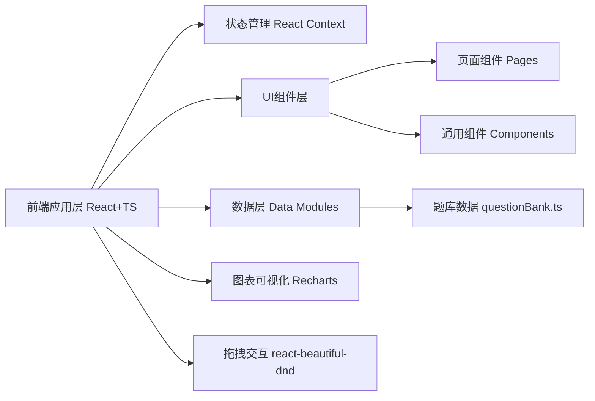

## 1. 架构设计



## 2. 技术描述

- **前端框架**：React 18 + TypeScript
- **构建工具**：Vite 5.x
- **Vite 插件**：@vitejs/plugin-react
- **样式方案**：CSS Modules / 全局 CSS 变量
- **状态管理**：React Context + useState/useReducer（轻量级，无需额外库）
- **拖拽功能**：react-beautiful-dnd
- **图表可视化**：Recharts
- **后端**：无，使用 Mock 数据模块
- **数据持久化**：localStorage（可选，用于保存考试进度）

## 3. 路由定义

| 路由路径 | 页面组件 | 功能用途 |
|----------|----------|----------|
| `/` | QuestionBankPage | 题库管理页面，默认首页 |
| `/question-bank` | QuestionBankPage | 题库管理：题目列表、筛选、添加 |
| `/create-paper` | CreatePaperPage | 自动组卷：规则配置、随机抽题、拖拽排序 |
| `/exam` | ExamPage | 在线考试：计时答题、自动评分 |
| `/report` | ReportPage | 成绩报告：可视化图表、答题详情、打印导出 |

## 4. 数据模型

### 4.1 类型定义

```typescript
type QuestionType = 'single' | 'multiple' | 'judge';
type Difficulty = 'easy' | 'medium' | 'hard';

interface Question {
  id: string;
  type: QuestionType;
  content: string;
  options?: string[];
  answer: string | string[];
  analysis: string;
  difficulty: Difficulty;
  tags: string[];
  score: number;
}

interface ExamRule {
  singleCount: number;
  multipleCount: number;
  judgeCount: number;
  easyRatio: number;
  mediumRatio: number;
  hardRatio: number;
}

interface UserAnswer {
  questionId: string;
  answer: string | string[];
  isCorrect: boolean;
}

interface ExamResult {
  totalScore: number;
  maxScore: number;
  correctCount: number;
  totalCount: number;
  typeStats: {
    single: { correct: number; total: number; accuracy: number };
    multiple: { correct: number; total: number; accuracy: number };
    judge: { correct: number; total: number; accuracy: number };
  };
  answers: UserAnswer[];
  questions: Question[];
}
```

### 4.2 数据模块函数

```typescript
// src/data/questionBank.ts
export function getAllQuestions(): Question[]
export function filterQuestions(params: {
  type?: QuestionType;
  difficulty?: Difficulty;
  tag?: string;
}): Question[]
export function getRandomQuestions(count: number, type?: QuestionType, difficulty?: Difficulty): Question[]
export function generatePaper(rule: ExamRule): Question[]
export function addQuestion(question: Omit<Question, 'id'>): Question
export function calculateScore(questions: Question[], answers: UserAnswer[]): ExamResult
```

## 5. 项目文件结构

```
e:\solo\SoloAutoDemo\tasks\auto35\
├── package.json
├── index.html
├── tsconfig.json
├── vite.config.js
└── src/
    ├── App.tsx              # 主组件：路由、全局状态、侧边栏布局
    ├── index.css            # 全局样式：CSS变量、主题、动画
    ├── main.tsx             # 入口文件
    ├── data/
    │   └── questionBank.ts  # 题库数据模块
    ├── pages/
    │   ├── QuestionBankPage.tsx  # 题库管理页面
    │   ├── CreatePaperPage.tsx   # 自动组卷页面
    │   ├── ExamPage.tsx          # 在线考试页面
    │   └── ReportPage.tsx        # 成绩报告页面
    └── components/
        ├── Sidebar.tsx           # 侧边栏导航
        ├── QuestionCard.tsx      # 题目卡片组件
        ├── Timer.tsx             # 计时器组件
        ├── ProgressRing.tsx      # 环形进度图
        └── AnimatedNumber.tsx    # 数字递增动画
```

## 6. 性能优化策略

- **列表渲染优化**：对题目列表使用合理的 key，避免不必要的重渲染
- **筛选性能**：筛选逻辑使用记忆化（useMemo），确保500ms内响应
- **试卷加载**：50道题渲染控制在1.5秒内，组件拆分合理，避免嵌套过深
- **动画性能**：优先使用 CSS transform 和 opacity 动画，避免 layout thrashing
- **图表渲染**：Recharts 图表数据使用 useMemo 缓存，动画使用 CSS transition
