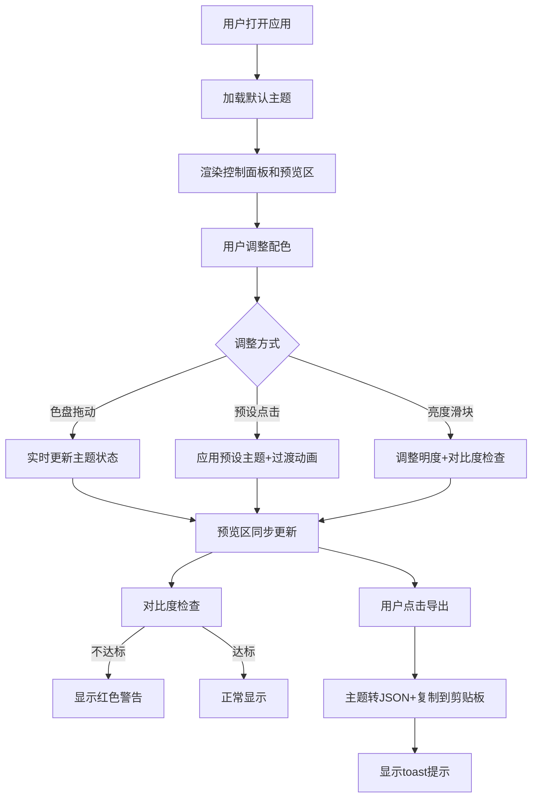

## 1. 产品概述

实时配色方案编辑器，帮助设计团队快速生成和预览不同配色方案对网页排版的影响，避免手动修改CSS的低效流程。

- **核心价值**：通过可视化的实时预览，让设计师能够直观地调整和验证配色方案，大幅提升配色决策效率
- **目标用户**：UI设计师、前端开发人员、设计团队

## 2. 核心功能

### 2.1 用户角色

| 角色 | 注册方式 | 核心权限 |
|------|----------|----------|
| 设计用户 | 无需注册 | 使用所有配色编辑、预览和导出功能 |

### 2.2 功能模块

1. **主页面**：左侧控制面板 + 右侧预览区的双栏布局
2. **配色编辑模块**：色盘调节、预设主题、亮度控制
3. **实时预览模块**：多组件样式同步预览
4. **主题导出模块**：JSON配置导出

### 2.3 页面详情

| 页面名称 | 模块名称 | 功能描述 |
|---------|----------|----------|
| 主页面 | 色盘调节区 | 三个圆形色盘分别调节主色、辅色、背景色，拖动时实时更新预览 |
| 主页面 | 预设主题区 | 6套预设主题缩略图，点击应用主题并播放平滑过渡动画 |
| 主页面 | 亮度控制区 | 滑块调节整体亮度(-30~+30)，自动确保对比度≥4.5:1 |
| 主页面 | 导出功能区 | 导出按钮将主题转为JSON并复制到剪贴板，显示toast提示 |
| 主页面 | 组件预览区 | 按钮、卡片、输入框、导航栏四个示例组件，实时响应配色变化 |

## 3. 核心流程

用户打开应用 → 查看默认主题的预览效果 → 通过色盘/预设/亮度滑块调整配色 → 实时观察预览区组件变化 → 满意后点击导出按钮 → 主题JSON自动复制到剪贴板 → 显示"已复制"提示

## 4. 用户界面设计

### 4.1 设计风格

- **布局**：双栏布局，左侧25%（最小240px）控制面板，右侧75%预览区
- **视觉风格**：卡片式分组设计，浅灰色圆角边框带阴影，卡片间距16px
- **色盘设计**：圆形滑块（直径40px），当前颜色填充，外围半透明轨道环
- **预设缩略图**：6个75px×75px方形，显示主辅背景三色渐变，悬停放大1.1倍+上浮阴影
- **过渡动画**：主题切换时颜色和圆角0.3秒ease-in-out平滑过渡
- **字体**：系统字体，文字大小14-16px
- **交互反馈**：悬停、点击、选中都有颜色微变和阴影变化

### 4.2 页面设计概览

| 页面名称 | 模块名称 | UI元素 |
|---------|----------|--------|
| 主页面 | 控制面板 | 卡片式分组、圆形色盘、预设缩略图网格、亮度滑块、导出按钮、警告文字 |
| 主页面 | 预览区 | 动态背景色、按钮组件、卡片组件、输入框组件、导航栏组件、24px垂直间距 |

### 4.3 响应式

- 桌面端优先设计
- 控制面板最小宽度240px，占比25%
- 预览区自适应剩余宽度
- 色盘和预设按钮在小屏幕下保持可点击区域

### 4.4 性能约束

- 色盘拖动时预览更新延迟≤100ms
- 重绘频率≥30帧/秒
- 主题导出剪贴板写入≤100ms
