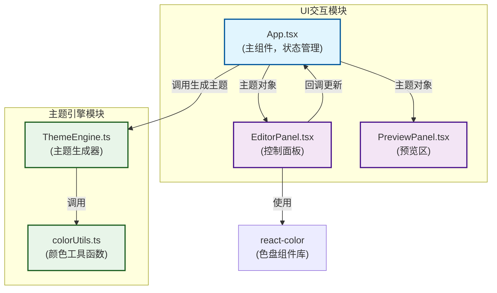

## 1. 架构设计



**数据流向说明**：
1. `App.tsx` 维护当前主题状态，调用 `ThemeEngine.generateTheme()` 生成完整主题对象
2. `ThemeEngine.ts` 调用 `colorUtils.ts` 中的纯函数进行颜色计算
3. `App.tsx` 将主题对象传递给 `EditorPanel.tsx` 和 `PreviewPanel.tsx`
4. `EditorPanel.tsx` 接收用户操作（色盘、预设、滑块），通过回调更新 `App.tsx` 中的状态
5. `PreviewPanel.tsx` 根据传入的主题对象动态应用样式到示例组件

## 2. 技术描述

- **前端框架**：React@18.2.0 + ReactDOM@18.2.0
- **构建工具**：Vite@5.0.8
- **开发语言**：TypeScript@5.3.3
- **React插件**：@vitejs/plugin-react@4.2.1
- **色盘组件**：react-color@2.19.3
- **状态管理**：React useState (本地状态，无需全局状态管理)
- **样式方案**：内联样式 + CSS变量（动态主题切换）

## 3. 目录结构与文件定义

```
auto38/
├── package.json              # 项目依赖和脚本配置
├── index.html                # 入口HTML页面
├── vite.config.js            # Vite构建配置
├── tsconfig.json             # TypeScript配置
└── src/
    ├── App.tsx               # 主组件，布局和状态管理
    ├── main.tsx              # React入口文件
    ├── components/
    │   ├── EditorPanel.tsx   # 控制面板组件
    │   └── PreviewPanel.tsx  # 预览区组件
    └── theme/
        ├── ThemeEngine.ts    # 主题引擎模块
        └── colorUtils.ts     # 颜色工具模块
```

### 文件职责说明

| 文件 | 职责 | 调用关系 |
|------|------|----------|
| [colorUtils.ts](file:///e:/solo/SoloAutoDemo/tasks/auto38/src/theme/colorUtils.ts) | 提供十六进制转RGB、亮度计算、对比度调整等纯函数 | 被ThemeEngine调用 |
| [ThemeEngine.ts](file:///e:/solo/SoloAutoDemo/tasks/auto38/src/theme/ThemeEngine.ts) | 接收主色和辅色，自动计算渐变、阴影、对比色和圆角值，生成完整主题对象 | 调用colorUtils，被App.tsx调用 |
| [EditorPanel.tsx](file:///e:/solo/SoloAutoDemo/tasks/auto38/src/components/EditorPanel.tsx) | 控制面板，包含色盘、预设主题按钮和亮度滑块，用户调整后通过回调更新主题状态 | 使用react-color，被App.tsx调用 |
| [PreviewPanel.tsx](file:///e:/solo/SoloAutoDemo/tasks/auto38/src/components/PreviewPanel.tsx) | 预览区，渲染按钮、卡片、输入框、导航栏，根据主题对象动态应用样式 | 被App.tsx调用 |
| [App.tsx](file:///e:/solo/SoloAutoDemo/tasks/auto38/src/App.tsx) | 主组件，双栏布局，管理主题状态，传递给子组件 | 调用ThemeEngine，渲染EditorPanel和PreviewPanel |

## 4. 数据类型定义

### Theme 主题对象类型

```typescript
interface Theme {
  primary: string;
  secondary: string;
  background: string;
  primaryLight: string;
  primaryDark: string;
  secondaryLight: string;
  secondaryDark: string;
  textPrimary: string;
  textSecondary: string;
  textOnPrimary: string;
  textOnSecondary: string;
  borderColor: string;
  shadowColor: string;
  gradientPrimary: string;
  gradientSecondary: string;
  borderRadius: string;
  shadow: string;
  cssVars: Record<string, string>;
}

interface PresetTheme {
  name: string;
  primary: string;
  secondary: string;
  background: string;
}
```

## 5. 核心功能实现要点

### 5.1 实时颜色更新机制
- 使用React `useState` 管理主题状态
- 色盘的 `onChange` 事件直接更新状态，触发重渲染
- 所有预览组件使用CSS变量或内联样式绑定主题值

### 5.2 对比度计算（WCAG AA标准）
- 实现相对亮度计算公式：`L = 0.2126 * R + 0.7152 * G + 0.0722 * B`
- 对比度公式：`(L1 + 0.05) / (L2 + 0.05)`，其中L1为较亮色的亮度
- 当对比度 < 4.5:1时，自动调整文字颜色或背景色

### 5.3 主题导出功能
- 使用 `JSON.stringify(theme, null, 2)` 格式化JSON
- 使用 `navigator.clipboard.writeText()` 写入剪贴板
- Toast提示使用CSS动画实现2秒自动消失

### 5.4 性能优化
- 使用 `React.memo` 包裹子组件避免不必要重渲染
- 色盘拖动时使用 `requestAnimationFrame` 确保流畅
- 颜色计算函数使用缓存避免重复计算

## 6. 预设主题配置

| 主题名称 | 主色 | 辅色 | 背景色 |
|---------|------|------|--------|
| 海洋蓝 | #1E88E5 | #42A5F5 | #E3F2FD |
| 森林绿 | #43A047 | #66BB6A | #E8F5E9 |
| 日落橙 | #FB8C00 | #FFA726 | #FFF3E0 |
| 暗夜紫 | #7B1FA2 | #AB47BC | #F3E5F5 |
| 樱花粉 | #EC407A | #F06292 | #FCE4EC |
| 极简灰 | #616161 | #9E9E9E | #FAFAFA |
