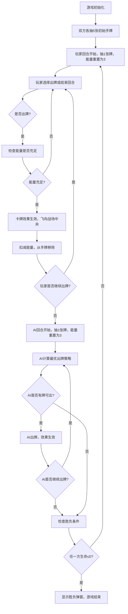

## 1. 产品概述

基于回合制的卡牌对战游戏应用，玩家通过出牌与AI进行策略较量。采用能量系统、护甲机制和多类型卡牌构建策略深度，通过Canvas API实现流畅的动画特效和科幻视觉风格。

- 核心目的：提供易上手、有策略深度的单人卡牌对战体验
- 目标用户：喜欢卡牌策略类游戏的休闲玩家

## 2. 核心功能

### 2.1 功能模块
1. **对战主界面**：AI区域、战场区、玩家手牌区、回合信息、能量条
2. **回合系统**：回合切换、抽牌、出牌、结束回合、胜负判定
3. **卡牌系统**：攻击牌、防御牌、治疗牌三种类型，能量消耗机制
4. **AI对战**：智能AI根据场上局势计算最优出牌策略
5. **动画系统**：出牌飞行动画、受击闪烁、回合切换过渡、胜负弹窗

### 2.2 页面详情
| 页面名称 | 模块名称 | 功能描述 |
|---------|---------|---------|
| 对战主界面 | AI信息区 | 显示AI头像、生命值、护甲值、手牌数量 |
| 对战主界面 | 战场区 | 展示出牌动画、当前回合出牌效果、光效粒子 |
| 对战主界面 | 玩家信息区 | 显示玩家头像、生命值、护甲值 |
| 对战主界面 | 手牌区 | 横向排列卡牌，支持悬停放大、点击出牌、能量不足置灰 |
| 对战主界面 | 信息栏 | 左上角回合数、右上角能量条、结束回合按钮 |
| 对战主界面 | 胜负弹窗 | 游戏结束时显示胜利/失败动画和重新开始按钮 |

## 3. 核心流程

## 4. 用户界面设计

### 4.1 设计风格
- **主色调**：深灰背景 #1a1a2e，科幻感色调
- **卡牌色系**：攻击牌红色系 #e94560 → #ff6b6b、防御牌蓝色系 #0f3460 → #4a9eff、治疗牌绿色系 #2d6a4f → #52b788
- **强调色**：金色能量条 #ffd700、青色科技光效 #00d9ff
- **字体**：使用 Orbitron（科幻风标题）配合 Rajdhani（数字和正文）
- **卡片样式**：半透明圆角卡片（backdrop-filter: blur），带发光边框
- **布局风格**：上中下三栏结构，顶部AI区、中部战场、底部手牌区

### 4.2 页面设计概述
| 页面名称 | 模块名称 | UI元素 |
|---------|---------|--------|
| 对战主界面 | AI信息区 | 圆形头像（带发光边框）、生命值血条、护甲图标数值、手牌背面图标 |
| 对战主界面 | 战场区 | 深色渐变背景、粒子光效、出牌飞行轨迹、卡牌展示位、伤害/治疗数字飘字 |
| 对战主界面 | 玩家信息区 | 圆形头像、生命值血条、护甲值、角色标识 |
| 对战主界面 | 手牌区 | 横向扇形排列卡牌、悬停放大上移动画、能量不足卡牌变暗、点击按压效果 |
| 对战主界面 | 信息栏 | 回合数标签（科幻边框）、能量条（发光进度条）、结束回合按钮（脉冲光效） |
| 对战主界面 | 回合过渡 | 屏幕中央"你的回合"/"AI回合"文字淡入淡出、扫描线动画 |
| 对战主界面 | 胜负弹窗 | 半透明遮罩、胜利/失败文字发光动画、粒子特效、重新开始按钮 |

### 4.3 响应式设计
- 桌面优先设计，基准分辨率 1440x900
- 适配 1024x768 及以上分辨率
- 使用 vw/vh 单位和 rem 相对单位实现自适应
- 卡牌尺寸和间距根据视口宽度动态计算
- 能量条、按钮等交互元素最小尺寸确保可点击性
- 文字大小使用 clamp() 函数设置上下限

### 4.4 动画特效
- **出牌动画**：卡牌从手牌位置沿贝塞尔曲线飞向战场中央，缩放+旋转+透明度渐变
- **受击特效**：目标头像红色闪烁 + 震动 + 伤害数字上升飘字
- **治疗特效**：目标头像绿色光环 + 治疗数字上升飘字
- **防御特效**：蓝色护盾环绕 + 护甲数值变化动画
- **回合切换**：全屏扫描线 + 中央文字淡入淡出 + 界面分区颜色微光
- **胜负动画**：confetti粒子爆炸 + 文字发光脉冲 + 弹窗弹性缩放
