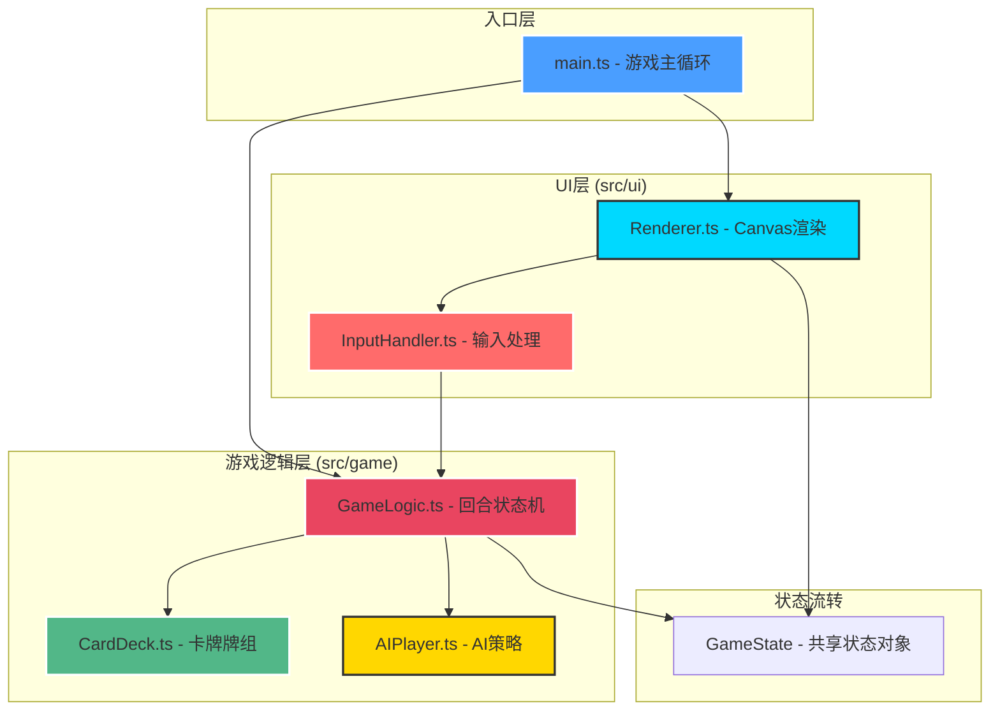

## 1. 架构设计



## 2. 技术描述

- **开发语言**：TypeScript 5.x（严格模式 strict: true）
- **构建工具**：Vite 5.x（ES 模块，热更新开发服务器）
- **渲染引擎**：HTML5 Canvas 2D API（纯原生，无第三方渲染库）
- **模块化**：ES Module 按功能分层架构
- **无后端**：纯前端应用，游戏状态内存管理，无持久化存储
- **字体方案**：Google Fonts (Orbitron + Rajdhani) 通过 CSS @import 加载

## 3. 目录结构

```
e:\solo\SoloAutoDemo\tasks\auto4\
├── package.json              # 项目依赖和脚本
├── index.html                # 入口HTML，Canvas挂载点
├── tsconfig.json             # TypeScript严格模式配置
├── vite.config.js            # Vite默认配置
└── src/
    ├── main.ts               # 游戏主循环入口，初始化各模块
    ├── types/
    │   └── game.ts           # 全局类型定义（Card, Player, GameState等）
    ├── game/
    │   ├── GameLogic.ts      # 回合逻辑/状态机/胜负判定
    │   ├── CardDeck.ts       # 卡牌生成/洗牌/抽牌/弃牌
    │   └── AIPlayer.ts       # AI出牌策略（getAction方法）
    └── ui/
        ├── Renderer.ts       # Canvas全量渲染（每帧调用draw）
        └── InputHandler.ts   # 鼠标事件监听→事件分发
```

## 4. 核心数据模型

### 4.1 TypeScript 类型定义

```typescript
// 卡牌类型
export type CardType = 'attack' | 'defense' | 'heal';

export interface Card {
  id: string;           // 唯一标识（UUID）
  type: CardType;       // 卡牌类型
  name: string;         // 卡牌名称
  cost: number;         // 能量消耗 1-2
  value: number;        // 效果数值（攻击5-8/防御3-5/治疗3-5）
  color: string;        // 主题色
  icon: string;         // emoji图标或绘制符号
}

// 玩家/AI状态
export interface Player {
  hp: number;           // 生命值 0-30
  maxHp: number;        // 最大生命值 30
  armor: number;        // 护甲值
  energy: number;       // 当前能量
  maxEnergy: number;    // 最大能量 3
  hand: Card[];         // 手牌数组
  deck: Card[];         // 牌库剩余
  discard: Card[];      // 弃牌堆
}

// 回合阶段
export type TurnPhase = 
  | 'player_draw'       // 玩家抽牌阶段
  | 'player_action'     // 玩家行动阶段
  | 'player_end'        // 玩家结束阶段
  | 'ai_draw'           // AI抽牌阶段
  | 'ai_action'         // AI行动阶段
  | 'ai_end';           // AI结束阶段

// 游戏阶段
export type GamePhase = 'playing' | 'victory' | 'defeat';

// 动画事件队列
export interface AnimationEvent {
  type: 'card_play' | 'damage' | 'heal' | 'shield' | 'turn_switch';
  from?: 'player' | 'ai';
  to?: 'player' | 'ai';
  card?: Card;
  value?: number;
  duration: number;     // 毫秒
  startTime: number;    // performance.now()
}

// 全局游戏状态（唯一数据源，Renderer只读，GameLogic只写）
export interface GameState {
  turn: number;         // 回合数
  currentPlayer: 'player' | 'ai';
  phase: GamePhase;
  turnPhase: TurnPhase;
  player: Player;
  ai: Player;
  animations: AnimationEvent[];
  battlefieldCard?: Card;  // 当前战场中央展示的卡牌
  message?: string;        // 临时显示消息（你的回合/AI回合）
}
```

### 4.2 状态管理原则

- **单一数据源**：`GameState` 是唯一的状态对象，由 `GameLogic` 实例持有并维护
- **单向数据流**：`InputHandler` → `GameLogic.handleXxx()` 方法 → 修改 `GameState` → `Renderer.draw(state)` 渲染
- **不可变更新**：GameLogic 修改状态时采用对象展开新引用，便于动画触发检测
- **动画队列**：所有视觉效果通过 `animations` 数组队列化，Renderer 逐帧消费

## 5. 模块接口定义

### 5.1 GameLogic 模块

```typescript
class GameLogic {
  state: GameState;
  
  // 初始化新游戏
  constructor();
  init(): void;
  
  // 处理玩家出牌
  playCard(cardId: string): boolean;
  
  // 玩家结束回合
  endTurn(): void;
  
  // 每帧更新（推进AI行动、更新动画）
  update(dt: number): void;
  
  // 内部：处理AI单步行动
  private processAITurn(): void;
  
  // 内部：检查胜负
  private checkVictory(): GamePhase;
  
  // 内部：卡牌效果结算
  private applyCardEffect(card: Card, caster: Player, target: Player): void;
}
```

### 5.2 CardDeck 模块

```typescript
class CardDeck {
  // 生成一副标准卡组（攻击/防御/治疗混合共30张）
  static generateStandardDeck(): Card[];
  
  // Fisher-Yates 洗牌
  static shuffle<T>(arr: T[]): T[];
  
  // 从牌库抽n张到手牌，牌库空时从弃牌堆重组
  static drawCards(player: Player, n: number): Card[];
  
  // 弃置单张卡牌到弃牌堆
  static discardCard(player: Player, cardId: string): Card | null;
}
```

### 5.3 AIPlayer 模块

```typescript
class AIPlayer {
  // 基于当前状态计算AI下一步行动
  // 返回 'end_turn' 或 要出的卡牌id
  static getAction(state: GameState): string | 'end_turn';
  
  // 内部：评估每张牌的优先级分数
  private static evaluateCard(card: Card, aiHp: number, playerArmor: number): number;
}
```

AI 策略要点：
1. 优先防御：当AI血量 < 15 且无护甲时，防御牌权重+50
2. 致命一击：如果手里有攻击牌且其伤害 ≥ 玩家剩余生命值（含护甲抵消后），必出
3. 治疗优先：当AI血量 < 10 时，治疗牌权重+80
4. 能量利用：在能量耗尽前尽量出高权重牌
5. 保底：无牌可出或所有好牌能量不够时结束回合

### 5.4 Renderer 模块

```typescript
class Renderer {
  private ctx: CanvasRenderingContext2D;
  private canvas: HTMLCanvasElement;
  private hoveredCardId: string | null = null;
  private pressedCardId: string | null = null;
  
  constructor(canvas: HTMLCanvasElement);
  
  // 每帧调用：完整渲染当前状态
  draw(state: GameState): void;
  
  // 查询指定屏幕坐标下的卡牌（用于输入模块）
  getCardAtPoint(x: number, y: number, state: GameState): Card | null;
  
  // 更新悬停卡牌（输入模块调用）
  setHoveredCard(cardId: string | null): void;
  setPressedCard(cardId: string | null): void;
  
  // 内部子绘制方法
  private drawBackground(): void;
  private drawAIInfo(ai: Player): void;
  private drawPlayerInfo(player: Player): void;
  private drawHand(player: Player, state: GameState): void;
  private drawBattlefield(state: GameState): void;
  private drawHUD(state: GameState): void;
  private drawCard(card: Card, x: number, y: number, scale: number, disabled: boolean): void;
  private drawAnimations(state: GameState, now: number): void;
  private drawEndTurnButton(state: GameState): void;
  private drawVictoryModal(state: GameState): void;
}
```

### 5.5 InputHandler 模块

```typescript
class InputHandler {
  private logic: GameLogic;
  private renderer: Renderer;
  private canvas: HTMLCanvasElement;
  
  constructor(canvas: HTMLCanvasElement, logic: GameLogic, renderer: Renderer);
  
  // 绑定事件监听
  attach(): void;
  detach(): void;
  
  // 内部事件处理器
  private onMouseMove(e: MouseEvent): void;
  private onMouseDown(e: MouseEvent): void;
  private onMouseUp(e: MouseEvent): void;
  private onClick(e: MouseEvent): void;
  private getCanvasCoords(e: MouseEvent): { x: number; y: number };
}
```

## 6. 游戏主循环 (main.ts)

```typescript
// 核心循环结构（requestAnimationFrame 驱动）
let lastTime = performance.now();
function loop(now: number) {
  const dt = now - lastTime;
  lastTime = now;
  
  // 1. 更新逻辑（AI行动推进、动画过期清理）
  gameLogic.update(dt);
  
  // 2. 渲染当前帧
  renderer.draw(gameLogic.state);
  
  // 3. 继续循环
  requestAnimationFrame(loop);
}

// 初始化
const canvas = document.getElementById('game') as HTMLCanvasElement;
const gameLogic = new GameLogic();
const renderer = new Renderer(canvas);
const input = new InputHandler(canvas, gameLogic, renderer);
input.attach();
gameLogic.init();
requestAnimationFrame(loop);
```

主循环性能保证：
- 固定逻辑步长可选，这里直接使用 dt 连续时间
- Renderer.draw 内部分区脏矩形检测（可选），每帧 < 8ms
- 动画通过 startTime + now 计算进度，0 额外逻辑消耗

## 7. 响应式适配策略

```typescript
// 基础设计分辨率
const BASE_W = 1440;
const BASE_H = 900;
const MIN_W = 1024;
const MIN_H = 768;

// Renderer.draw 内部第一行执行的缩放计算
function updateViewport() {
  const vw = window.innerWidth;
  const vh = window.innerHeight;
  const scale = Math.min(vw / BASE_W, vh / BASE_H);
  const offsetX = (vw - BASE_W * scale) / 2;
  const offsetY = (vh - BASE_H * scale) / 2;
  
  canvas.width = vw;
  canvas.height = vh;
  ctx.setTransform(scale, 0, 0, scale, offsetX, offsetY);
  
  // 后续所有绘制都使用 1440x900 的虚拟坐标
}
window.addEventListener('resize', updateViewport);
```

所有坐标、尺寸按 1440×900 虚拟画布设计，通过 `ctx.setTransform` 一次完成适配，避免每个绘制点单独计算。

## 8. 性能优化要点

1. **Canvas 分层**：背景用静态离屏 canvas 只绘制一次，每帧 `drawImage` 贴图
2. **粒子对象池**：动画粒子复用对象，避免 GC
3. **字体预渲染**：中文/数字用系统字体或位图缓存
4. **动画帧节流**：非关键动画 30fps 即可，关键动画 60fps
5. **事件防抖**：mousemove 使用 rAF 节流，避免重复命中检测
