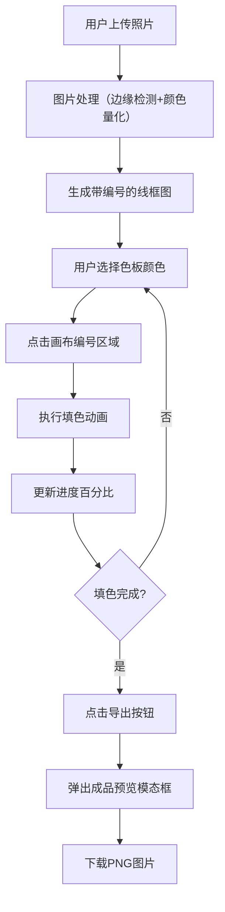

## 1. 产品概述
在线数字油画创作工具，用户上传照片后自动生成带编号的线框图，通过按编号填色完成数字油画创作并导出成品。
- 核心目标：让普通用户无需绘画基础即可体验数字油画创作的乐趣
- 目标用户：手工爱好者、休闲娱乐用户、艺术初学者

## 2. 核心功能

### 2.1 用户角色
| 角色 | 注册方式 | 核心权限 |
|------|----------|----------|
| 普通用户 | 无需注册，直接使用 | 上传图片、填色创作、导出作品、保存进度 |

### 2.2 功能模块
1. **主画布区**：显示原始图/线框图/填色图，支持填色交互
2. **左侧工具栏**：上传按钮、显示切换缩略图、导出按钮
3. **右侧色板区**：颜色列表、编号显示、颜色选择
4. **进度指示器**：右下角圆环进度条
5. **导出预览**：模态框预览成品图、支持下载

### 2.3 页面详情
| 页面名称 | 模块名称 | 功能描述 |
|-----------|-------------|---------------------|
| 主页面 | 工具栏 | 上传图片触发文件选择器，缩略图切换显示模式，导出按钮弹出预览模态框 |
| 主页面 | 画布区 | 展示线框图并划分编号区域，点击区域进行填色，支持显示切换动画 |
| 主页面 | 色板区 | 列出15种以内的颜色及编号，点击选中颜色，选中项高亮边框 |
| 主页面 | 进度指示 | 圆环动画展示已填色/总区域数百分比 |
| 导出预览 | 模态框 | 展示成品图，支持缩放拖拽，提供PNG下载按钮 |

## 3. 核心流程
用户上传照片 → 系统自动处理（边缘检测+颜色量化）生成线框图 → 用户从色板选择颜色 → 点击画布编号区域填色 → 系统记录进度并保存到localStorage → 完成后点击导出 → 预览成品图并下载PNG

## 4. 用户界面设计

### 4.1 设计风格
- 主色调：米白色底 (#FAF8F5)
- 高亮色：莫兰迪色系（灰蓝 #8BA5B5、灰粉 #D4A5A5、灰绿 #A5B5A5、灰紫 #B5A5C5）
- 按钮风格：圆角设计，悬停时从白色渐变为主题色背景（0.2秒过渡）
- 字体：优雅的无衬线字体，清晰的层级关系
- 布局风格：三栏布局（左工具栏、中画布、右色板），居中对齐
- 动画效果：淡入淡出切换（0.3秒）、填色扩散动画（0.2秒）、错误闪烁边框（0.5秒）

### 4.2 页面设计概览
| 页面名称 | 模块名称 | UI元素 |
|-----------|-------------|-------------|
| 主页面 | 工具栏 | 上传按钮（带图标）、缩略图（3张横向排列）、导出按钮 |
| 主页面 | 画布区 | 大号画布容器、编号文字（白色小号）、填色区域、淡入淡出遮罩层 |
| 主页面 | 色板区 | 颜色方块网格、编号文字、选中高亮边框 |
| 主页面 | 进度指示 | 圆环进度条（SVG）、百分比文字 |
| 导出预览 | 模态框 | 半透明遮罩、预览画布（可缩放拖拽）、下载按钮、关闭按钮 |

### 4.3 响应式
桌面端优先设计，画布区域自适应窗口大小，色板和工具栏固定宽度。
