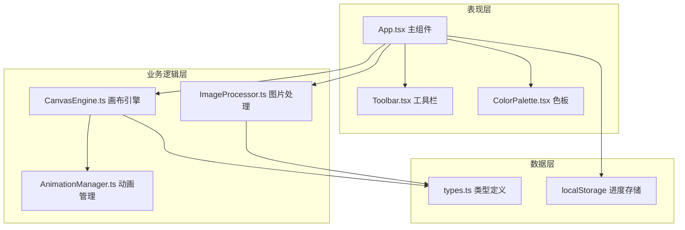

## 1. 架构设计
纯前端单页应用，采用模块化架构，分离业务逻辑与UI渲染。



## 2. 技术描述
- 前端框架：React 18 + TypeScript
- 构建工具：Vite 5
- 状态管理：React useState/useReducer（轻量场景）
- 图标库：lucide-react
- 唯一ID生成：uuid
- 图片处理：Canvas API + 简化的边缘检测与K-Means颜色量化算法
- 动画：requestAnimationFrame + CSS transition

## 3. 文件结构
```
.
├── index.html
├── package.json
├── tsconfig.json
├── vite.config.js
└── src/
    ├── App.tsx
    ├── components/
    │   ├── Toolbar.tsx
    │   └── ColorPalette.tsx
    └── modules/
        ├── imageProcessor/
        │   ├── ImageProcessor.ts
        │   └── types.ts
        └── canvasEngine/
            ├── CanvasEngine.ts
            └── AnimationManager.ts
```

## 4. 核心类型定义
```typescript
// 处理后的图片数据
interface ProcessedImageData {
  originalImage: HTMLImageElement;
  lineArtCanvas: HTMLCanvasElement;
  regions: FilledRegion[];
  colorPalette: ColorEntry[];
  width: number;
  height: number;
}

// 填充区域
interface FilledRegion {
  id: string;
  colorIndex: number;
  boundary: { x: number; y: number }[];
  centerX: number;
  centerY: number;
  filled: boolean;
  filledColor?: string;
}

// 颜色条目
interface ColorEntry {
  index: number;
  color: string;
  hex: string;
}
```

## 5. 性能优化
- 图片处理使用离屏Canvas，避免阻塞主线程
- 颜色量化限制最大15种颜色
- 动画使用requestAnimationFrame，自动降级
- 填色区域使用Path2D缓存，提升渲染性能
- localStorage异步保存，避免UI卡顿
