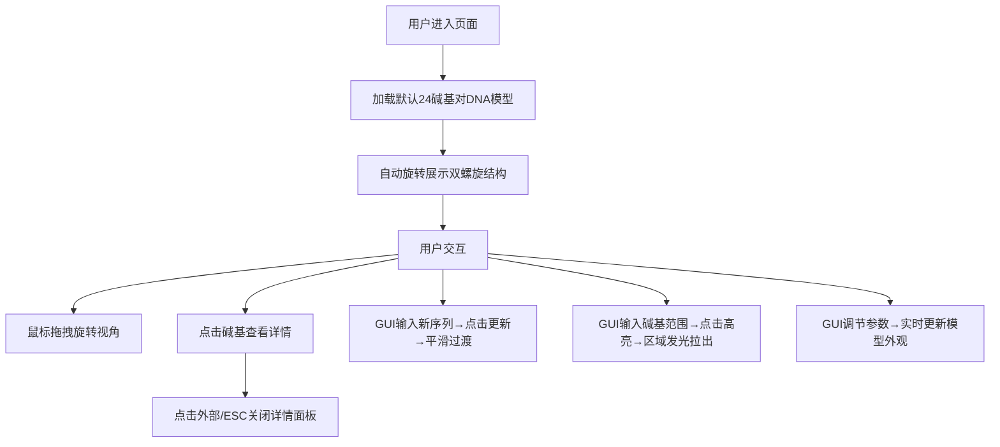

## 1. 产品概述

DNA结构探索器是一款面向生物医学教学与研究的3D交互式可视化应用，帮助学生和研究人员直观理解DNA双螺旋的空间构型、碱基配对规则及序列变异影响。

- **核心目标**：通过沉浸式3D交互降低分子生物学学习门槛，提升教学效果
- **目标用户**：生物医学专业学生、教师、科研人员
- **应用价值**：将抽象的DNA结构具象化，支持自定义序列探索和局部结构高亮分析

## 2. 核心功能

### 2.1 功能模块

1. **3D双螺旋渲染模块**：默认24个碱基对（12个完整螺旋周期）的DNA双螺旋结构，半透明管状主链、彩色碱基对、氢键虚线
2. **序列编辑模块**：支持自定义A/T/C/G序列输入（最多64字符），平滑过渡动画更新模型
3. **碱基交互模块**：点击碱基查看详情（名称、位置、配对、氢键数），缩放动画反馈
4. **视角控制模块**：自动旋转、OrbitControls拖拽旋转缩放、旋转速度可调节
5. **区域高亮模块**：指定碱基范围高亮，发光效果+向外拉出动画

### 2.3 页面详情

| 页面名称 | 模块名称 | 功能描述 |
|-----------|-------------|---------------------|
| 主页面 | 3D画布 | 全屏DNA双螺旋模型渲染，支持鼠标交互旋转缩放 |
| 主页面 | 标题信息 | 左上角显示应用名称和当前序列长度 |
| 主页面 | 详情面板 | 右上角毛玻璃面板，点击碱基后滑入显示详情 |
| 主页面 | 控制面板 | 右下角dat.GUI折叠面板，含参数调节、序列输入、高亮控制 |

## 3. 核心流程

## 4. 用户界面设计

### 4.1 设计风格

- **主色调**：#4fc3f7（科技蓝）
- **辅色调**：#7c4dff（梦幻紫）
- **背景色**：深蓝色渐变 #0a0a2e → #1a1a4e
- **碱基配色**：A-绿色、T-红色、C-黄色、G-蓝色
- **整体风格**：科研实验室沉浸感、蓝紫对比科技感、深色主题

### 4.2 页面设计概述

| 页面名称 | 模块名称 | UI元素 |
|-----------|-------------|-------------|
| 主页面 | 3D画布 | 全屏WebGL渲染、深蓝色渐变背景、DNA双螺旋模型 |
| 主页面 | 标题区域 | 左上角白色半透明小字、应用名+序列长度 |
| 主页面 | 详情面板 | 右上角毛玻璃效果(backdrop-filter: blur(8px))、rgba(0,0,0,0.6)背景、白色文字、右侧滑入动画0.3s |
| 主页面 | 控制面板 | 右下角折叠式dat.GUI、齿轮图标按钮、展开后滑块+按钮+输入框 |

### 4.3 响应式设计

- **桌面端**：标准布局，控制面板水平排列
- **移动端**（<768px）：控制面板缩小字体、垂直排列、轨道控制器旋转灵敏度自适应
- **触控优化**：支持双指缩放、单指旋转

### 4.4 3D场景设计

- **环境**：深蓝色渐变背景，营造深邃分子空间感
- **光照**：环境光+两盏方向光，确保碱基对两面均有充足光照
- **相机**：PerspectiveCamera，初始距离约15单位，看向原点
- **构图**：DNA螺旋居中垂直排列，占画面主体约70%高度
- **交互**：OrbitControls支持阻尼效果，自动旋转绕Y轴
- **动画**：碱基更新补间动画0.8秒、点击缩放动画0.3秒、高亮拉出动画0.5秒
- **性能**：64碱基对时稳定45FPS以上，射线检测响应<50ms
