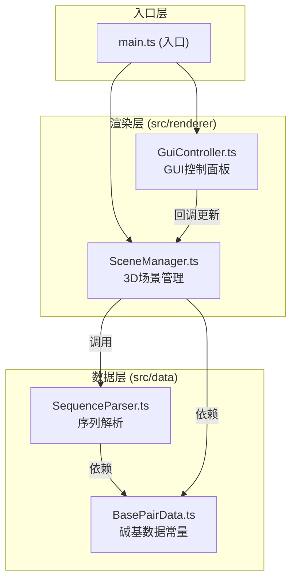

## 1. 架构设计



**数据流向说明**：
1. 序列数据：用户输入 → GuiController → SceneManager.updateSequence() → SequenceParser.parse() → 碱基对坐标数组 → SceneManager更新网格
2. 控制参数：GuiController滑块 → 回调函数 → SceneManager属性更新 → 模型实时调整
3. 选中信息：SceneManager射线检测 → 碱基信息 → DOM详情面板展示

## 2. 技术栈说明

- **前端框架**：原生 TypeScript + Vite
- **3D渲染**：Three.js（r158+）
- **GUI控制**：dat.GUI（0.7.9）
- **类型定义**：@types/three、@types/dat.gui
- **构建工具**：Vite（5.x）
- **语言**：TypeScript（严格模式）
- **模块系统**：ES Modules

## 3. 文件结构

```
├── package.json              # 项目依赖与脚本
├── tsconfig.json             # TypeScript严格模式配置
├── vite.config.js            # Vite默认配置
├── index.html                # 入口HTML（全屏Canvas布局）
└── src/
    ├── main.ts               # 应用入口，整合各模块
    ├── renderer/
    │   ├── SceneManager.ts   # 3D场景管理（场景/相机/灯光/控制器/DNA模型/动画）
    │   └── GuiController.ts  # GUI控制面板（dat.GUI封装）
    └── data/
        ├── SequenceParser.ts # 序列解析器（字符串→碱基对坐标列表）
        └── BasePairData.ts   # 碱基数据结构与常量（配对规则/颜色/尺寸）
```

## 4. 核心模块定义

### 4.1 BasePairData 模块

**职责**：定义碱基相关的所有常量和类型

**类型定义**：
```typescript
type BaseType = 'A' | 'T' | 'C' | 'G';

interface BasePairInfo {
  type: BaseType;
  name: string;           // 中文名称
  color: number;          // HEX颜色值
  pairWith: BaseType;     // 配对碱基
  hydrogenBonds: number;  // 氢键数量
}

interface BasePairData {
  index: number;
  base1: BaseType;
  base2: BaseType;
  position: { x: number; y: number; z: number };
  helixAngle: number;
}
```

**常量**：
- BASE_COLORS: 碱基颜色映射（A:#4caf50, T:#f44336, C:#ffeb3b, G:#2196f3）
- BASE_NAMES: 中文名称映射
- PAIR_RULES: 配对规则（A↔T, C↔G）
- HYDROGEN_BONDS: 氢键数（A-T:2, C-G:3）
- HELIX_RADIUS: 螺旋半径
- BASES_PER_TURN: 每圈碱基数（10个）
- BASE_HEIGHT: 碱基高度（轴向间距）
- BACKBONE_RADIUS: 主链半径
- HYDROGEN_BOND_LENGTH: 氢键长度

### 4.2 SequenceParser 模块

**职责**：将用户输入的DNA序列字符串解析为结构化的碱基对数据

**核心方法**：
```typescript
parse(sequence: string): BasePairData[]
```

**处理逻辑**：
1. 验证输入（仅限A/T/C/G，大写转换）
2. 计算每个碱基对的螺旋角度和Y轴位置
3. 生成配对碱基（与输入链互补）
4. 返回碱基对数据数组

### 4.3 SceneManager 模块

**职责**：3D场景的初始化、渲染、动画和交互管理

**核心属性**：
- translateX: number - X轴平移
- rotateSpeed: number - 自动旋转速度
- baseRadius: number - 碱基半径
- backboneRadius: number - 主链半径
- baseHeight: number - 碱基高度
- helixPitch: number - 螺旋间距

**核心方法**：
```typescript
init(container: HTMLElement): void
updateSequence(sequence: string): void
setHighlight(start: number, end: number): void
clearHighlight(): void
onBaseClick(callback: (data: BasePairData) => void): void
```

**子模块功能**：
- 场景/相机/灯光初始化
- OrbitControls 轨道控制
- DNA模型生成（TubeGeometry主链、CylinderGeometry碱基、Line氢键）
- 自动旋转动画
- 平滑过渡动画（tween）
- 射线检测与碱基选中
- 高亮效果与拉出动画

### 4.4 GuiController 模块

**职责**：使用dat.GUI创建交互式控制面板

**控制项**：
- 主链半径滑块（0.1-0.5）
- 碱基高度滑块（0.2-0.8）
- 螺旋间距滑块（1.0-3.0）
- 旋转速度滑块（0-2.0）
- 暂停/恢复旋转按钮
- 序列输入框 + 更新按钮
- 高亮起始/结束索引 + 高亮按钮
- 清除高亮按钮

**对外接口**：
```typescript
constructor(sceneManager: SceneManager)
setSequence(seq: string): void
```

## 5. 性能优化策略

- **几何体复用**：使用InstancedMesh或共享几何体减少draw call
- **材质复用**：同类型碱基共享材质对象
- **射线检测优化**：只对碱基网格进行检测，限制检测对象数量
- **动画优化**：使用requestAnimationFrame，仅在需要时更新矩阵
- **标签优化**：使用CanvasTexture或CSS2DRenderer减少DOM数量
