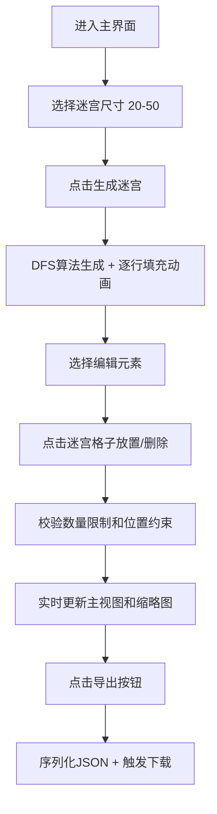

## 1. 产品概述
2D像素风迷宫地图自动生成与编辑器应用，面向RPG游戏关卡设计师，解决手动设计迷宫效率低下且缺乏随机性的问题。
- 主要用途：自动生成随机迷宫、编辑放置起终点和怪物刷新点、导出JSON格式地图数据
- 目标用户：独立游戏开发者、RPG关卡设计师

## 2. 核心功能

### 2.1 用户角色
无多角色区分，单一用户模式。

### 2.2 功能模块
1. **迷宫生成模块**：使用随机DFS算法生成20x20到50x50矩形迷宫，保证连通性，自动定位入口和出口
2. **地图编辑器模块**：点击放置/删除起点、终点、怪物刷新点，支持数量限制和位置约束
3. **导出功能模块**：将迷宫数据序列化为JSON格式并提供下载
4. **地图概览模块**：右下角缩略图实时同步迷宫全貌，悬停高亮对应区域

### 2.3 页面详情
| 页面名称 | 模块名称 | 功能描述 |
|-----------|-------------|---------------------|
| 主界面 | 迷宫主视图 | Canvas渲染迷宫，支持点击编辑，左侧占70%宽度 |
| 主界面 | 右侧操作面板 | 上部元素选择按钮（起点/终点/怪物），下部状态显示，占30%宽度 |
| 主界面 | 缩略图区域 | 右下角小型Canvas缩略图，实时同步，悬停高亮 |
| 主界面 | 工具栏 | 迷宫尺寸选择、生成按钮、导出按钮 |

## 3. 核心流程
用户进入主界面 → 选择迷宫尺寸 → 点击生成按钮（逐行填充动画）→ 选择编辑元素 → 在迷宫上点击放置/删除元素 → 实时更新缩略图 → 点击导出下载JSON文件

## 4. 用户界面设计

### 4.1 设计风格
- 设计风格：复古像素风
- 主色调：深灰色背景 #2a2a2a，亮黄色描边 #f0d060
- 通路颜色：浅米色 #f5e6c8，墙壁颜色：深色 #1a1a1a
- 起点：绿色，终点：红色，怪物刷新点：紫色骷髅
- 按钮样式：圆形图标，直径40px，悬停放大120%并抖动
- 图标：像素风格16x16精灵图

### 4.2 页面设计概述
| 页面名称 | 模块名称 | UI元素 |
|-----------|-------------|-------------|
| 主界面 | 迷宫主视图 | Canvas渲染，逐行展开动画（每行200ms，1秒内完成），点击放置元素0.3s淡入淡出过渡 |
| 主界面 | 右侧操作面板 | 三圆形按钮（绿/红/紫），元素计数显示，<1200px时折叠为侧边栏 |
| 主界面 | 缩略图 | 右下角小Canvas，红绿紫标记元素，悬停高亮主视图对应区域 |
| 主界面 | 工具栏 | 尺寸下拉框、生成按钮、导出按钮，像素风格 |

### 4.3 响应式
- 桌面优先设计，适配宽度1024px到1920px
- 右侧面板在视口宽度小于1200px时自动折叠为可展开侧边栏
- Canvas根据容器尺寸自适应缩放，保持像素清晰

### 4.4 动画设计
- 迷宫生成：逐行展开填充动画，每行200ms，整体≤1秒
- 元素放置：0.3s淡入淡出过渡（新元素淡入，旧元素淡出）
- 按钮悬停：放大至120% + 轻微抖动动画
- 缩略图悬停：主视图对应区域高亮边框
