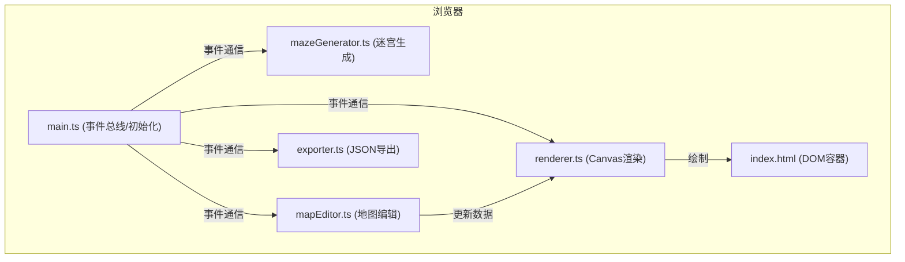

## 1. 架构设计



## 2. 技术说明
- 前端框架：原生 TypeScript + Vite + Canvas API
- 构建工具：Vite（默认配置）
- 后端服务：无（纯前端应用）
- 数据存储：浏览器内存（运行时）+ 本地文件（导出JSON）

## 3. 文件结构
| 文件路径 | 职责说明 |
|----------|----------|
| package.json | 项目依赖和启动脚本配置 |
| vite.config.js | Vite 默认构建配置 |
| tsconfig.json | TypeScript 严格模式配置 |
| index.html | 入口HTML页面，包含Canvas容器和侧边面板 |
| src/mazeGenerator.ts | 随机DFS迷宫生成算法，保证连通性 |
| src/mapEditor.ts | 点击事件处理、元素增删管理、约束校验 |
| src/renderer.ts | Canvas主视图和缩略图渲染，动画实现 |
| src/exporter.ts | JSON序列化、Blob下载、导入接口 |
| src/main.ts | 应用初始化、事件总线、模块协调 |

## 4. 核心数据模型

```typescript
// 迷宫单元格类型：0=通路, 1=墙壁
type CellType = 0 | 1;

// 迷宫二维数组
type MazeGrid = CellType[][];

// 坐标点
interface Point {
  x: number;
  y: number;
}

// 元素类型
type ElementType = 'start' | 'end' | 'monster';

// 地图元素列表
interface MapElements {
  starts: Point[];       // 最多5个
  ends: Point[];         // 最多5个
  monsters: Point[];     // 最多5个
}

// 完整地图数据
interface MapData {
  width: number;
  height: number;
  grid: MazeGrid;
  elements: MapElements;
}
```

## 5. 事件总线定义

```typescript
// 事件类型
enum AppEvent {
  MAZE_GENERATED = 'maze:generated',
  ELEMENT_PLACED = 'element:placed',
  ELEMENT_REMOVED = 'element:removed',
  TOOL_CHANGED = 'tool:changed',
  EXPORT_REQUESTED = 'export:requested',
  RENDER_UPDATE = 'render:update',
  THUMBNAIL_HOVER = 'thumbnail:hover'
}

// 事件载荷类型
interface EventPayload {
  [AppEvent.MAZE_GENERATED]: { grid: MazeGrid; width: number; height: number };
  [AppEvent.ELEMENT_PLACED]: { type: ElementType; point: Point };
  [AppEvent.ELEMENT_REMOVED]: { type: ElementType; point: Point };
  [AppEvent.TOOL_CHANGED]: { tool: ElementType | null };
  [AppEvent.EXPORT_REQUESTED]: void;
  [AppEvent.RENDER_UPDATE]: void;
  [AppEvent.THUMBNAIL_HOVER]: { rect: { x: number; y: number; w: number; h: number } | null };
}
```

## 6. 性能优化策略
- 迷宫生成：DFS算法时间复杂度O(n²)，50x50网格控制在500ms内
- Canvas渲染：使用脏矩形局部重绘，保证60fps
- 缩略图更新：使用 requestAnimationFrame 节流，独立渲染不阻塞主线程
- 动画：使用CSS transform实现按钮悬停动画，使用Canvas全局透明度实现元素淡入淡出
