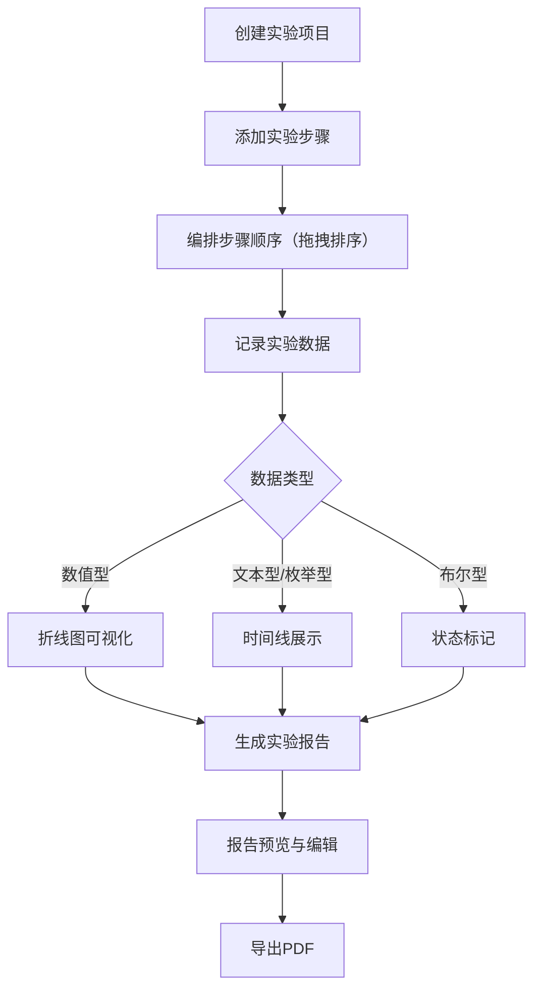

## 1. 产品概述

LabFlow 是一款面向科研团队与学术机构的实验流程管理应用，旨在解决传统实验记录依赖纸质笔记、数据散落难以追溯、报告撰写耗时且格式不统一的问题。通过数字化的实验项目管理、步骤编排、数据记录和自动报告生成，提升科研效率与数据可追溯性。

- 目标用户：科研团队、实验室研究人员、学术机构
- 核心价值：将实验全流程数字化，从项目创建到报告导出一站式完成，减少70%以上的报告撰写时间

## 2. 核心功能

### 2.1 用户角色

| 角色 | 注册方式 | 核心权限 |
|------|----------|----------|
| 研究员 | 默认登录 | 创建/管理实验项目、编排步骤、记录数据、生成报告 |

### 2.2 功能模块

1. **主页面**：左侧实验列表 + 右侧内容区域，包含实验项目创建与管理
2. **步骤编排页面**：当前实验的步骤列表，支持拖拽排序、附件上传、批量操作
3. **数据记录页面**：当前步骤下的数据记录点，支持多种数据类型与可视化
4. **报告生成页面**：自动收集数据并生成结构化HTML报告，支持PDF导出

### 2.3 页面详情

| 页面名称 | 模块名称 | 功能描述 |
|----------|----------|----------|
| 主页面 | 实验列表侧栏 | 展示所有实验项目卡片，支持点击切换、拖拽排序和删除，每个卡片显示进度圆环 |
| 主页面 | 创建实验表单 | 底部弹入动画的表单卡片，填写项目名称、日期、负责人和描述，提交后列表新增条目并高亮闪烁1秒 |
| 步骤编排页面 | 步骤列表 | 添加/删除步骤，拖拽排序（缩放0.95+阴影反馈），每个步骤含名称、时间、预期/实际结果、附件上传 |
| 步骤编排页面 | 附件上传 | 点击上传按钮触发，上传进度条动画，完成后显示缩略图预览 |
| 步骤编排页面 | 批量操作 | 复选框选中步骤后，底部工具栏出现"删除选中"按钮 |
| 数据记录页面 | 数据类型选择 | 每条记录可选数值型、文本型、布尔型、枚举型 |
| 数据记录页面 | 折线图 | 数值型记录自动生成SVG折线图，贝塞尔曲线插值，悬停Tooltip |
| 数据记录页面 | 时间线展示 | 文本型/枚举型记录以时间线形式展示，左侧色条，点击展开（0.3秒动画） |
| 数据记录页面 | 步骤切换过渡 | 切换步骤时列表渐隐渐现0.2秒 |
| 报告生成页面 | 生成报告按钮 | 收集数据后生成HTML报告，DNA双螺旋加载动画1.5秒 |
| 报告生成页面 | 报告内容 | 封面（渐变背景）、目录（锚点跳转）、步骤详情、数据分析小结、结论编辑区 |
| 报告生成页面 | 导出PDF | 通过window.print一键导出PDF |

## 3. 核心流程

用户创建实验项目 → 添加实验步骤并排序 → 在步骤下记录各类数据 → 查看数据可视化 → 生成规范化实验报告 → 导出PDF

## 4. 用户界面设计

### 4.1 设计风格

- **主色**：深蓝紫色 `#2A2355`
- **辅色/强调色**：Amber `#FFB300`（按钮高亮、选中态、强调元素）
- **背景**：深色渐变 `#1A1535` → `#2A2355`
- **字体颜色**：浅灰色 `#E0E0E0`
- **卡片背景**：`#2F2860`，圆角12px，内边距24px
- **按钮风格**：圆角按钮，hover时上浮 `translateY(-2px)` + 阴影加深，点击时 `scale(0.95)` 持续0.1秒
- **字体**：标题使用 JetBrains Mono，正文使用 Source Sans 3
- **布局风格**：左侧边栏280px + 右侧卡片式布局

### 4.2 页面设计概览

| 页面名称 | 模块名称 | UI元素 |
|----------|----------|--------|
| 主页面 | 左侧列表 | 280px宽，背景#2F2860，hover半透明amber(0.1)，选中项3px amber竖条发光 |
| 主页面 | 顶部导航栏 | 高56px，左侧Logo+名称，右侧用户名+红色退出按钮 |
| 主页面 | 创建表单卡片 | 底部弹入动画，包含4个输入字段 |
| 主页面 | 实验卡片 | 进度圆环（0.6秒填充动画），基本信息展示 |
| 步骤编排页面 | 步骤卡片 | 拖拽时缩放0.95+左偏移阴影，附件缩略图预览，批量复选框 |
| 步骤编排页面 | 上传进度条 | 进度条动画，完成后缩略图出现 |
| 数据记录页面 | 折线图 | SVG绘制，贝塞尔曲线，圆形标记点，悬停Tooltip |
| 数据记录页面 | 时间线卡片 | 左边界色条（按类型变色），点击展开0.3秒动画 |
| 报告生成页面 | 加载动画 | DNA双螺旋旋转图标，1.5秒 |
| 报告生成页面 | 报告预览 | 封面渐变色，目录锚点跳转，SVG图表嵌入 |

### 4.3 响应式设计

- 桌面优先设计，最低支持1280px宽度
- 侧栏固定280px，主内容区域自适应
- 数据折线图自适应容器宽度

### 4.4 动画性能要求

- 步骤列表切换动画帧率 ≥ 45FPS
- 数据折线图50个数据点渲染延迟 ≤ 100ms
- 报告生成总耗时 ≤ 3秒
