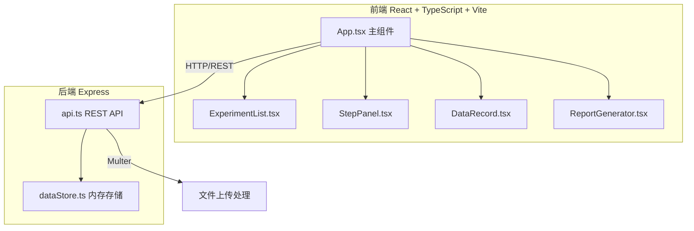
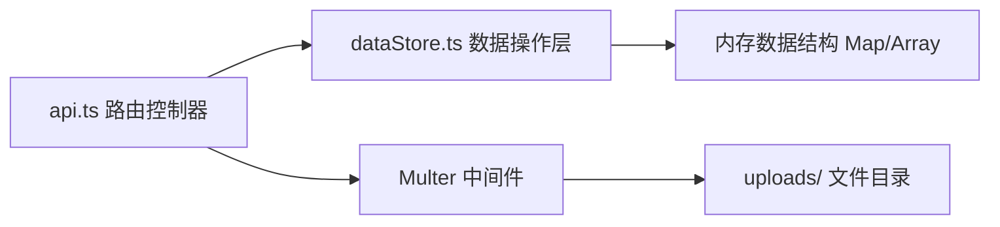
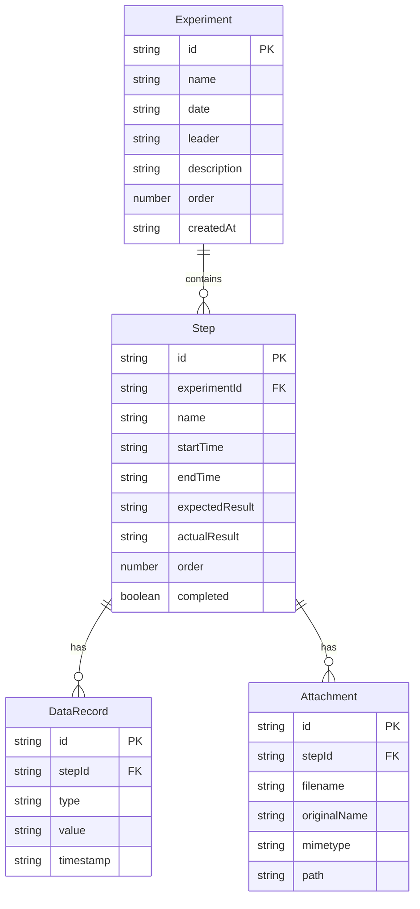

## 1. 架构设计



## 2. 技术说明

- **前端**：React@18.2.0 + TypeScript@5.3.3 + Vite@5.0.8
- **初始化工具**：Vite
- **后端**：Express@4.18.2 + CORS + Multer（文件上传）
- **数据库**：内存数据存储（dataStore.ts 单例），模拟数据库操作
- **其他依赖**：uuid@9.0.0（ID生成）、date-fns@2.30.0（日期处理）

## 3. 路由定义

| 路由 | 用途 |
|------|------|
| `/` | 主页面，左侧实验列表 + 右侧内容区域 |

（单页应用，通过组件状态切换不同内容面板，无需前端路由）

## 4. API 定义

### 4.1 实验项目 API

| 方法 | 路径 | 请求体 | 响应 |
|------|------|--------|------|
| GET | `/api/experiments` | - | `Experiment[]` |
| POST | `/api/experiments` | `{name, date, leader, description}` | `Experiment` |
| PUT | `/api/experiments/:id` | `{name?, date?, leader?, description?}` | `Experiment` |
| DELETE | `/api/experiments/:id` | - | `{success: boolean}` |
| PUT | `/api/experiments/reorder` | `{ids: string[]}` | `{success: boolean}` |

### 4.2 步骤 API

| 方法 | 路径 | 请求体 | 响应 |
|------|------|--------|------|
| GET | `/api/experiments/:expId/steps` | - | `Step[]` |
| POST | `/api/experiments/:expId/steps` | `{name, startTime, endTime, expectedResult, actualResult}` | `Step` |
| PUT | `/api/steps/:id` | `{name?, startTime?, endTime?, expectedResult?, actualResult?}` | `Step` |
| DELETE | `/api/steps/:id` | - | `{success: boolean}` |
| PUT | `/api/experiments/:expId/steps/reorder` | `{ids: string[]}` | `{success: boolean}` |
| POST | `/api/steps/:id/attachments` | `FormData (file)` | `Attachment` |
| DELETE | `/api/steps/:id/attachments/:attId` | - | `{success: boolean}` |
| POST | `/api/steps/batch-delete` | `{ids: string[]}` | `{success: boolean}` |

### 4.3 数据记录 API

| 方法 | 路径 | 请求体 | 响应 |
|------|------|--------|------|
| GET | `/api/steps/:stepId/records` | - | `DataRecord[]` |
| POST | `/api/steps/:stepId/records` | `{type, value, timestamp?}` | `DataRecord` |
| PUT | `/api/records/:id` | `{value?}` | `DataRecord` |
| DELETE | `/api/records/:id` | - | `{success: boolean}` |

### 4.4 报告 API

| 方法 | 路径 | 请求体 | 响应 |
|------|------|--------|------|
| POST | `/api/experiments/:id/report` | `{conclusion?: string}` | `{html: string}` |

### 4.5 TypeScript 类型定义

```typescript
interface Experiment {
  id: string;
  name: string;
  date: string;
  leader: string;
  description: string;
  order: number;
  createdAt: string;
}

interface Step {
  id: string;
  experimentId: string;
  name: string;
  startTime: string;
  endTime: string;
  expectedResult: string;
  actualResult: string;
  order: number;
  attachments: Attachment[];
  completed: boolean;
}

interface Attachment {
  id: string;
  filename: string;
  originalName: string;
  mimetype: string;
  path: string;
  thumbnailUrl?: string;
}

interface DataRecord {
  id: string;
  stepId: string;
  type: 'numeric' | 'text' | 'boolean' | 'enum';
  value: string;
  timestamp: string;
  enumOptions?: string[];
}
```

## 5. 服务端架构图



## 6. 数据模型

### 6.1 数据模型定义



### 6.2 数据存储实现

使用 TypeScript Map 和 Array 在内存中存储数据，导出单例实例供 api.ts 使用：

- `experiments: Map<string, Experiment>` — 实验项目存储
- `steps: Map<string, Step>` — 步骤存储，按 experimentId 关联
- `records: Map<string, DataRecord>` — 数据记录存储，按 stepId 关联
- `attachments: Map<string, Attachment>` — 附件元数据存储
