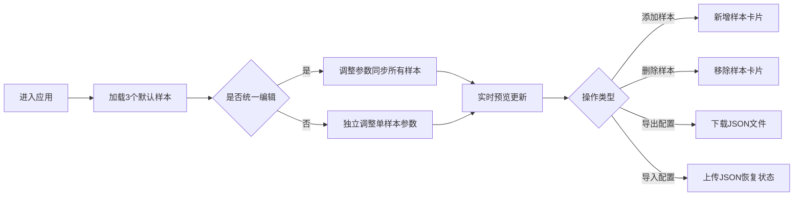

## 1. 产品概述

字体排版预览与对比应用，帮助设计团队快速查看和对比不同字体在不同字号、行高下的排版效果，提升排版方案决策效率。

- **目标用户**：UI/UX 设计师、前端工程师、排版设计师
- **核心价值**：实时多方案对比、参数化调整、一键导出配置，替代繁琐的手动 CSS 调试

## 2. 核心功能

### 2.1 功能模块

1. **多样本对比面板**：并排展示多个排版样本，支持独立编辑与同步编辑两种模式
2. **排版参数编辑器**：字体选择、字号滑块、行高滑块、字重选择、颜色选择器
3. **实时预览卡片**：文字渲染预览、参数数值标签、过渡动画效果
4. **配置导入导出**：JSON 格式配置文件的导入与导出

### 2.2 页面详情

| 页面名称 | 模块名称 | 功能描述 |
|-----------|-------------|---------------------|
| 主页面 | 顶部工具栏 | 统一编辑开关、添加样本按钮、导入按钮、导出按钮 |
| 主页面 | 左侧编辑区 | 滚动展示所有样本的编辑面板，白色卡片式布局 |
| 主页面 | 右侧预览区 | 横向排列预览卡片，实时渲染排版效果 |

## 3. 核心流程

用户进入应用 → 默认加载 3 个排版样本 → 调整单样本参数或开启统一编辑 → 实时预览效果 → 点击导出配置保存 JSON → 或点击导入恢复历史配置

## 4. 用户界面设计

### 4.1 设计风格

- **主色调**：深蓝色 #1a73e8
- **辅助色**：浅灰 #f5f5f5、深灰 #333333
- **按钮风格**：圆角 8px、无边框、文字粗体、悬停 0.2 秒背景色过渡
- **卡片风格**：白色背景、圆角 12px、轻微阴影 0 2px 8px rgba(0,0,0,0.08)
- **布局风格**：左右两栏布局（左 1/3 编辑区，右 2/3 预览区），移动端上下堆叠
- **动效风格**：所有交互 0.3 秒内过渡，流畅平滑

### 4.2 页面设计概览

| 页面名称 | 模块名称 | UI 元素 |
|-----------|-------------|-------------|
| 主页面 | 顶部工具栏 | 统一编辑开关（背景色渐变）、添加样本按钮、导入按钮、导出按钮（绿色闪烁反馈） |
| 主页面 | 编辑面板 | 字体下拉框、字号滑块、行高滑块、字重选择、颜色选择器、文本输入框 |
| 主页面 | 预览卡片 | 文字预览区（背景渐变色过渡）、底部数值标签、右上角删除按钮（缩小淡出动画） |

### 4.3 响应式

- **桌面端**：左右两栏布局，最大宽度 1200px
- **移动端**（<768px）：编辑区与预览区上下堆叠
- **触摸优化**：滑块和按钮尺寸适配触摸操作

### 4.4 动效设计

- **字体切换**：旧字体 0.15 秒淡出，新字体淡入
- **字号调整**：文字缩放平滑过渡
- **样本添加**：叠入动画逐个出现（间隔 0.15 秒）
- **样本删除**：缩小淡出动画 0.3 秒
- **导出反馈**：0.3 秒缩放 + 0.5 秒绿色闪烁
- **背景过渡**：字号/行高变化时，背景灰白渐变回白色 0.2 秒
