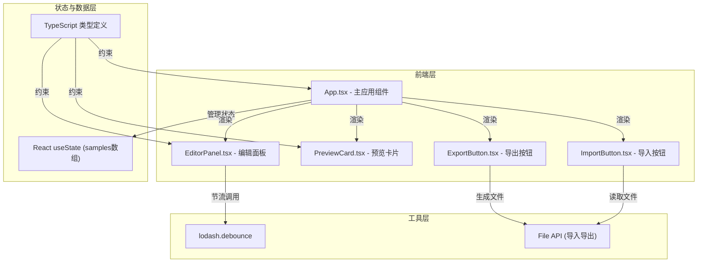

## 1. 架构设计



## 2. 技术描述

- **前端框架**：React 18 + TypeScript 5
- **构建工具**：Vite 5 + @vitejs/plugin-react
- **样式方案**：CSS Modules / 内联样式
- **工具库**：lodash.debounce（参数调整节流）
- **字体资源**：Google Fonts（Roboto、Open Sans、Lato、Montserrat、Playfair Display、Source Code Pro）
- **初始化方式**：手动创建项目结构（非脚手架生成）

### 数据流向

1. **App.tsx** 持有 samples 数组状态，每个 sample 包含完整排版配置
2. **EditorPanel** 接收单样本配置，用户调整参数时通过 debounce 后的 onChange 回调回传
3. **PreviewCard** 接收配置进行渲染，展示实时预览效果
4. **ExportButton** 接收所有样本配置，触发 JSON 导出
5. **ImportButton** 读取 JSON 文件，通过回调通知 App 更新状态

## 3. 文件结构

| 文件路径 | 职责 | 依赖 |
|---------|------|------|
| `package.json` | 项目依赖与脚本 | - |
| `vite.config.js` | Vite 配置（React 插件、端口 3000） | - |
| `tsconfig.json` | TypeScript 配置（严格模式、ES 模块） | - |
| `index.html` | 入口 HTML 页面 | - |
| `src/main.tsx` | React 入口，渲染 App 组件 | ReactDOM |
| `src/App.tsx` | 主应用组件，管理多样本状态 | EditorPanel、PreviewCard、ExportButton、ImportButton |
| `src/EditorPanel.tsx` | 编辑面板组件，调整排版参数 | lodash.debounce |
| `src/PreviewCard.tsx` | 预览卡片组件，渲染文字效果 | - |
| `src/ExportButton.tsx` | 导出按钮组件，JSON 导出 | - |
| `src/ImportButton.tsx` | 导入按钮组件，JSON 导入 | - |
| `src/types.ts` | TypeScript 类型定义 | - |
| `src/App.css` | 主应用样式 | - |
| `src/EditorPanel.css` | 编辑面板样式 | - |
| `src/PreviewCard.css` | 预览卡片样式 | - |

## 4. 数据模型

### 4.1 类型定义

```typescript
interface TypographyConfig {
  text: string;
  fontFamily: string;
  fontSize: number;
  lineHeight: number;
  fontWeight: number;
  color: string;
}

interface Sample {
  id: string;
  config: TypographyConfig;
}
```

### 4.2 默认样本配置

- 默认 3 个样本，每个样本使用不同字体和字号
- 文本内容：预置一段示例文字（最多 200 字）
- 字体预设：Roboto、Open Sans、Lato、Montserrat、Playfair Display、Source Code Pro
- 字号范围：12-72px
- 行高范围：1.0-2.0
- 字重选项：100-900 步进 100

## 5. 性能优化

- **参数节流**：使用 lodash.debounce 减少频繁状态更新
- **局部渲染**：单样本参数变化仅触发对应组件重渲染
- **CSS 过渡**：动画使用 CSS transition，避免 JS 动画开销
- **目标性能**：参数调整响应 < 50ms，6 样本同时预览帧率 > 55fps
