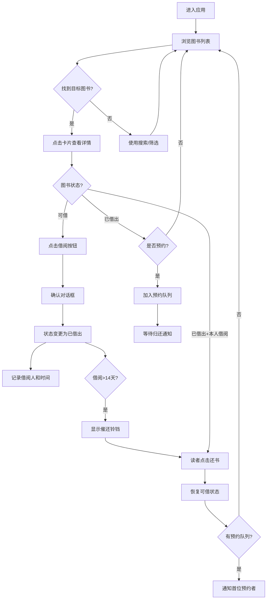

## 1. 产品概述

社区图书馆图书共享借阅管理应用，旨在解决传统纸质图书借阅效率低下的问题，提升读者借阅体验和图书馆管理效率。
- 目标用户：图书馆管理员（图书上架管理）、社区读者（搜索、借阅、预约图书）
- 产品价值：简化借还流程、提高图书流通率、追踪阅读记录、提升管理效率

## 2. 核心功能

### 2.1 用户角色

| 角色 | 登录方式 | 核心权限 |
|------|----------|----------|
| 图书馆管理员 | 模拟登录 | 图书上架、管理图书信息、查看所有借阅记录 |
| 社区读者 | 模拟登录 | 搜索浏览、借阅归还、预约排队、查看阅读记录 |

### 2.2 功能模块

1. **图书列表页面**：搜索栏、分类筛选、图书卡片网格、状态标签
2. **添加图书弹窗**：表单录入、字段验证、提交刷新
3. **图书详情弹窗**：详细信息、借阅/归还/预约操作
4. **个人中心页面**：借阅历史、阅读进度条、状态管理
5. **顶部通知栏**：预约通知、催还提醒、系统消息

### 2.3 页面详情

| 页面名称 | 模块名称 | 功能描述 |
|----------|----------|----------|
| 图书列表页 | 搜索栏 | 按书名/作者模糊搜索，防抖300ms实时过滤 |
| 图书列表页 | 分类筛选 | 下拉选择分类（文学、科技、历史、艺术），淡入淡出过渡 |
| 图书列表页 | 卡片网格 | 响应式3/2/1列布局，悬浮上移阴影加深 |
| 图书列表页 | 状态标签 | 可借（绿色）/已借出（浅红）/催还（橙铃铛摆动） |
| 添加图书弹窗 | 表单 | 书名、作者、ISBN、分类、封面URL，非空验证 |
| 添加图书弹窗 | 动画 | 新书卡片从底部弹入，0.4s ease-out |
| 图书详情弹窗 | 借还操作 | 确认对话框，状态变更，借阅时间记录 |
| 图书详情弹窗 | 预约队列 | 借出状态下可预约，归还后按队列通知 |
| 个人中心页 | 借阅记录 | 书名、借阅/归还日期、阅读状态 |
| 个人中心页 | 进度条 | 可手动调整的阅读进度百分比 |
| 顶部通知栏 | 系统通知 | 预约可用提醒、催还提示 |

## 3. 核心流程

读者进入应用，通过搜索或筛选找到图书，点击查看详情后进行借阅/预约操作；管理员通过添加入口录入新书。图书归还时系统自动通知预约队列中的首位读者。借阅超过14天自动触发催还标志。

## 4. 用户界面设计

### 4.1 设计风格

- **主色**：墨绿色 #2D5016（导航栏、按钮、标题）
- **背景色**：米白色 #F5F0E8（页面整体背景）
- **强调色**：暖橙色 #D9822B（提示、交互元素、催还标志）
- **卡片背景**：纯白 #FFFFFF，圆角 12px
- **阴影**：默认 0 2px 8px rgba(0,0,0,0.08)，悬浮 0 4px 16px rgba(0,0,0,0.15)
- **按钮样式**：圆角矩形，点击 0.95 倍缩放
- **字体**：标题使用优雅衬线字体，正文使用现代无衬线字体
- **布局风格**：顶部固定导航栏 + 居中内容区（最大1200px）+ 卡片网格
- **图标风格**：简洁线性图标（lucide-react）

### 4.2 页面设计概述

| 页面名称 | 模块名称 | UI元素 |
|----------|----------|--------|
| 图书列表页 | 导航栏 | 墨绿色背景、白色文字、左侧Logo、右侧导航（图书列表/个人中心/添加图书） |
| 图书列表页 | 搜索筛选区 | 搜索输入框（聚焦时绿色边框过渡）、分类下拉框、两元素横向排列 |
| 图书列表页 | 卡片网格 | 响应式网格、卡片悬浮上移2px+阴影加深（0.3s过渡） |
| 图书列表页 | 图书卡片 | 封面缩略图（顶部圆角）、书名（粗体墨绿）、作者（灰色小字）、状态标签（右侧） |
| 添加图书弹窗 | 遮罩层 | 半透明黑色背景 |
| 添加图书弹窗 | 表单卡片 | 白色背景、大圆角、垂直排列表单字段 |
| 添加图书弹窗 | 输入框 | 浅灰边框，聚焦时过渡到墨绿边框 |
| 个人中心页 | 标题区 | 大号墨绿标题 + 副标题统计 |
| 个人中心页 | 记录列表 | 每条记录左侧信息+右侧进度条，白色卡片背景 |
| 个人中心页 | 进度条 | 墨绿填充色，可拖拽手柄 |

### 4.3 响应式设计

桌面优先，移动端自适应：
- 桌面（≥1024px）：3列卡片网格，内容区最大宽度1200px
- 平板（768-1023px）：2列卡片网格，内容区左右边距缩小
- 手机（<768px）：1列卡片网格，导航栏菜单折叠，搜索筛选纵向堆叠
- 触摸优化：按钮最小高度44px，足够间距防止误触

### 4.4 动效设计

- 新书卡片入场：translateY(30px) + opacity 0 → 1，0.4s ease-out
- 筛选切换：列表 opacity 1 → 0 → 1，0.3s 淡入淡出
- 催还铃铛：左右摆动 ±15deg，1s 动画，5s 间隔触发
- 按钮点击：scale(0.95)，100ms 回弹
- 悬浮交互：卡片 translateY(-2px) + 阴影加深，0.3s 过渡
- 输入框聚焦：border-color 浅灰 → 墨绿，0.2s 平滑过渡
