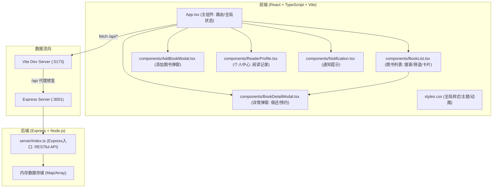
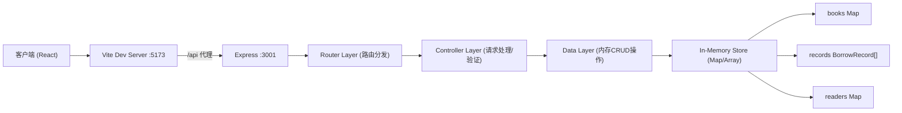
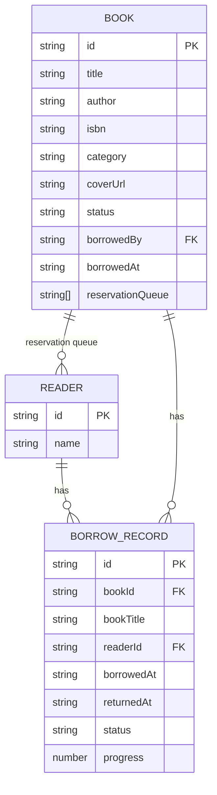

## 1. 架构设计



## 2. 技术说明

- **前端**：React@18.2.0 + ReactDOM@18.2.0 + TypeScript@5.3.3 + Vite@5.0.8
- **构建工具**：Vite@5.0.8 + @vitejs/plugin-react@4.2.0
- **后端**：Express@4.18.2 + Node.js，内存数据存储
- **跨域**：cors@2.8.5（开发环境同时使用 Vite 代理 /api → 后端 3001 端口）
- **ID生成**：uuid@9.0.0
- **类型定义**：@types/express@4.17.21, @types/cors@2.8.17
- **启动方式**：concurrently 同时启动 Vite (前端) 和 ts-node (后端)
- **样式**：原生 CSS (styles.css)，CSS 变量管理主题色

## 3. 路由定义（前端页面路由）

| 路由 | 页面/组件 | 用途 |
|------|-----------|------|
| / | BookList | 图书列表首页（搜索、筛选、卡片展示） |
| /profile | ReaderProfile | 个人中心（借阅历史、阅读进度） |

## 4. API 定义（后端 RESTful API）

### 4.1 类型定义

```typescript
interface Book {
  id: string;
  title: string;
  author: string;
  isbn: string;
  category: '文学' | '科技' | '历史' | '艺术' | string;
  coverUrl: string;
  status: 'available' | 'borrowed';
  borrowedBy?: string;
  borrowedAt?: string;
  reservationQueue: string[];
}

interface BorrowRecord {
  id: string;
  bookId: string;
  bookTitle: string;
  readerId: string;
  borrowedAt: string;
  returnedAt?: string;
  status: 'reading' | 'completed';
  progress: number;
}

interface Reader {
  id: string;
  name: string;
}
```

### 4.2 API 端点

| 方法 | 路径 | 请求体 | 响应 | 说明 |
|------|------|--------|------|------|
| GET | /api/books | query: search, category | { books: Book[] } | 获取图书列表，支持搜索和分类筛选 |
| GET | /api/books/:id | - | { book: Book } | 获取单本图书详情 |
| POST | /api/books | { title, author, isbn, category, coverUrl } | { book: Book } | 添加新图书（上架） |
| POST | /api/books/:id/borrow | { readerId } | { book: Book, record: BorrowRecord } | 借阅图书 |
| POST | /api/books/:id/return | { readerId } | { book: Book, notified?: string } | 归还图书，返回被通知的预约者 |
| POST | /api/books/:id/reserve | { readerId } | { book: Book, position: number } | 加入预约队列 |
| GET | /api/readers/:id/records | - | { records: BorrowRecord[] } | 获取读者借阅记录 |
| PUT | /api/records/:id/progress | { progress } | { record: BorrowRecord } | 更新阅读进度 |
| GET | /api/readers/current | - | { reader: Reader } | 获取当前模拟登录读者 |

## 5. 服务器架构图



## 6. 数据模型

### 6.1 实体关系图



### 6.2 内存数据结构说明

**初始数据**：
- 预置 3 位读者（张小明、李老师、王同学），默认当前读者为张小明
- 预置 8 本示例图书，涵盖各分类，包含可借和已借出状态
- 预置 3 条借阅历史记录用于展示个人中心

**数据流向说明**：
1. 前端通过 `fetch('/api/...')` 发起请求
2. Vite 开发服务器将 `/api` 前缀的请求代理转发到 `http://localhost:3001`
3. Express 服务器接收请求，通过路由匹配到对应处理函数
4. 处理函数操作内存中的 Map 和 Array 数据结构
5. 返回 JSON 响应给前端，前端更新组件状态并重新渲染
