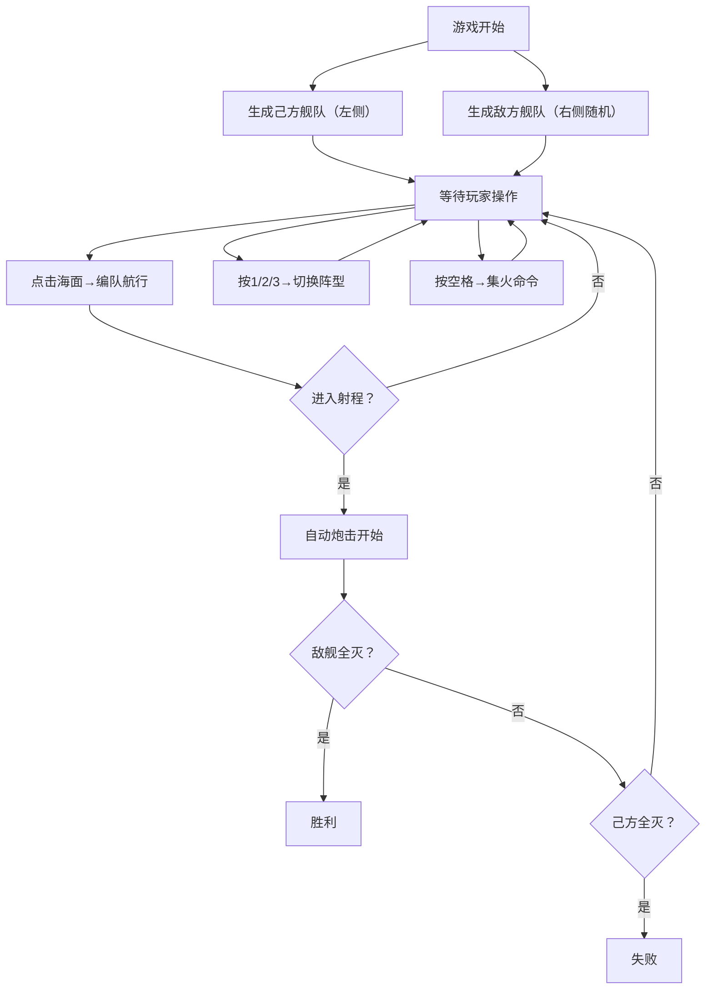

## 1. 产品概述

本产品是一款基于 Canvas 2D 的海战策略游戏，玩家通过控制舰队编队进行航行与炮击对战，解决即时战斗中多艘舰船协同控制操作复杂的问题。

- 核心目标：提供直观的编队控制体验，让玩家可以轻松指挥多艘舰船进行协同作战
- 目标用户：策略游戏爱好者、海战题材游戏玩家
- 市场价值：填补轻量级海战战术模拟游戏的空白，提供流畅的 60FPS 战斗体验

## 2. 核心功能

### 2.1 功能模块

1. **编队航行模块**：创建 3-5 艘舰船编队，点击海面自动航行至目标点
2. **炮击对战模块**：自动射程检测、炮弹发射、爆炸特效、生命值管理
3. **战术指令模块**：阵型切换（箭形/线形/圆形）、集火命令
4. **状态反馈模块**：UI 面板显示阵型、集火状态、击沉数量、战斗耗时、生命值

### 2.2 功能详情

| 模块名称 | 功能点 | 详细描述 |
|---------|--------|---------|
| 编队航行 | 舰船类型区分 | 驱逐舰（黄色三角形）、巡洋舰（蓝色菱形）、战列舰（红色矩形） |
| 编队航行 | 阵型排列 | 箭形阵型：前排1艘驱逐舰，后排2艘巡洋舰和2艘战列舰扇形排列 |
| 编队航行 | 尾迹特效 | 每艘船尾有白色尾迹粒子效果，持续1秒后消散 |
| 炮击对战 | 射程检测 | 150像素范围内自动开始炮击 |
| 炮击对战 | 炮弹发射 | 每艘船每2秒发射一颗炮弹，圆形弹丸带拖尾光效 |
| 炮击对战 | 爆炸特效 | 击中后红橙色粒子扩散，持续0.3秒 |
| 炮击对战 | 生命值管理 | 敌舰头顶红色血条，每秒更新，归零时0.5秒缩小淡出沉没 |
| 战术指令 | 阵型切换 | 数字键1-3切换，0.3秒平滑过渡，easeInOut曲线 |
| 战术指令 | 集火命令 | 空格键触发，5秒内集中攻击最近敌舰，炮击频率1秒，红色弹丸 |
| 状态反馈 | 状态面板 | 左下角显示阵型名称和集火状态 |
| 状态反馈 | 战况统计 | 右上角显示击沉数量和总耗时 |
| 状态反馈 | 损失反馈 | 己方被击沉时中央红色碎裂动画（0.4秒），左上角船只图标变灰打叉 |
| 状态反馈 | 编队生命条 | 顶部进度条，70%以上绿色，40%-70%黄色，40%以下红色 |

## 3. 核心流程

玩家进入游戏后，己方舰队在左侧生成，敌方舰队在右侧随机分布。玩家通过点击海面移动编队，进入射程后自动炮击。可随时切换阵型或下达集火命令，直到所有敌舰被击沉或己方全灭。

## 4. 用户界面设计

### 4.1 设计风格

- **主色调**：深蓝色海洋主题，背景色 `#0a1628`
- **面板色**：半透明深色面板 `#1a2a4a`，透明度 0.7
- **按钮色**：悬停时从 `#2a4a6a` 渐变到 `#4a8aaa`
- **舰船配色**：驱逐舰 `#ffd700`（黄金色）、巡洋舰 `#4169e1`（皇家蓝）、战列舰 `#dc143c`（猩红色）
- **动画风格**：0.15秒悬停渐变，3px上浮效果；0.3秒阵型过渡使用 easeInOut 曲线
- **字体**：使用 Orbitron 等军事/科技感字体搭配 Roboto 等易读正文字体

### 4.2 页面布局

| 区域 | 位置 | 内容 |
|-----|------|------|
| 主画布 | 居中 800x600 | 海面、舰船、炮弹、特效渲染区域 |
| 顶部面板 | 全屏宽度 | 编队生命值总进度条 |
| 左上角面板 | 固定 | 己方舰船状态列表（图标、血条、击沉状态） |
| 左下角面板 | 固定 | 当前阵型名称、集火状态指示 |
| 右上角面板 | 固定 | 击沉敌舰数量、战斗总耗时 |
| 中央动画层 | 画布上方 | 舰船损失时的红色碎裂动画 |

### 4.3 视觉元素

- **海面背景**：深蓝色带缓慢波动的网格动画，模拟海浪效果
- **波浪纹理**：多层正弦波叠加，营造海面纵深感
- **舰船形状**：驱逐舰三角形、巡洋舰菱形、战列舰矩形，带细微描边
- **粒子特效**：尾迹粒子、爆炸粒子、炮弹拖尾光效
- **按钮交互**：悬停时背景色渐变 + 轻微上浮（translateY -3px）

### 4.4 响应式设计

- **桌面优先**：1280x720 及以上分辨率布局正常
- **画布居中**：800x600 主画布始终居中显示
- **UI 避让**：所有面板元素不遮挡 800x600 战斗区域
- **自适应缩放**：低于 1280 宽度时，面板适当缩小确保不重叠
