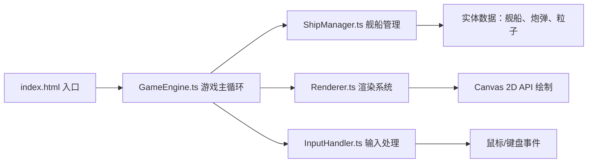
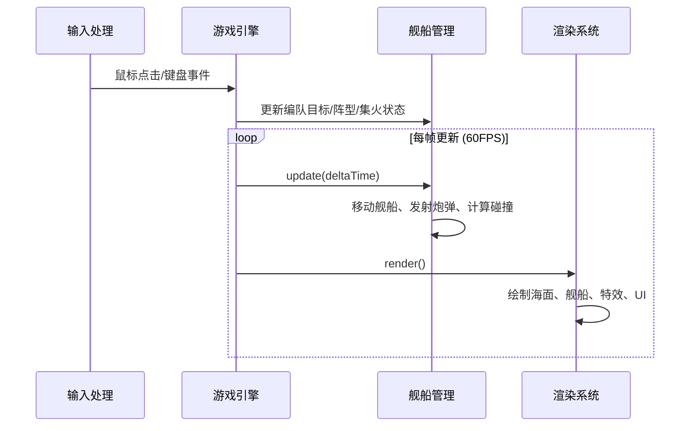
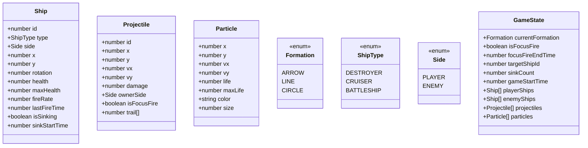

## 1. 架构设计

本项目采用纯前端 Canvas 2D 游戏架构，无需后端服务。核心采用模块化设计，将游戏引擎、舰船管理、渲染系统和输入处理分离，确保代码可维护性和性能。



### 核心数据流



## 2. 技术描述

- **前端框架**：无框架，原生 TypeScript + Canvas 2D API
- **构建工具**：Vite@5.0.8，提供热更新和快速打包
- **编程语言**：TypeScript@5.3.3，严格模式
- **性能目标**：60FPS 稳定帧率，每帧更新耗时 ≤ 8ms
- **渲染方式**：单层 Canvas 2D，所有元素在同一画布绘制

## 3. 项目文件结构

| 文件路径 | 职责描述 |
|---------|---------|
| `package.json` | 项目依赖（typescript@5.3.3、vite@5.0.8）、启动脚本 |
| `index.html` | 入口页面，全屏 Canvas 布局，加载主脚本 |
| `tsconfig.json` | TypeScript 配置，严格模式启用 |
| `vite.config.js` | Vite 默认配置 |
| `src/main.ts` | 应用入口，初始化游戏引擎 |
| `src/GameEngine.ts` | 游戏主循环：帧率管理、状态同步、每帧 update/render |
| `src/ShipManager.ts` | 舰船实体：创建、移动、炮击、生命值、阵型算法 |
| `src/Renderer.ts` | 渲染模块：海面、舰船、尾迹、炮弹、爆炸、UI 面板 |
| `src/InputHandler.ts` | 输入处理：鼠标/键盘监听，坐标转换，指令触发 |
| `src/types.ts` | 类型定义：Ship、Projectile、Particle、Formation 等接口 |

## 4. 数据模型定义

### 4.1 核心类型定义



### 4.2 关键常量定义

| 常量名称 | 值 | 说明 |
|---------|----|------|
| `CANVAS_WIDTH` | 800 | 主画布宽度 |
| `CANVAS_HEIGHT` | 600 | 主画布高度 |
| `SHIP_SPEED` | 80 | 舰船移动速度（像素/秒） |
| `FIRE_RANGE` | 150 | 炮击射程（像素） |
| `NORMAL_FIRE_RATE` | 2000 | 正常炮击间隔（毫秒） |
| `FOCUS_FIRE_RATE` | 1000 | 集火炮击间隔（毫秒） |
| `FOCUS_FIRE_DURATION` | 5000 | 集火持续时间（毫秒） |
| `FORMATION_TRANSITION_TIME` | 300 | 阵型过渡时间（毫秒） |
| `EXPLOSION_DURATION` | 300 | 爆炸特效持续时间（毫秒） |
| `WAKE_PARTICLE_LIFE` | 1000 | 尾迹粒子生命周期（毫秒） |
| `SHIP_SINK_DURATION` | 500 | 舰船沉没动画时间（毫秒） |
| `SHATTER_ANIMATION_DURATION` | 400 | 碎裂动画持续时间（毫秒） |

### 4.3 阵型位置算法

**箭形阵型 (ARROW)**：
- 驱逐舰：(0, 0) - 前排居中
- 巡洋舰1：(-60, 50) - 左后
- 巡洋舰2：(60, 50) - 右后
- 战列舰1：(-100, 100) - 最左后
- 战列舰2：(100, 100) - 最右后

**线形横排 (LINE)**：
- 5艘舰船水平等间距排列，间距40像素
- 顺序：战列舰1、巡洋舰1、驱逐舰、巡洋舰2、战列舰2

**圆形防御 (CIRCLE)**：
- 5艘舰船均匀分布在半径80像素的圆周上
- 角度从 0° 开始，每 72° 一艘

## 5. 核心算法

### 5.1 编队导航算法

```
输入：目标点坐标 (targetX, targetY)
输出：每艘舰船的移动目标位置

1. 计算编队中心到目标点的向量
2. 计算编队旋转角度（朝向目标点）
3. 根据当前阵型计算每艘舰船相对于编队中心的偏移量
4. 将偏移量旋转编队角度后加上目标点坐标，得到每艘船的实际目标点
5. 每帧根据 deltaTime 平滑移动舰船向目标点靠近
```

### 5.2 碰撞检测算法

```
炮弹-舰船碰撞检测（每帧执行）：
1. 遍历所有炮弹
2. 对每枚炮弹，遍历对立阵营的所有舰船
3. 计算炮弹与舰船中心点的距离
4. 如果距离 < 舰船半径 + 炮弹半径，则判定命中
5. 减少舰船生命值，生成爆炸粒子，销毁炮弹
```

### 5.3 缓动函数 (easeInOut)

```typescript
function easeInOut(t: number): number {
    return t < 0.5 ? 2 * t * t : 1 - Math.pow(-2 * t + 2, 2) / 2;
}
```

## 6. 性能优化策略

1. **对象池模式**：炮弹和粒子对象复用，避免频繁 GC
2. **空间分区**：使用网格对舰船进行空间划分，减少碰撞检测对数
3. **批量绘制**：同类型元素批量绘制，减少 Canvas 状态切换
4. **DeltaTime 驱动**：所有动画基于时间差，不受帧率波动影响
5. **性能监控**：每帧记录 update/render 耗时，超过 8ms 输出警告

## 7. 接口规范

### 7.1 模块间接口

| 模块 | 方法 | 参数 | 返回值 | 说明 |
|-----|------|------|--------|------|
| `GameEngine` | `start()` | 无 | `void` | 启动游戏循环 |
| `GameEngine` | `update(dt: number)` | 时间差（秒） | `void` | 更新游戏状态 |
| `GameEngine` | `render()` | 无 | `void` | 渲染当前帧 |
| `ShipManager` | `createFleet(side: Side)` | 阵营 | `Ship[]` | 创建舰队 |
| `ShipManager` | `moveFleet(targetX: number, targetY: number)` | 目标坐标 | `void` | 设置编队移动目标 |
| `ShipManager` | `switchFormation(formation: Formation)` | 阵型 | `void` | 切换编队阵型 |
| `ShipManager` | `activateFocusFire()` | 无 | `void` | 激活集火模式 |
| `Renderer` | `renderAll(state: GameState)` | 游戏状态 | `void` | 渲染所有元素 |
| `InputHandler` | `onClick(callback: (x, y) => void)` | 回调 | `void` | 注册点击回调 |
| `InputHandler` | `onKeyDown(callback: (key) => void)` | 回调 | `void` | 注册按键回调 |
