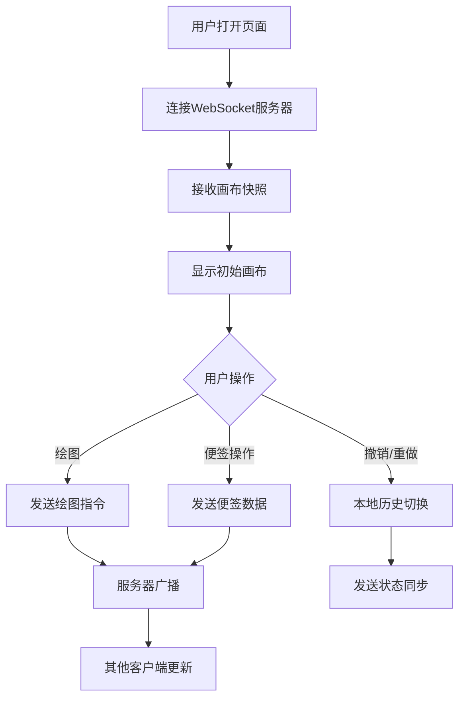

## 1. 产品概述
在线协作白板应用，支持多用户实时绘图、便签添加和画布缩放平移，提升远程协作效率。
- 主要用途：团队头脑风暴、远程教学、设计讨论等需要实时视觉协作的场景
- 目标用户：设计师、教育工作者、远程团队成员
- 产品价值：提供轻量级、高性能的实时协作白板体验，无需复杂安装即可使用

## 2. 核心功能

### 2.1 功能模块
1. **画布区域**：SVG绘图层 + DOM便签层，支持缩放平移
2. **工具栏**：画笔工具、颜色选择、粗细调节、便签创建、撤销重做、清空画布
3. **便签系统**：可拖拽、可编辑、可删除、可切换颜色的便签
4. **实时协作**：WebSocket实时同步所有操作，新用户加入获取完整快照
5. **历史记录**：最多50步撤销重做，带淡入淡出过渡效果

### 2.2 页面详情
| 页面名称 | 模块名称 | 功能描述 |
|-----------|-------------|---------------------|
| 白板主页面 | 顶部状态栏 | 显示应用名称、在线用户数量、连接状态指示器 |
| 白板主页面 | 左侧工具栏 | 画笔颜色/粗细选择、便签颜色选择、便签添加、撤销/重做、清空画布 |
| 白板主页面 | 画布区域 | 浅灰色网格背景，支持SVG绘图、便签展示、缩放平移 |
| 白板主页面 | 便签组件 | 黄色圆角矩形，可拖拽、双击编辑、右键切换颜色、右上角删除 |

## 3. 核心流程

用户打开应用 → 连接WebSocket服务器 → 接收画布状态快照 → 选择工具进行绘图/创建便签 → 操作通过WebSocket广播 → 其他用户实时接收更新 → 支持撤销重做恢复状态

## 4. 用户界面设计

### 4.1 设计风格
- 主色调：蓝色(#1976d2)、白色(#ffffff)、浅灰色(#f0f0f0)
- 辅助色：红色(#e53935)、绿色(#43a047)、紫色(#8e24aa)（画笔颜色）
- 便签颜色：黄色(#fff59d)、粉色(#f8bbd9)、浅蓝色(#b3e5fc)
- 按钮风格：圆形Material Design图标，选中蓝色背景高亮，悬停缩放1.05倍
- 字体：系统无衬线字体，标题16px加粗，正文14px
- 布局：左侧固定工具栏60px宽，主体画布区域，顶部窄条状态栏
- 图标风格：Material Design风格简洁线性图标

### 4.2 页面设计概述
| 页面名称 | 模块名称 | UI元素 |
|-----------|-------------|-------------|
| 白板主页面 | 顶部状态栏 | 应用名称标题、在线人数（用户图标+数字）、连接状态圆点（绿/红闪烁） |
| 白板主页面 | 左侧工具栏 | 垂直排列圆形图标按钮：5种颜色、4种粗细、便签颜色下拉、便签添加、撤销、重做、清空 |
| 白板主页面 | 画布区域 | #f0f0f0背景，5px间距浅蓝色网格线，SVG绘图层，便签DOM层 |
| 白板主页面 | 便签组件 | 120x80px圆角矩形，左上角小信封图标，双击进入编辑，右上角×删除按钮 |

### 4.3 响应式
- Desktop-first设计，宽度小于768px时工具栏变为底部横条
- 画布区域随窗口大小自动适配
- 触摸设备支持手指绘图和便签拖拽
