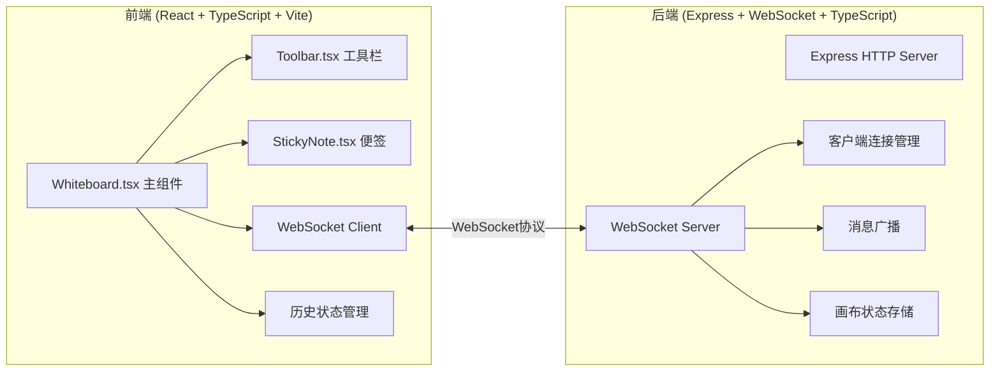
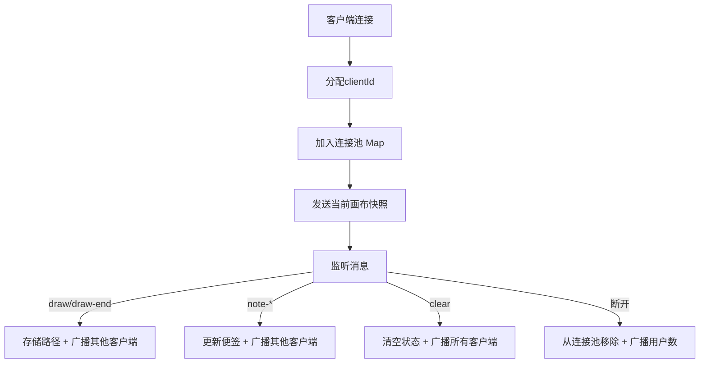

## 1. 架构设计



## 2. 技术描述
- 前端：React@18.2.0 + TypeScript@5.3.3 + Vite@5.0.8 + @vitejs/plugin-react@4.2.0
- 后端：Express@4.18.2 + ws@8.16.0 + TypeScript@5.3.3
- 跨域：cors@2.8.5
- 工具库：uuid@9.0.0、concurrently（同时启动前后端）
- 状态管理：React useState/useRef + useReducer管理历史记录
- 通信：WebSocket（ws库），消息JSON序列化

## 3. 项目文件结构
| 文件路径 | 用途 |
|-------|---------|
| /package.json | 项目依赖和脚本配置 |
| /index.html | Vite入口HTML |
| /tsconfig.json | TypeScript配置（严格模式、ES模块） |
| /vite.config.js | Vite配置（代理WebSocket到后端） |
| /src/server/WebSocketServer.ts | WebSocket服务器，管理连接和消息广播 |
| /src/client/Whiteboard.tsx | 白板主组件，画布管理、事件处理、WebSocket通信 |
| /src/client/Toolbar.tsx | 工具栏组件，工具选择和操作按钮 |
| /src/client/StickyNote.tsx | 便签组件，拖拽、编辑、删除功能 |
| /src/client/main.tsx | React入口文件 |
| /src/client/index.css | 全局样式 |
| /src/shared/types.ts | 前后端共享类型定义 |

## 4. WebSocket消息协议

```typescript
// 消息类型
type WSMessageType = 
  | 'init'        // 新用户连接，服务器发送完整快照
  | 'draw'        // 绘图指令
  | 'draw-end'    // 一笔绘制完成
  | 'note-add'    // 添加便签
  | 'note-update' // 更新便签
  | 'note-delete' // 删除便签
  | 'clear'       // 清空画布
  | 'snapshot'    // 完整画布状态
  | 'user-count'  // 在线用户数更新

// 绘图点
interface DrawPoint {
  x: number
  y: number
}

// 绘图路径（二次贝塞尔曲线）
interface DrawPath {
  id: string
  points: DrawPoint[]
  color: string
  width: number
}

// 便签
interface StickyNoteData {
  id: string
  x: number
  y: number
  content: string
  color: 'yellow' | 'pink' | 'blue'
}

// 画布完整状态
interface CanvasState {
  paths: DrawPath[]
  notes: StickyNoteData[]
}

// WebSocket消息
interface WSMessage {
  type: WSMessageType
  payload: any
  clientId?: string
}
```

## 5. 服务器架构



服务器内存存储：
- `clients: Map<string, WebSocket>` - 在线客户端
- `canvasState: CanvasState` - 当前画布完整状态
- `history: CanvasState[]` - 历史记录（最多50步，可选服务端历史）

## 6. 前端核心数据流

### 6.1 绘图流程
1. mousedown → 开始新路径，记录起始点
2. mousemove → 收集点，实时渲染临时路径，通过WebSocket发送draw消息
3. mouseup → 完成路径，存入历史，发送draw-end消息

### 6.2 便签操作
1. 点击便签按钮 → 在画布中央创建新便签 → 发送note-add
2. 拖拽便签 → 更新位置 → 发送note-update
3. 双击编辑 → Enter保存 → 发送note-update
4. 右键便签 → 切换颜色 → 发送note-update
5. 点击删除 → 0.3s缩小动画 → 发送note-delete

### 6.3 撤销重做
- 维护 `history: CanvasState[]` 数组和 `historyIndex: number`
- 每次操作后push新状态到history（超过50条移除最旧）
- 撤销：historyIndex--，快照切换，0.2s淡入淡出
- 重做：historyIndex++，快照切换，0.2s淡入淡出
