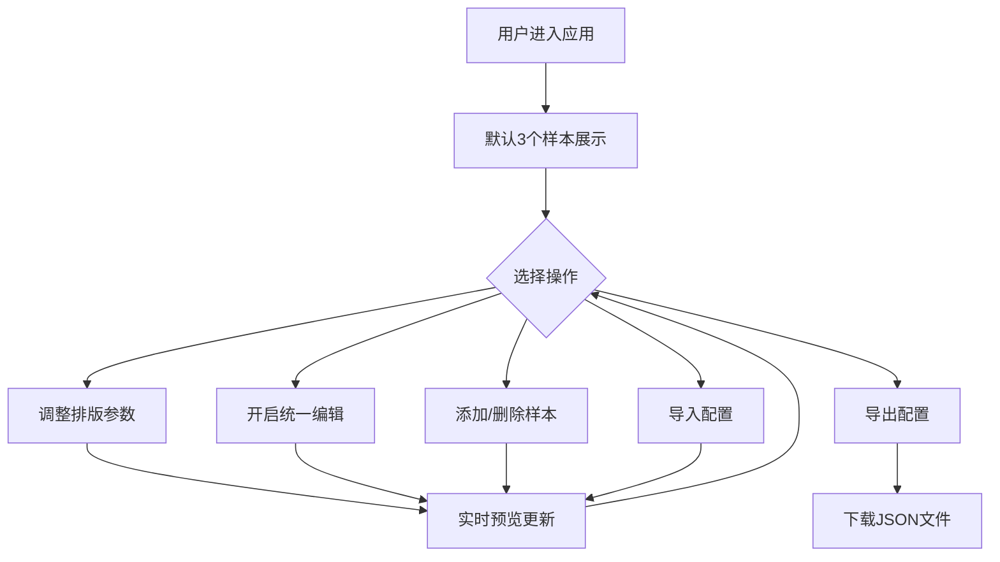

## 1. 产品概述

字体排版预览与对比应用，为设计团队提供实时调整和对比多组文字排版方案的工具。支持多样本并行预览、参数实时联动、统一编辑模式，以及排版配置的导入导出，消除手动调参的繁琐流程。

- 目标用户：UI/UX设计师、前端开发者、排版爱好者
- 核心价值：将"调参-预览-对比"的工作流压缩到单一界面，实时反馈排版效果，提升设计决策效率

## 2. 核心功能

### 2.1 功能模块

1. **主页面**：编辑区域 + 预览区域 + 顶部工具栏，承载所有交互

### 2.2 页面详情

| 页面名称 | 模块名称 | 功能描述 |
|---------|---------|---------|
| 主页面 | 顶部工具栏 | 统一编辑开关、添加样本按钮、导入/导出按钮 |
| 主页面 | 左侧编辑区 | 多个编辑面板，每个面板含字体选择、字号滑块、行高滑块、字重选择、颜色选择器、文本输入框 |
| 主页面 | 右侧预览区 | 多个预览卡片并排显示，实时反映编辑参数变化 |
| 主页面 | 导入导出 | JSON文件导入导出排版配置 |

## 3. 核心流程

**主要用户流程：**
1. 用户进入应用，默认展示3个排版样本
2. 用户在左侧编辑区调整任一样本的排版参数（字体、字号、行高、字重、颜色）
3. 右侧预览区实时更新对应样本的渲染效果
4. 用户可开启"统一编辑"模式，同步调整所有样本的排版参数
5. 用户可通过"添加样本"增加新样本，或通过关闭按钮删除样本
6. 用户可将当前配置导出为JSON文件，或导入之前的配置文件

## 4. 用户界面设计

### 4.1 设计风格

- 主色：深蓝色 `#1a73e8`
- 辅助色：灰色系（`#f5f5f5` 编辑区背景、`#666` 辅助文字、`#e0e0e0` 边框）
- 按钮风格：圆角8px、无边框、文字粗体、悬停时背景色深度变化0.2秒过渡
- 字体：Google Fonts（Roboto、Open Sans、Lato、Montserrat、Playfair Display、Source Code Pro）
- 布局：左右两栏（1/3编辑 + 2/3预览），最大宽度1200px
- 卡片样式：编辑卡片白色背景、圆角12px、阴影0 2px 8px rgba(0,0,0,0.08)；预览卡片白色背景、0.5px浅灰边框、4px圆角

### 4.2 页面设计概览

| 页面名称 | 模块名称 | UI元素 |
|---------|---------|--------|
| 主页面 | 顶部工具栏 | 深蓝主色按钮、统一编辑开关（灰/蓝渐变）、悬停过渡动画 |
| 主页面 | 左侧编辑区 | 浅灰背景、白色编辑卡片、下拉框、滑块、颜色选择器、文本域 |
| 主页面 | 右侧预览区 | 纯白背景、300px宽预览卡片、2px虚线分隔、字号行高标签 |
| 主页面 | 导出按钮 | 缩放动画、绿色闪烁反馈 |

### 4.3 响应式设计

- 桌面端（≥768px）：左右两栏布局，编辑区1/3、预览区2/3
- 移动端（<768px）：上下堆叠布局，编辑区在上、预览区在下
- 整体最大宽度1200px，居中显示

### 4.4 动画规范

- 预览更新：0.2秒内完成渲染
- 字体切换：旧字体0.15秒淡出，新字体淡入
- 字号调整：平滑缩放动画
- 删除样本：缩小淡出0.3秒
- 导入样本：叠入动画逐个出现，间隔0.15秒
- 统一编辑开关：0.3秒背景色渐变
- 导出按钮：0.3秒缩放 + 0.5秒绿色闪烁
- 所有交互操作过渡动画≤0.3秒
