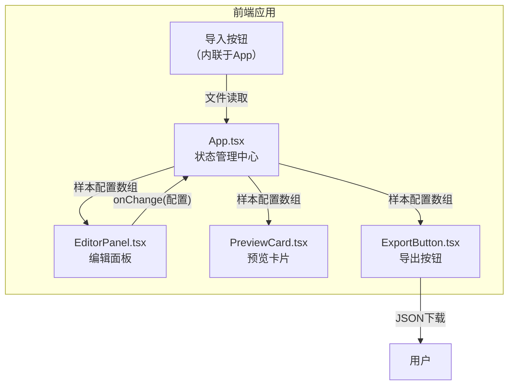

## 1. 架构设计



**数据流向：**
- App.tsx 维护 `samples` 状态数组，每个样本包含 `{ id, text, fontFamily, fontSize, lineHeight, fontWeight, color }`
- EditorPanel 通过 props 接收单个样本配置，通过 onChange 回调将更新推回 App
- PreviewCard 通过 props 接收单个样本配置，纯展示组件
- ExportButton 接收完整 samples 数组，生成 JSON 文件下载
- 导入功能在 App 中处理，读取 JSON 文件后更新 samples 状态

## 2. 技术说明

- 前端：React 18 + TypeScript + Vite
- 状态管理：React useState（组件内状态管理，无需全局状态库）
- 样式方案：CSS Modules + 内联样式（动画相关）
- 初始化工具：vite-init（react-ts 模板）
- 后端：无
- 数据库：无

## 3. 路由定义

| 路由 | 用途 |
|------|------|
| / | 主页面，包含编辑区、预览区、工具栏 |

## 4. 文件结构与调用关系

```
project-root/
├── index.html                  # 入口页面，加载 main.tsx
├── package.json                # 依赖和脚本配置
├── vite.config.ts              # Vite配置（React插件，端口3000）
├── tsconfig.json               # TypeScript严格模式配置
└── src/
    ├── main.tsx                # 应用入口，挂载App组件
    ├── App.tsx                 # 主组件：管理samples状态、统一编辑模式、导入导出
    ├── EditorPanel.tsx         # 编辑面板：字体/字号/行高/字重/颜色/文本编辑
    ├── PreviewCard.tsx         # 预览卡片：排版效果渲染、过渡动画
    ├── ExportButton.tsx        # 导出按钮：JSON生成与下载、动画反馈
    └── types.ts                # TypeScript类型定义
```

**调用关系：**
- `main.tsx` → 渲染 `App.tsx`
- `App.tsx` → 渲染 `EditorPanel.tsx`（每个样本一个）、`PreviewCard.tsx`（每个样本一个）、`ExportButton.tsx`
- `App.tsx` ↔ `EditorPanel.tsx`：通过 props 传递配置，通过 onChange 回调接收更新
- `App.tsx` → `PreviewCard.tsx`：单向数据流，传递配置用于渲染
- `App.tsx` → `ExportButton.tsx`：传递完整 samples 数组

## 5. 核心类型定义

```typescript
interface SampleConfig {
  id: string;
  text: string;
  fontFamily: string;
  fontSize: number;
  lineHeight: number;
  fontWeight: number;
  color: string;
}
```

## 6. 性能策略

- 使用 lodash.debounce 对滑块等高频输入进行节流（延迟50ms），确保渲染响应时间≤50ms
- 预览卡片使用 React.memo 避免不必要的重渲染
- CSS transition 替代 JS 动画，确保6个样本同时预览时帧率≥55fps
- 字体切换使用 CSS transition 实现淡入淡出，避免重排
