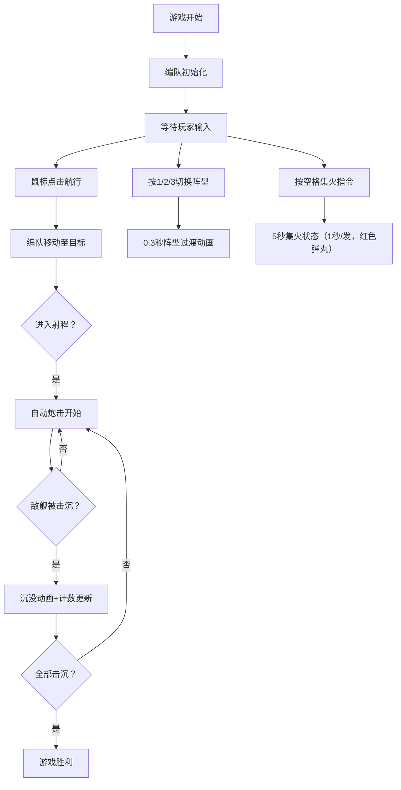

## 1. 产品概述

海战舰队编队策略游戏，玩家指挥3-5艘舰船组成的编队在海上进行航行与炮击对战。解决即时战斗中多舰船协同控制操作复杂的问题，通过编队系统简化操作，提供战术深度。

- 核心玩法：编队航行、自动炮击、阵型切换、集火指令
- 目标用户：喜欢策略类即时战术游戏的玩家
- 产品价值：提供直观的编队控制体验，降低多单位操作门槛

## 2. 核心特性

### 2.1 用户角色
| 角色 | 说明 | 核心权限 |
|------|------|----------|
| 玩家 | 单用户游戏 | 控制己方编队、切换阵型、下达战术指令 |

### 2.2 功能模块
1. **舰队编队与航行系统**：舰船创建、编队阵型、自动导航、尾迹粒子
2. **炮击对战系统**：射程检测、自动开火、炮弹轨迹、爆炸特效、生命值、沉没动画
3. **战术指令系统**：阵型切换（箭形/线形/圆形）、集火命令
4. **战况反馈系统**：状态面板、血条、击沉计数、碎裂动画、编队生命进度条

### 2.3 页面详情
| 页面名称 | 模块名称 | 功能描述 |
|----------|----------|----------|
| 游戏主界面 | 战斗画布 | 800x600 Canvas，显示海面、舰船、炮弹、特效 |
| 游戏主界面 | 顶部状态栏 | 编队总生命值进度条（绿→黄→红渐变） |
| 游戏主界面 | 左下方面板 | 当前阵型名称、集火状态指示 |
| 游戏主界面 | 右上方面板 | 击沉敌舰数量、总耗时计时器 |
| 游戏主界面 | 左上方面板 | 己方舰船列表（存活状态图标） |
| 游戏主界面 | 中央提示区 | 舰船被击沉时的红色碎裂动画 |

## 3. 核心流程

玩家进入游戏后，己方编队（1艘驱逐舰+2艘巡洋舰+2艘战列舰）出现在左半屏，敌方AI舰队随机分布在右半屏。玩家通过鼠标点击指定航行目标，编队自动导航。当进入射程时自动开始炮击。玩家可随时按数字键1-3切换阵型，按空格键下达集火命令。战斗持续到一方全军覆没。

## 4. 用户界面设计

### 4.1 设计风格
- **主色调**：深蓝色 #0a1628（海洋背景）
- **面板色**：#1a2a4a（半透明0.7）
- **按钮悬停色**：#2a4a6a → #4a8aaa（0.15秒渐变，上浮3px）
- **舰船配色**：
  - 驱逐舰：黄色三角形
  - 巡洋舰：蓝色菱形
  - 战列舰：红色矩形
- **炮弹**：白色圆形，集火时红色，均带拖尾光效
- **爆炸**：红橙粒子扩散
- **血条**：红色，位于舰船头顶
- **生命进度条**：绿(>70%) → 黄(40%-70%) → 红(<40%) 平滑渐变
- **字体**：无衬线字体，清晰易读

### 4.2 页面设计概览
| 页面名称 | 模块名称 | UI元素 |
|----------|----------|--------|
| 游戏主界面 | 战斗画布 | 800x600居中，海浪网格动画，深蓝背景带波浪纹理 |
| 游戏主界面 | 顶部生命条 | 全宽进度条，颜色随HP渐变 |
| 游戏主界面 | 左右侧面板 | 半透明深色面板，承载UI状态信息 |
| 游戏主界面 | 舰船 | 几何图形（三角/菱形/矩形），带旋转朝向，头顶血条 |
| 游戏主界面 | 特效 | 尾迹粒子、炮弹拖尾、爆炸粒子、碎裂动画 |

### 4.3 响应式设计
- 桌面优先（1280x720及以上）
- 主画布800x600固定像素，居中显示
- UI面板位于画布两侧，不遮挡战斗区域
- 在更高分辨率下保持布局对称，面板扩展填充

## 5. 性能要求
- 目标帧率：60 FPS
- 每帧编队导航+碰撞检测计算 ≤ 8ms
- 粒子系统对象池管理，避免频繁GC
- Canvas 2D API 直接渲染，无额外DOM开销
