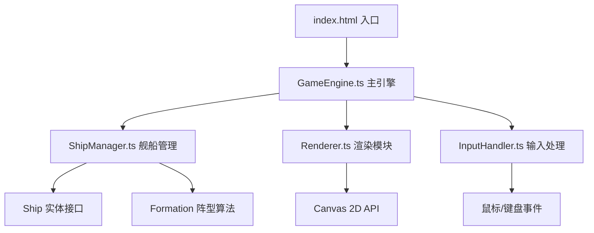

## 1. 架构设计



整体采用分层模块化架构：
- **入口层**：index.html 提供 Canvas 容器
- **引擎层**：GameEngine 作为核心协调器，管理主循环、状态机
- **业务逻辑层**：ShipManager 负责舰船编队、移动、射击逻辑
- **渲染层**：Renderer 独立负责所有 Canvas 绘制
- **输入层**：InputHandler 处理用户输入并转发给引擎

## 2. 技术描述

- **前端框架**：原生 TypeScript 5.3.3（无UI框架，纯 Canvas 2D）
- **构建工具**：Vite 5.0.8
- **渲染技术**：HTML5 Canvas 2D API
- **无后端、无数据库**：纯前端单页游戏

### 2.1 项目依赖
| 依赖 | 版本 | 用途 |
|------|------|------|
| typescript | 5.3.3 | 类型系统 |
| vite | 5.0.8 | 构建与开发服务器 |

### 2.2 启动脚本
```
npm install && npm run dev
```

## 3. 文件结构

```
auto71/
├── index.html              # 入口页面，全屏Canvas布局
├── package.json            # 项目依赖与脚本
├── tsconfig.json           # TypeScript严格模式配置
├── vite.config.js          # Vite默认配置
└── src/
    ├── GameEngine.ts       # 游戏主循环：帧率管理、输入、状态、炮击逻辑
    ├── ShipManager.ts      # 舰船实体管理：创建、移动、发射、HP、阵型算法
    ├── Renderer.ts         # 渲染模块：海面、舰船、粒子、UI面板
    └── InputHandler.ts     # 输入处理：鼠标点击、键盘事件、坐标转换
```

## 4. 核心数据模型

### 4.1 Ship 接口
```typescript
interface Ship {
  id: string;
  type: 'destroyer' | 'cruiser' | 'battleship';
  team: 'player' | 'enemy';
  x: number;
  y: number;
  rotation: number;
  targetX: number;
  targetY: number;
  targetRotation: number;
  hp: number;
  maxHp: number;
  speed: number;
  fireCooldown: number;
  fireRate: number; // 炮击间隔（ms）
  range: number;    // 射程（像素）
  damage: number;
  formationOffsetX: number;
  formationOffsetY: number;
  isSinking: boolean;
  sinkProgress: number; // 0~1
  isAlive: boolean;
}
```

### 4.2 Projectile 接口
```typescript
interface Projectile {
  id: string;
  x: number;
  y: number;
  vx: number;
  vy: number;
  damage: number;
  team: 'player' | 'enemy';
  isFocusFire: boolean;
  trail: { x: number; y: number }[];
}
```

### 4.3 Particle 接口
```typescript
interface Particle {
  x: number;
  y: number;
  vx: number;
  vy: number;
  life: number;
  maxLife: number;
  color: string;
  size: number;
  type: 'wake' | 'explosion' | 'shatter';
}
```

### 4.4 Formation 阵型枚举
```typescript
type FormationType = 'arrow' | 'line' | 'circle';
```

## 5. 核心算法

### 5.1 阵型位置计算
- **箭形（arrow）**：前排1艘驱逐舰居中，后排2巡洋舰+2战列舰扇形展开（左右各30°角）
- **线形（line）**：5艘舰船水平均匀排列，驱逐舰居中，巡洋舰在两侧，战列舰在两端
- **圆形（circle）**：5艘舰船均匀分布在半径为R的圆周上，朝向圆心外

### 5.2 缓动函数
```typescript
// easeInOutQuad 用于阵型切换过渡动画
function easeInOutQuad(t: number): number {
  return t < 0.5 ? 2 * t * t : 1 - Math.pow(-2 * t + 2, 2) / 2;
}
```

### 5.3 生命值颜色渐变
```typescript
// HP百分比 → RGB颜色平滑插值
// >70%: 绿色(46,204,113) → 40%-70%: 黄色(241,196,15) → <40%: 红色(231,76,60)
```

## 6. 主循环时序

```
每一帧（16.6ms @ 60FPS）:
  1. InputHandler.poll()        // 读取输入状态 (<0.1ms)
  2. ShipManager.update(dt)     // 舰船移动、冷却计时、AI、发射炮弹 (<4ms)
     ├── 编队导航计算
     ├── 射程检测 + 碰撞检测
     └── 粒子更新
  3. Renderer.render()          // 绘制所有实体 (<4ms)
     ├── 背景海浪
     ├── 舰船 + 血条
     ├── 炮弹 + 拖尾
     ├── 粒子特效
     └── UI面板
```

## 7. 性能优化策略
- **对象池**：Particle 和 Projectile 使用对象池复用，避免频繁 GC
- **空间分区**：射程检测使用简单距离计算（舰船数量≤10，O(n²)可接受）
- **增量渲染**：海面波纹使用分层绘制，每帧仅更新动画相位
- **数学运算缓存**：预计算三角函数值，避免重复 Math.sin/cos
